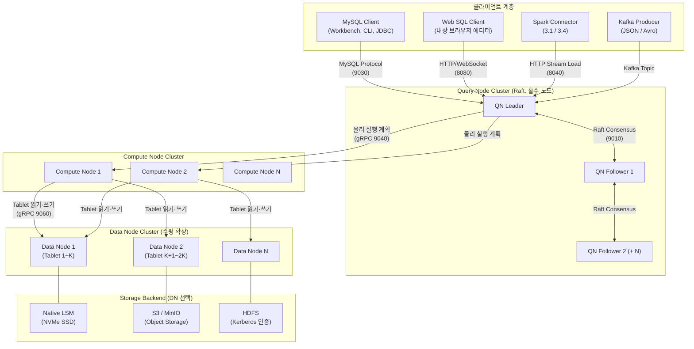
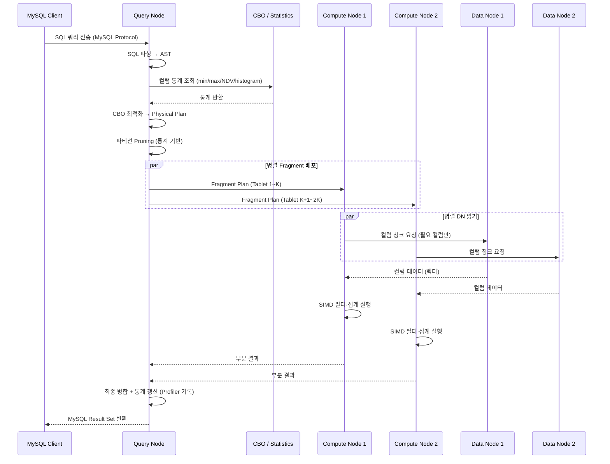
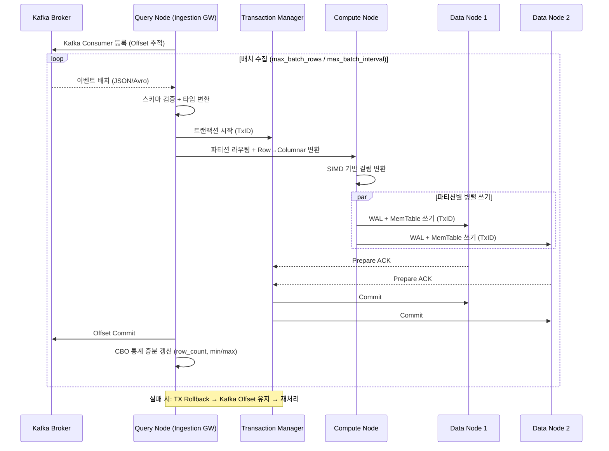
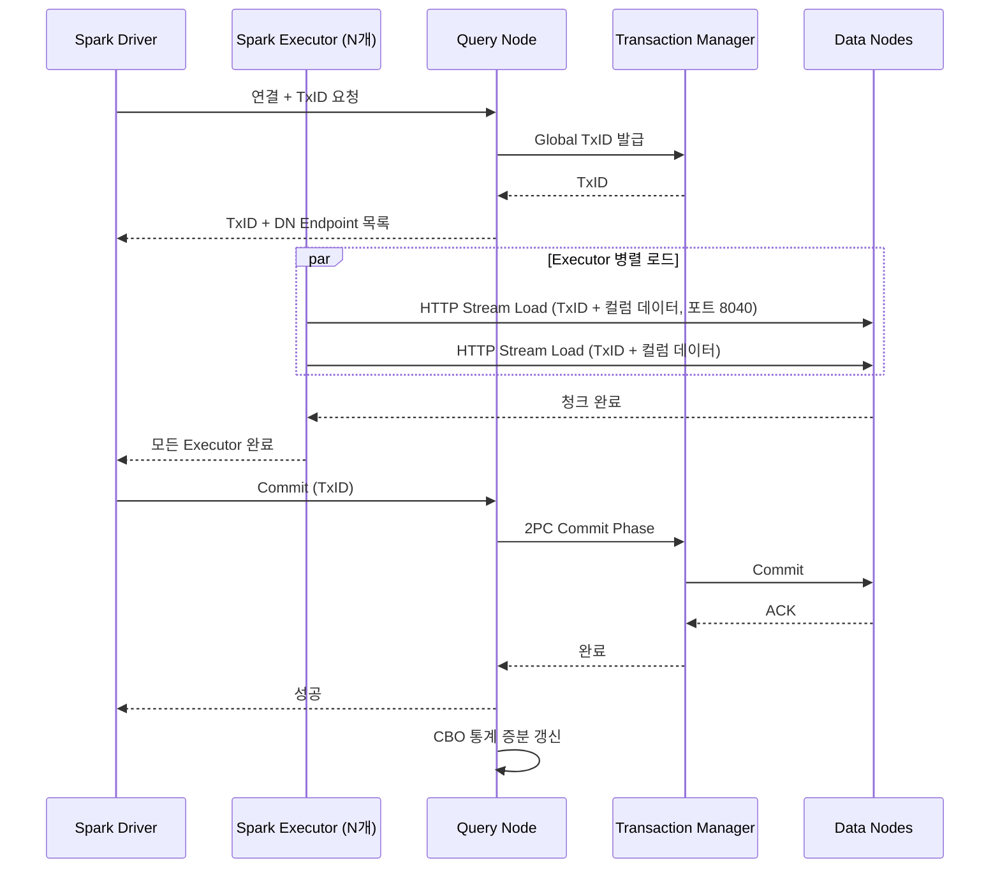
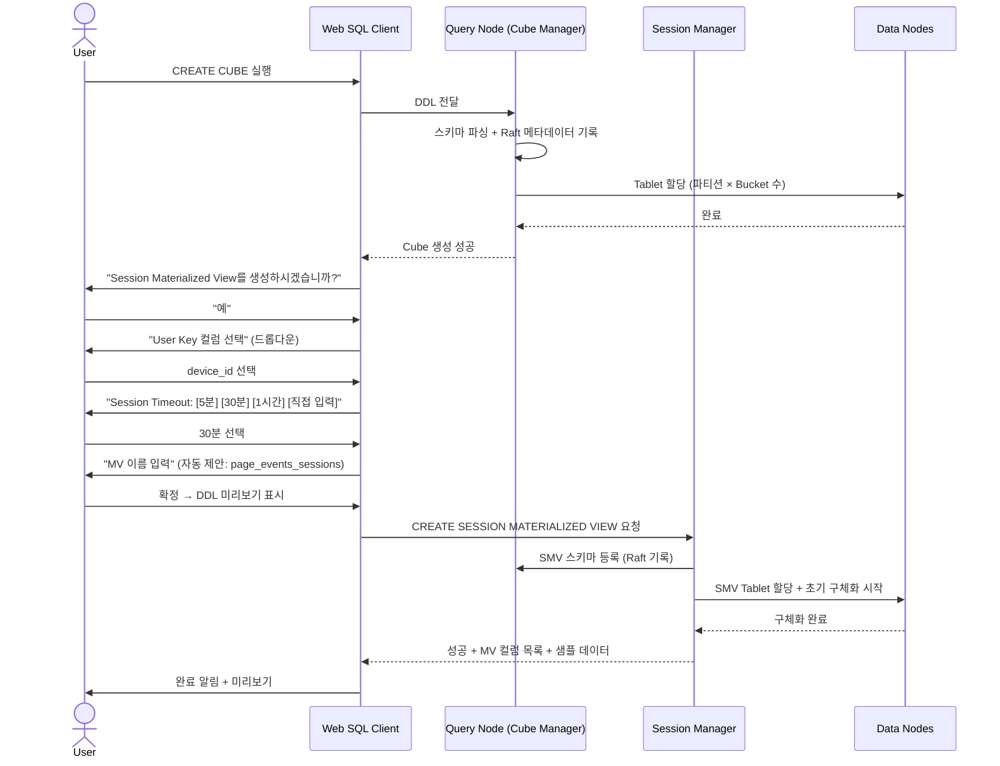
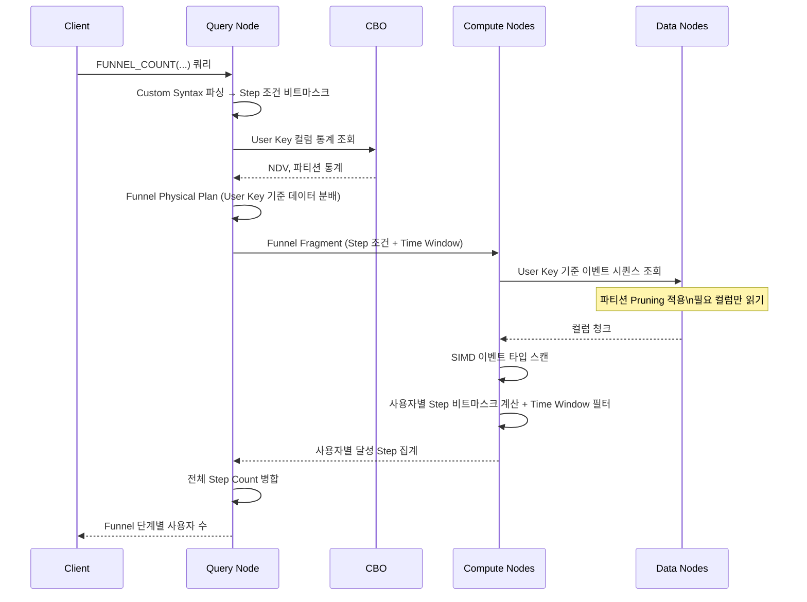
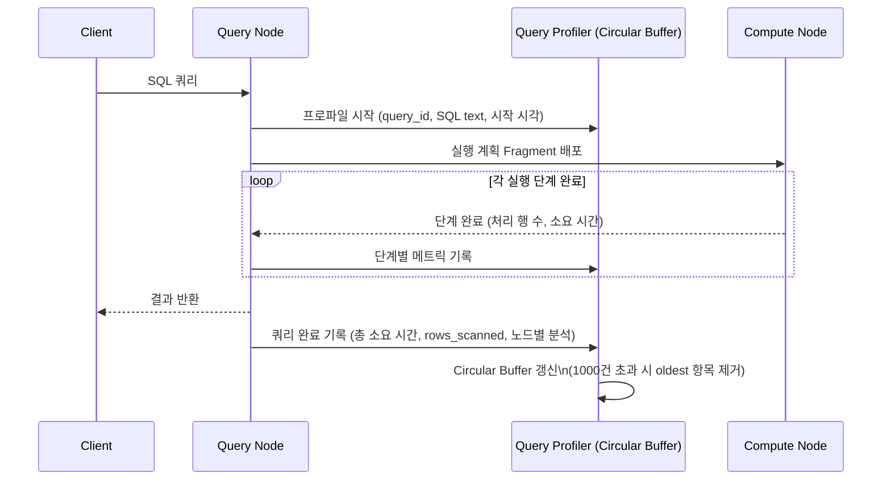

# WOW-DB Software Requirements Specification

---

| 항목 | 내용 |
|---|---|
| 문서 버전 | v0.2 Draft |
| 작성일 | 2026-04-12 |
| 상태 | 초안 (Draft) |
| 프로젝트명 | WOW-DB |
| 참조 시스템 | StarRocks, ClickHouse, RocksDB, Snowflake |

---

## 목차

1. [개요](#1장-개요)
2. [시스템 아키텍처 및 상호작용 다이어그램](#2장-시스템-아키텍처-및-상호작용-다이어그램)
3. [기능적 요구사항](#3장-기능적-요구사항)
4. [비기능적 요구사항](#4장-비기능적-요구사항)
5. [코드 예제](#5장-코드-예제)

---

# 1장. 개요

## 1.1 문서 목적

본 문서는 **WOW-DB**의 소프트웨어 요구사항 명세서(Software Requirements Specification)이다.
WOW-DB는 웹 분석에 특화된 MySQL 호환 OLAP 데이터베이스로서, 이벤트 기반의 데이터 수집·저장·분석을 주목적으로 한다.
본 문서는 설계자, 개발자, QA 엔지니어가 시스템을 구현하고 검증하기 위한 기준 문서로 활용된다.

## 1.2 시스템 배경 및 범위

### 1.2.1 배경

현대 웹 서비스는 수백억 건 이상의 사용자 이벤트를 생성한다. 기존 범용 OLAP 데이터베이스(ClickHouse, StarRocks 등)는 이러한 이벤트 데이터를 저장하고 쿼리하는 데 적합하지만, 다음과 같은 문제를 안고 있다.

- 분석가가 직접 스키마를 설계하고 세션 로직을 구현해야 함
- Funnel·Cohort·Path 분석을 위한 커스텀 SQL 작성 부담
- 이벤트 → 세션 변환 파이프라인을 별도로 구축해야 함
- Storage와 Compute가 결합되어 있어 독립적 확장 불가

WOW-DB는 이러한 문제를 해결하기 위해, **이벤트 Cube 정의만으로 자동 세션화(Sessionization) Materialized View를 생성**하고, 웹 분석에 특화된 함수(FUNNEL, COHORT, PATH)를 내장하며, Storage와 Compute를 분리한 3-Tier 분산 아키텍처를 채택한다.

### 1.2.2 범위

WOW-DB가 커버하는 범위:

- 이벤트 데이터의 대용량 수집 (Kafka, Spark, MySQL INSERT)
- 컬럼 지향 LSM-Tree 기반 분산 스토리지 (Native / S3 / HDFS)
- 웹 분석 전용 쿼리 엔진 (SIMD 가속, CBO 최적화)
- 대화형 Session Materialized View 생성 (Web UI)
- MySQL 클라이언트 프로토콜 호환
- 클러스터 모니터링 및 Query Profiler

WOW-DB가 커버하지 않는 범위:

- OLTP 워크로드 (높은 빈도의 point update)
- 지리공간(GIS) 분석
- 머신러닝 학습 (분석 결과 제공만 가능)

## 1.3 주요 용어 정의

| 용어 | 정의 |
|---|---|
| **Event** | 웹 서비스에서 사용자가 발생시킨 단일 행동 단위 (예: page_view, click, purchase) |
| **Cube** | WOW-DB에서 이벤트 데이터를 저장하는 논리적 스키마 단위. `CREATE CUBE` DDL로 정의 |
| **Session** | 동일 사용자가 일정 시간 내에 연속적으로 발생시킨 이벤트의 묶음 |
| **Session Materialized View (SMV)** | Cube로부터 자동 생성된 세션화 뷰. 세션 ID, 세션 시작/종료 시각, 이벤트 시퀀스 등이 포함됨 |
| **User Key** | 사용자를 식별하는 컬럼. `user_id`, `device_id` 등 사용자가 지정 |
| **Session Timeout** | 연속 이벤트 간 허용되는 최대 비활성 시간. 이 시간을 초과하면 새 세션으로 분리 |
| **Funnel Analysis** | 사전 정의된 단계(Step)를 순서대로 수행한 사용자 전환율 분석 |
| **Cohort Analysis** | 특정 기준일(진입 이벤트 기준)로 그룹화된 사용자의 재방문/전환 추적 |
| **Path Analysis** | 사용자가 실제로 이동한 이벤트 시퀀스 패턴 분석 |
| **Query Node (QN)** | SQL 파싱·CBO·플래닝·메타데이터 관리·사용자 Frontend 담당 노드. 홀수 개로 Raft 클러스터 구성. Stateless 설계로 K8s LoadBalancer 라우팅 지원 |
| **Compute Node (CN)** | Query Node의 물리 실행 계획을 수행하는 Worker 노드. Data Node와 co-located 또는 독립 배치 가능 |
| **Data Node (DN)** | 컬럼 지향 LSM-Tree 기반 스토리지 담당 노드. 수평 확장 가능. Native/S3/HDFS 백엔드 지원 |
| **CBO** | Cost-Based Optimizer. 컬럼 통계(min/max/NDV/Histogram)를 기반으로 최적 실행 계획을 선택 |
| **NDV** | Number of Distinct Values. 컬럼의 유니크 값 종류 수 (CBO 통계 항목) |
| **Tablet** | Data Node에서 데이터를 분산 저장하는 최소 물리 단위 |
| **Partition** | Cube의 데이터를 시간 또는 키 범위로 나눈 논리 단위. **파티션 내에서만 LSM Merge 발생** |
| **Sort Key** | 파티션 내 LSM Merge 및 SSTable 정렬 기준. `ORDER BY`로 지정 |
| **SIMD** | Single Instruction Multiple Data. CPU 벡터 연산을 활용한 병렬 데이터 처리 |
| **LSM-Tree** | Log-Structured Merge Tree. 쓰기에 최적화된 트리 구조 스토리지 |
| **Query Profiler** | 최근 최대 1,000건의 쿼리 실행 이력(SQL, 소요 시간, 노드별 처리량)을 기록하는 모듈 |
| **Storage Backend** | Data Node의 물리 저장소 종류: Native LSM (로컬 NVMe), S3, HDFS (Kerberos 인증 필수) |

## 1.4 시스템 개요

WOW-DB는 다음 여섯 가지 핵심 가치를 중심으로 설계된다.

```
1. 웹 분석 최적화      : Event → Session 변환 자동화, 전용 분석 함수 내장
2. 대용량 처리         : 200억+ 레코드, Data Node 수평 확장
3. 실시간 수집         : Kafka, Spark Streaming, MySQL INSERT 동시 지원
4. MySQL 호환성        : 기존 MySQL 클라이언트/툴/드라이버 그대로 연결
5. Storage-Compute 분리: Compute Node와 Data Node 독립 확장, 클라우드 스토리지 지원
6. 개발자 친화성       : Web SQL Editor, 대화형 Cube Builder, Profiler, Monitoring 내장
```

## 1.5 설계 원칙

| 원칙 | 설명 |
|---|---|
| **Write Optimized First** | LSM-Tree 채택으로 대용량 이벤트 스트림 수집 최우선 |
| **Column-Oriented Storage** | 컬럼 단위 파일 저장으로 분석 쿼리 IO 최소화 |
| **SIMD Everywhere** | 스캔, 집계, 필터, 해시 조인 모든 연산에 AVX2 이상 적용 |
| **Schema on Write** | Cube 정의 시 스키마 확정으로 쿼리 성능 보장 |
| **Guided Analytics** | 대화형 UI로 세션/분석 설정 가능 |
| **Storage-Compute Separation** | DN과 CN 분리로 독립 확장 및 S3/HDFS 클라우드 활용 |
| **Stateless Query Nodes** | 모든 QN이 Raft 복제 메타데이터 보유 → K8s 무작위 라우팅 가능 |
| **CBO-Driven Planning** | 쿼리 통계 기반 비용 최적화, 불필요 파티션/파일 스캔 제거 |

## 1.6 참조 시스템

- **StarRocks 3.x**: FE/BE 분리 아키텍처, Tablet 분산, Routine Load 설계 참조
- **ClickHouse**: 실시간 수집, MergeTree 컬럼 저장, SIMD 활용 참조
- **Snowflake**: Storage-Compute 분리, 멀티 클라우드 스토리지 참조
- **RocksDB**: LSM-Tree 구현체 참조 (WOW-DB는 Rust로 자체 구현)
- **MySQL 8.0**: 클라이언트 프로토콜, DDL/DML 문법 호환 기준

---

# 2장. 시스템 아키텍처 및 상호작용 다이어그램

## 2.1 전체 시스템 아키텍처



> **Storage-Compute 분리 모드**: CN과 DN을 별도 호스트에 배치, S3/HDFS를 공유 스토리지로 사용. CN만 독립 확장 가능.
>
> **Co-located 모드**: CN과 DN을 동일 호스트에서 실행. 네트워크 오버헤드 최소화, 온프레미스 환경에 적합.

## 2.2 Query Node (QN) 상세 구조

### 2.2.1 QN 역할

| 컴포넌트 | 책임 |
|---|---|
| MySQL Protocol Handler | MySQL 8.0 Wire Protocol 처리 (포트 9030) |
| Web Server | Web SQL Editor REST API + WebSocket (포트 8080) |
| SQL Parser | MySQL 호환 SQL + WOW-DB Custom Syntax 파싱, AST 생성 |
| CBO (Cost-Based Optimizer) | 컬럼 통계 기반 Logical → Physical Plan 최적화 |
| Statistics Manager | 컬럼별 min/max/NDV/Histogram 통계 수집·저장·제공 |
| Logical Planner | AST → 논리 계획 변환 (Join 순서, 집계 방식 결정) |
| Physical Planner | 논리 계획 → 분산 물리 계획 (CN Fragment 할당) |
| Cube Manager | CREATE/ALTER/DROP CUBE DDL, 스키마 메타데이터 관리 |
| Session Manager | Session MV 생성 대화 흐름, MV 갱신 스케줄 관리 |
| Ingestion Gateway | Kafka Offset 추적, Spark 트랜잭션 코디네이션 |
| Transaction Manager | 2-Phase Commit (2PC) 프로토콜 구현 |
| Monitoring Service | 클러스터 전체 상태 수집·제공 (Prometheus `/metrics`) |
| Query Profiler | 최근 1,000건 쿼리 실행 이력 기록 (Circular Buffer) |

### 2.2.2 QN HA 구성 및 Raft 메타데이터

- **노드 수**: 반드시 홀수 (3, 5, 7, ...). Raft 과반수 보장을 위해 필수
- **Leader**: 모든 쓰기 요청 처리, 메타데이터 변경 권한, CN 작업 할당
- **Follower**: 읽기 요청 분산 처리, Leader 장애 시 자동 선출
- **메타데이터 내용**: Cube 스키마, Tablet 위치 맵, 컬럼 통계, Routine Load 상태, 세션 토큰
- **동기화**: 모든 메타데이터 변경은 Raft WAL로 팔로워에 복제 후 클라이언트 응답

### 2.2.3 QN Stateless 설계 (Kubernetes 대응)

```
[K8s LoadBalancer / Service]
         ↓ (라운드로빈 또는 랜덤)
  QN-Pod-1 | QN-Pod-2 | QN-Pod-3
         ↓
  모두 동일한 Raft 복제 메타데이터 보유
  → 어떤 QN 파드에 접속해도 동일한 응답 보장
```

- QN 요청 처리에 필요한 모든 상태를 Raft 메타스토어에서 읽음
- 로컬 인메모리 캐시는 TTL 기반 무효화
- Web Client 세션 토큰은 Raft KV에 저장 → 모든 QN에서 검증 가능

### 2.2.4 CBO (Cost-Based Optimizer)

**수집 통계 항목:**

| 통계 | 설명 | 수집 시점 |
|---|---|---|
| `row_count` | 파티션·Tablet별 레코드 수 | 쓰기 완료 시 증분 |
| `min_val` | 컬럼의 최솟값 | SSTable Flush 시 |
| `max_val` | 컬럼의 최댓값 | SSTable Flush 시 |
| `ndv` | 컬럼의 유니크 값 수 (HyperLogLog 추정) | 쿼리 실행 시 샘플링 |
| `null_count` | NULL 값 수 | SSTable Flush 시 |
| `histogram` | 컬럼 값 분포 버킷 (기본 100 버킷) | `ANALYZE TABLE` 또는 자동 |

**CBO 활용 예:**

| 최적화 | 활용 통계 |
|---|---|
| **파티션 Pruning** | `min_val`, `max_val` 으로 WHERE 조건 비교 → 불필요 파티션 스캔 제거 |
| **Join 순서** | `row_count`, `ndv` 로 Build/Probe 측 결정 |
| **집계 전략** | `ndv` 기반 Hash Agg vs Sort Agg 선택 |
| **Index 활용** | BITMAP 인덱스의 `ndv` 가 낮을 때 우선 사용 |
| **Predicate Pushdown** | `histogram` 으로 선택도 추정 → DN 레벨 필터 적용 여부 결정 |

## 2.3 Compute Node (CN) 상세 구조

### 2.3.1 CN 역할

Compute Node는 Query Node의 Physical Planner가 생성한 실행 계획을 실제로 수행하는 Worker이다.

| 컴포넌트 | 책임 |
|---|---|
| Execution Engine | Physical Plan Fragment 수신 및 Pipeline 실행 |
| SIMD Executor | AVX2/AVX-512 기반 컬럼 스캔, 필터, 집계 |
| Hash Join Engine | SIMD 기반 해시 빌드·프로브, Partitioned Hash Join |
| Sort / Merge Engine | 정렬, Merge Sort, Top-K |
| Vectorized Aggregation | GROUP BY, 집계 함수의 벡터화 실행 |
| Data Shuffle | 분산 Join·Aggregation을 위한 CN 간 데이터 교환 |
| Pipeline Scheduler | 비동기 파이프라인 실행, 백프레셔(backpressure) 관리 |
| Session/Funnel/Path Executor | FUNNEL_COUNT, COHORT_ANALYSIS, PATH_ANALYSIS 전용 실행기 |

### 2.3.2 Co-located 모드 vs. 분리 모드

| 항목 | Co-located 모드 | 분리(Decoupled) 모드 |
|---|---|---|
| **배치** | CN + DN 동일 호스트 | CN과 DN 별도 호스트 |
| **데이터 접근** | 로컬 파일 직접 읽기 | 네트워크를 통해 DN 또는 S3/HDFS 접근 |
| **확장 방식** | CN/DN 함께 확장 | CN만 독립 확장 가능 |
| **권장 환경** | 온프레미스 NVMe 서버 | 클라우드 (S3/HDFS 공유 스토리지) |
| **성능** | 최고 (로컬 IO) | 약간 낮음 (네트워크 IO) |

## 2.4 Data Node (DN) 상세 구조

### 2.4.1 DN 역할

| 컴포넌트 | 책임 |
|---|---|
| Partition Manager | Sort Key 기반 파티션 라우팅 |
| LSM-Tree Engine | MemTable + WAL + SSTable 관리 (파티션 단위) |
| Compaction Service | Partition 경계 내 Leveled Compaction (백그라운드) |
| Columnar File Writer | 컬럼 단위 SSTable 파일 생성 |
| Storage Abstraction Layer | Native / S3 / HDFS 백엔드 통합 인터페이스 |
| Block Cache | LRU 기반 SSTable 블록 캐시 (컬럼 블록 단위) |
| WAL | 크래시 복구를 위한 Write-Ahead Log |
| Bloom Filter | SSTable별 Bloom Filter (point lookup 최적화) |

### 2.4.2 컬럼 지향 파티션 파일 구조

WOW-DB는 컬럼 지향(Column-Oriented) DB이다. 각 컬럼은 파티션 단위로 독립된 파일로 저장된다.

```
Data Node 스토리지 레이아웃

analytics/page_events/
├── partition=p_2024_q1/
│   ├── device_id/
│   │   ├── seg_0001.col        ← 컬럼 데이터 (압축: LZ4/ZSTD)
│   │   ├── seg_0001.bloom      ← Bloom Filter
│   │   └── seg_0001.min_max    ← CBO용 Min/Max 통계
│   ├── event_name/
│   │   ├── seg_0001.col
│   │   └── seg_0001.dict       ← Dictionary 인코딩 (저기수 컬럼)
│   ├── event_time/
│   │   └── seg_0001.col        ← Delta 인코딩 (단조 증가 시계열)
│   ├── properties/
│   │   └── seg_0001.col        ← JSON 원본 저장
│   └── _meta/
│       ├── schema.json         ← 파티션 스키마 메타데이터
│       └── stats.json          ← CBO용 컬럼 통계
├── partition=p_2024_q2/
│   └── ...
└── _cube_meta/
    └── tablet_map.json         ← Tablet → DN 매핑
```

**컬럼 인코딩 전략:**

| 컬럼 특성 | 인코딩 | 예시 |
|---|---|---|
| 저기수(NDV < 1000) | Dictionary Encoding | event_name, country_code |
| 단조 증가 | Delta Encoding | event_time, sequence_id |
| 고기수 문자열 | Plain + LZ4 | device_id, page_url |
| 정수 | BitPacking | session_event_count |
| JSON | Plain + ZSTD | properties |

### 2.4.3 LSM-Tree 파티션 내 Merge

```
파티션 내 LSM-Tree 동작:

Write Path:
  새 이벤트 도착
    → WAL 기록
    → MemTable에 Sort Key(ORDER BY) 기준 정렬 삽입
    → MemTable 임계값 초과 → Immutable MemTable 전환
    → Flush: 파티션 디렉토리에 컬럼별 SSTable 파일 생성 (Level 0)
    → 백그라운드 Compaction: Level 0 → Level N (파티션 경계 내)

파티션 경계 규칙:
  - LSM Merge는 파티션 내부에서만 발생 (파티션 간 Merge 없음)
  - 파티션 Pruning: CBO가 min_val/max_val 통계로 불필요 파티션 스킵
```

### 2.4.4 스토리지 백엔드

#### Native LSM (로컬 NVMe)

- 기본 백엔드. DN과 동일 호스트 로컬 디스크
- I/O: Rust `tokio::fs` + `io_uring` (Linux, 비동기 DIO)
- 권장: NVMe SSD, XFS 파일시스템, noatime 마운트

#### S3 Backend

- AWS S3 및 S3 호환 스토리지 (MinIO, Ceph RGW 등) 지원
- SSTable 파일 단위 Object PUT/GET/DELETE
- 로컬 LRU 캐시 레이어: 반복 접근 블록 캐시 (크기 설정 가능)

```toml
# data_node.toml
[storage]
backend          = "s3"
bucket           = "wowdb-data"
prefix           = "analytics/"
region           = "ap-northeast-2"
local_cache_dir  = "/tmp/wowdb_cache"
local_cache_size = "128GB"
# 인증: 환경변수 AWS_ACCESS_KEY_ID / AWS_SECRET_ACCESS_KEY 또는 IAM Role
```

#### HDFS Backend (Kerberos 인증 필수)

- Hadoop 3.x HDFS 지원
- **Kerberos 인증은 필수** (비인증 HDFS 접속 불허)
- keytab 자동 갱신 (`kerberos_renew_interval_sec` 설정)

```toml
# data_node.toml
[storage]
backend                     = "hdfs"
namenode                    = "hdfs://namenode:8020"
base_path                   = "/wowdb/analytics"
kerberos_keytab             = "/etc/security/keytabs/wowdb.keytab"
kerberos_principal          = "wowdb/dn-host@REALM.COM"
kerberos_renew_interval_sec = 3600
```

## 2.5 상호작용 다이어그램 (Interaction Diagrams)

### 2.5.1 SELECT 쿼리 실행 흐름



### 2.5.2 Kafka Streaming Ingestion 흐름



### 2.5.3 Spark Ingestion 흐름



### 2.5.4 Cube 생성 및 Session MV 대화 흐름 (Web UI)



### 2.5.5 Funnel 분석 쿼리 실행 흐름



### 2.5.6 Query Profiler 기록 흐름



## 2.6 분산 클러스터 구성

### 2.6.1 최소 운영 구성

```
Query Node  : 3 노드 (홀수 필수, Raft Leader 1 + Follower 2)
Compute Node: 2 노드 이상 (DN co-located 또는 별도)
Data Node   : 3 노드 이상 (Tablet 복제본 3개 보장)
```

### 2.6.2 대용량 운영 구성 (200억+ 레코드 기준)

```
Query Node  : 3 또는 5 노드
Compute Node: 8~16 노드 (분리 모드, S3/HDFS 공유 스토리지)
              또는 co-located with DN
Data Node   : 10~30 노드 (NVMe SSD 또는 S3/HDFS)
```

### 2.6.3 포트 구성

| 노드 | 포트 | 용도 |
|---|---|---|
| Query Node | 9030 | MySQL Wire Protocol |
| Query Node | 8080 | Web SQL Client HTTP/WebSocket |
| Query Node | 9010 | 내부 Raft 통신 (QN 간) |
| Query Node | 9011 | QN ↔ CN/DN 내부 gRPC |
| Compute Node | 9040 | Fragment Plan 수신 (gRPC) |
| Data Node | 9060 | 내부 스토리지 API (gRPC) |
| Data Node | 8040 | HTTP Stream Load (Spark 커넥터) |
| 모든 노드 | 9090 | Prometheus `/metrics` |

---

# 3장. 기능적 요구사항

## 3.1 Event Cube 관리

### 3.1.1 Cube 생성 (FR-CUBE-001)

**지원 옵션:**

| 옵션 | 필수 여부 | 설명 |
|---|---|---|
| 컬럼 정의 | 필수 | 이름, 타입, NOT NULL, COMMENT |
| ENGINE | 필수 | `WOW_LSM` 고정 |
| PARTITION BY | 선택 | RANGE(datetime) 또는 RANGE + HASH |
| DISTRIBUTED BY | 필수 | HASH 기반 Tablet 분산 키 |
| ORDER BY | 권장 | LSM Sort Key. 파티션 내 SSTable 정렬 기준 |
| PROPERTIES | 선택 | 복제본 수, 압축 알고리즘, 스토리지 백엔드 등 |

**지원 데이터 타입:**

| 카테고리 | 타입 |
|---|---|
| 정수 | TINYINT, SMALLINT, INT, BIGINT |
| 실수 | FLOAT, DOUBLE, DECIMAL(p, s) |
| 문자열 | VARCHAR(n), CHAR(n), TEXT |
| 날짜/시간 | DATE, DATETIME, TIMESTAMP |
| 반정형 | JSON |
| 불리언 | BOOLEAN |
| 고기수 집계용 | HLL (HyperLogLog), BITMAP |

### 3.1.2 Cube 수정 (FR-CUBE-002)

- `ALTER CUBE ADD COLUMN` 지원 (Online DDL, 서비스 무중단)
- `ALTER CUBE MODIFY COLUMN` 타입 확장만 허용 (축소 불가)
- `ALTER CUBE ADD PARTITION` 파티션 동적 추가
- 컬럼 삭제 시 연관 SMV 자동 무효화 경고

### 3.1.3 Cube 삭제 (FR-CUBE-003)

- `DROP CUBE <name>` 지원
- 연관 SMV 존재 시 `CASCADE` 필수

## 3.2 Session Materialized View (SMV)

### 3.2.1 대화형 SMV 생성 (FR-SMV-001)

```
Step 1: "이 Cube에 대한 Session Materialized View를 생성하시겠습니까?"
        [예] [아니요]

Step 2: "세션을 구분할 User Key 컬럼을 선택하세요"
        → 컬럼 목록 드롭다운 (COALESCE 식 직접 입력도 허용)

Step 3: "Session Timeout을 설정하세요"
        [5분] [30분] [1시간] [직접 입력 (분 단위)]

Step 4: "Materialized View 이름을 입력하세요"
        → 기본값: {cube_name}_sessions

Step 5: 요약 화면 (생성될 DDL SQL 미리보기) → [생성] [취소]
```

### 3.2.2 SMV 자동 생성 컬럼 (FR-SMV-002)

| 컬럼명 | 타입 | 설명 |
|---|---|---|
| `session_id` | VARCHAR(64) | 세션 고유 ID (UUID 기반) |
| `session_start_time` | DATETIME | 세션 첫 이벤트 시각 |
| `session_end_time` | DATETIME | 세션 마지막 이벤트 시각 |
| `session_duration_sec` | BIGINT | 세션 지속 시간 (초) |
| `session_event_count` | INT | 세션 내 이벤트 수 |
| `session_seq` | INT | 세션 내 이벤트 순서 (1부터) |
| `is_new_user` | BOOLEAN | 해당 Cube 기준 첫 세션 여부 |

### 3.2.3 SMV 갱신 전략 (FR-SMV-003)

| 갱신 모드 | 설명 | 권장 사용 |
|---|---|---|
| `REFRESH REALTIME` | 새 이벤트 수집 시 증분 갱신 | Kafka |
| `REFRESH ON DEMAND` | 수동 `REFRESH MATERIALIZED VIEW` | 배치 |
| `REFRESH EVERY <interval>` | 지정 주기 자동 갱신 | Spark 마이크로배치 |

### 3.2.4 세션 경계 판단 알고리즘 (FR-SMV-004)

```
동일 User Key의 연속 이벤트에 대해:
  if (event[i+1].event_time - event[i].event_time) > SESSION_TIMEOUT
    → 새 세션 시작 (session_id 신규 발급)
  else
    → 동일 세션 유지
```

## 3.3 쿼리 엔진

### 3.3.1 MySQL 호환 SQL (FR-QE-001)

| 구문 | 지원 범위 |
|---|---|
| SELECT | FROM, WHERE, GROUP BY, HAVING, ORDER BY, LIMIT, OFFSET |
| JOIN | INNER, LEFT OUTER, CROSS JOIN |
| 집계 함수 | COUNT, SUM, AVG, MIN, MAX, COUNT(DISTINCT) |
| 윈도우 함수 | ROW_NUMBER, RANK, DENSE_RANK, LAG, LEAD, SUM OVER, AVG OVER |
| 서브쿼리 | 스칼라, IN/EXISTS, FROM 절 |
| CTE | WITH 절 (재귀 CTE 포함) |
| JSON 함수 | JSON_EXTRACT, JSON_VALUE, JSON_KEYS, JSON_CONTAINS |
| 날짜 함수 | DATE_FORMAT, DATE_ADD, DATE_DIFF, TIMESTAMPDIFF, NOW() |
| 문자열 함수 | CONCAT, SUBSTRING, LIKE, REGEXP |

### 3.3.2 CBO 통계 수집 (FR-QE-002)

- 쿼리 실행 시 샘플링 방식으로 NDV 추정치 갱신
- SSTable Flush 시 min/max/null_count 자동 수집
- `ANALYZE TABLE` 명령으로 전체 통계 재계산 (백그라운드)
- `SHOW STATS` 명령으로 현재 통계 조회
- 통계는 Raft 메타스토어에 저장 (모든 QN 동기화)

### 3.3.3 Funnel Analysis (FR-QE-003)

```sql
FUNNEL_COUNT(
    <조건1> STEP <n>, ...,
    TIME_WINDOW => INTERVAL <n> <UNIT>,
    STRICT => TRUE | FALSE
)

SELECT * FROM FUNNEL_ANALYSIS(
    SOURCE => '<table>', USER_KEY => '<col>',
    STEPS  => ARRAY['<조건식1>', ...],
    TIME_WINDOW => INTERVAL <n> <UNIT>
)
```

### 3.3.4 Cohort Analysis (FR-QE-004)

```sql
SELECT * FROM COHORT_ANALYSIS(
    SOURCE => '<table>', ENTRY_EVENT => '<event>',
    RETURN_EVENT => '<event>', COHORT_DATE => <날짜 표현식>,
    METRIC => 'RETENTION_RATE' | 'USER_COUNT' | 'CONVERSION_RATE',
    TIME_UNIT => 'DAY' | 'WEEK' | 'MONTH',
    MAX_PERIODS => <n>, USER_KEY => '<col>'
)
```

### 3.3.5 Path Analysis (FR-QE-005)

```sql
SELECT * FROM PATH_ANALYSIS(
    SOURCE => '<table>', PATH_EVENT => '<col>',
    USER_KEY => '<col>', SESSION_KEY => '<col>',
    MAX_DEPTH => <n>, MIN_SUPPORT => <0.0~1.0>,
    ENTRY_FILTER => '<조건식>', EXIT_FILTER => '<조건식>'
)
```

### 3.3.6 Custom Query 문법 (FR-QE-006)

| 구문 | 설명 |
|---|---|
| `CREATE CUBE` | 이벤트 스키마 정의 |
| `CREATE SESSION MATERIALIZED VIEW` | 세션화 MV 생성 |
| `REFRESH MATERIALIZED VIEW` | MV 수동 갱신 |
| `CREATE ROUTINE LOAD` | Kafka 지속 수집 작업 등록 |
| `SHOW CUBES` / `SHOW SESSIONS` | Cube / SMV 목록 조회 |
| `EXPLAIN PHYSICAL` | 물리 실행 계획 출력 |
| `SHOW TABLET STATUS` | Tablet 분산 상태 조회 |
| `ANALYZE TABLE` / `SHOW STATS` | CBO 통계 재계산 / 조회 |
| `SHOW QUERY PROFILE` | Query Profiler 이력 조회 |
| `SHOW CLUSTER STATUS` | 전체 노드 상태 조회 |

## 3.4 데이터 수집 (Ingestion)

### 3.4.1 MySQL INSERT (FR-ING-001)

- 표준 `INSERT INTO ... VALUES` 및 `INSERT INTO ... SELECT` 지원
- 성능 목표: QN 단일 노드 기준 초당 100,000건 이상

### 3.4.2 Kafka Streaming Ingestion (FR-ING-002)

| 기능 | 설명 |
|---|---|
| 포맷 | JSON, Avro, CSV |
| Offset 관리 | OFFSET_BEGINNING, OFFSET_END, 특정 Offset |
| 병렬 소비 | 파티션별 병렬 Consumer |
| 스키마 검증 | 타입 불일치 레코드 → Dead Letter Queue |
| 보안 | SASL/SSL 지원 |
| Exactly-once | Kafka 트랜잭션 API + WOW-DB 2PC |
| 모니터링 | `SHOW ROUTINE LOAD` 상태·Lag 조회 |

### 3.4.3 Spark Batch/Micro-batch Ingestion (FR-ING-003)

| Spark 버전 | API | 특이사항 |
|---|---|---|
| 3.1 | DataSource V1 | HTTP Stream Load (DN 포트 8040) |
| 3.4 | DataSource V2 | 분산 트랜잭션, Structured Streaming |

### 3.4.4 트랜잭션 지원 (FR-ING-004)

- Kafka, Spark 모두 2PC 트랜잭션 지원
- 타임아웃 설정 가능 (기본 5분), 실패 시 자동 롤백
- 트랜잭션 로그: QN WAL에 보관

## 3.5 스토리지 엔진

### 3.5.1 LSM-Tree 구현 (FR-ST-001)

| 구성요소 | 요구사항 |
|---|---|
| MemTable | Skip List 기반, Arc + RwLock 동시성 |
| WAL | Append-only, 세그먼트 방식, CRC32 체크섬 |
| SSTable | 컬럼별 독립 파일, Bloom Filter, LZ4/ZSTD 압축 |
| Block Cache | LRU 기반, 컬럼 블록 단위 |
| Compaction | Leveled Compaction, **파티션 내부에서만** |
| MVCC | 버전 태그 기반 스냅샷 격리 |

### 3.5.2 SIMD 가속 (FR-ST-002)

| 연산 | 최소 ISA |
|---|---|
| 컬럼 스캔, WHERE 필터, SUM/COUNT/MIN/MAX | AVX2 |
| LIKE 패턴 매칭 | SSE4.2 |
| 해시 조인, BITMAP 집계, Row→Columnar 변환 | AVX2 |

- 런타임 `cpuid` 감지로 AVX-512 자동 활성화

### 3.5.3 스토리지 백엔드 (FR-ST-003)

| 백엔드 | 설정 값 | 인증 |
|---|---|---|
| Native LSM | `backend = "local"` | OS 파일 권한 |
| S3 | `backend = "s3"` | AWS IAM Role 또는 Access Key |
| HDFS | `backend = "hdfs"` | **Kerberos 필수** |

### 3.5.4 Materialized View 관리 (FR-ST-004)

- SMV는 독립 Cube로 물리 저장 (독립 Tablet 할당)
- 증분 갱신: 새 이벤트 도착 시 영향 세션만 재계산

## 3.6 Web SQL Client (FR-WEB)

| 기능 | 설명 |
|---|---|
| SQL 편집기 | 코드 하이라이팅, 자동완성, 결과 표시, 다중 탭, Explain 시각화 |
| Cube Builder | 컬럼/파티션/백엔드 GUI 설정, DDL 미리보기, SMV 생성 진입 |
| Profiler 화면 | 최근 1,000건 쿼리 이력 테이블 (정렬·필터) |
| Cluster 모니터링 | 노드별 CPU/메모리/디스크/쿼리 현황 실시간 대시보드 |
| 분석 대시보드 | Funnel/Cohort/Path 결과 기본 차트, JDBC 접속 정보 내보내기 |

## 3.7 MySQL 프로토콜 호환성 (FR-COMPAT)

| 항목 | 세부 사항 |
|---|---|
| Wire Protocol | MySQL 8.0 Client/Server Protocol (포트 9030) |
| 인증 | mysql_native_password, caching_sha2_password |
| 클라이언트 호환 | MySQL CLI, Workbench, DBeaver, JDBC 8.x |
| 시스템 테이블 | `information_schema.TABLES`, `COLUMNS` 지원 |
| SHOW 명령 | `SHOW DATABASES`, `SHOW TABLES`, `SHOW CREATE TABLE` |
| 주의 사항 | `UPDATE`/`DELETE`는 단일 Tablet 범위 제한 |

## 3.8 분산 처리 (FR-DIST)

| 기능 | 요구사항 |
|---|---|
| DN 노드 추가 | 온라인 Tablet 재분배 (무중단) |
| CN 노드 추가/제거 | 무중단 (QN이 새 CN에 Fragment 자동 배분) |
| QN Leader 선출 | Raft 기반 자동 선출 (장애 감지 3초, 선출 15초 이내) |
| DN 장애 처리 | Replication Factor 3, 동시 1 노드 허용, 자동 복제본 전환 |
| K8s 지원 | QN Stateless, Service/LoadBalancer 라우팅, Helm Chart 제공 |

## 3.9 클러스터 모니터링 (FR-MON)

**수집 메트릭:**

| 분류 | 메트릭 |
|---|---|
| 노드 상태 | 생존 여부, 역할(Leader/Follower), 버전, 업타임 |
| 시스템 리소스 | CPU 사용률, 메모리, 디스크, 네트워크 I/O |
| 스토리지 | DN별 Tablet 수, LSM Level별 파일 수, Compaction 진행, WAL 크기 |
| 수집 | Kafka Consumer Lag, Routine Load 처리 속도, 트랜잭션 성공/실패 |
| 쿼리 | 활성 쿼리 수, 큐 대기 수, 평균/P99 응답 시간 |
| CBO | 통계 갱신 빈도, 파티션 Pruning 효율 |

**접근 방법:**
- Prometheus 엔드포인트: 모든 노드 `:9090/metrics`
- Web UI 대시보드: `http://QN:8080/admin/cluster`
- SQL: `SHOW CLUSTER STATUS`
- Alertmanager 연동 지원

## 3.10 Query Profiler (FR-PROF)

QN의 Circular Buffer에 최근 **1,000건** 쿼리 실행 이력 유지.

**수집 항목:** query_id, sql_text, user, start_time, end_time, duration_ms, rows_scanned, rows_returned, partitions_pruned, compute_nodes_used, status (SUCCESS/ERROR/TIMEOUT), error_message, node_breakdown (JSON)

**접근 방법:**

```sql
SHOW QUERY PROFILE ORDER BY duration_ms DESC LIMIT 20;
SHOW QUERY PROFILE WHERE status = 'ERROR';
SHOW QUERY PROFILE WHERE query_id = '<uuid>';
```

- Web UI: `http://QN:8080/profiler`
- 1,000건 초과 시 oldest 자동 제거, 재시작 시 초기화

---

# 4장. 비기능적 요구사항

## 4.1 성능 (NFR-PERF)

| 항목 | 목표치 | 측정 조건 |
|---|---|---|
| 쓰기 처리량 | ≥ 1,000,000 이벤트/초 | 10 DN 노드, Kafka 수집 |
| 쿼리 지연 (P99) | ≤ 3초 | 10억 행, GROUP BY 쿼리 |
| 쿼리 지연 (P50) | ≤ 500ms | 동일 조건 |
| Funnel 쿼리 | ≤ 10초 | 10억 행, 4-step |
| 동시 쿼리 | ≥ 200 동시 쿼리 | 10 CN + 10 DN 노드 |
| 총 데이터 규모 | ≥ 200억 레코드 | 분산 클러스터 |
| 컬럼 스캔 속도 | ≥ 10 GB/s | AVX-512, CN 단일 코어 |
| 파티션 Pruning 효율 | ≥ 70% 파티션 제거 | 1개월 범위 쿼리, 12개월 데이터 |

## 4.2 확장성 (NFR-SCALE)

- **DN 수평 확장**: DN 추가만으로 저장 용량·처리량 선형 증가
- **CN 독립 확장**: CN만 추가하여 연산 처리량 확장 (분리 모드)
- **QN 수평 확장**: Read Follower 추가로 읽기 처리량 확장
- **최대 지원 규모**: DN 100대, CN 200대, Tablet 10,000개

## 4.3 가용성 및 안정성 (NFR-HA)

| 항목 | 목표 |
|---|---|
| 가용성 | 99.99% (연간 ≤ 52분 다운타임) |
| RPO | ≤ 1분 (WAL 기반) |
| RTO | ≤ 30초 (자동 장애 복구) |
| DN 장애 내성 | Replication Factor 3, 동시 1 노드 허용 |
| QN Leader 장애 | Raft 자동 선출, 15초 이내 복구 |
| CN 장애 | QN이 실패 Fragment를 다른 CN에 재배분 |

## 4.4 보안 (NFR-SEC)

| 항목 | 요구사항 |
|---|---|
| 전송 암호화 | TLS 1.2 이상 (Client↔QN, QN↔CN, QN↔DN) |
| 인증 | MySQL 호환 사용자 계정 |
| 권한 관리 | GRANT/REVOKE (DATABASE/TABLE/COLUMN 레벨) |
| 감사 로그 | 모든 DDL 및 관리 명령 로깅 |
| HDFS | **Kerberos 인증 필수** |
| Web Client | HTTPS 필수, 세션 토큰 (Raft KV 저장) |

## 4.5 운영성 (NFR-OPS)

| 항목 | 요구사항 |
|---|---|
| 모니터링 | Prometheus 메트릭 (모든 노드 `:9090/metrics`) |
| 로깅 | 구조화 JSON 로그, 레벨 조정 가능 |
| 설정 | TOML 파일 기반 (QN, CN, DN 각각) |
| 업그레이드 | 롤링 업그레이드 지원 (무중단) |
| 백업 | Snapshot 기반 백업/복원 |
| CLI | `wowdb-ctl` 커맨드라인 관리 툴 |
| K8s | Helm Chart 제공, CN HPA (Horizontal Pod Autoscaler) 지원 |

## 4.6 구현 기술 제약 (NFR-TECH)

| 항목 | 요구사항 |
|---|---|
| 구현 언어 | Rust (stable, edition 2021+) |
| 최소 SIMD | AVX2 (x86-64) |
| 운영체제 | Linux (Ubuntu 20.04+, RHEL 8+), Docker/K8s |
| QN 메모리 | 최소 16GB |
| CN 메모리 | 최소 32GB |
| DN 메모리 | 최소 64GB |
| DN 스토리지 | NVMe SSD 권장 (Local 모드) |
| 네트워크 | 10GbE 이상 (CN↔DN 간) |

---

# 5장. 코드 예제

## 5.1 DDL 예제

### 5.1.1 Event Cube 생성 (S3 백엔드)

```sql
CREATE CUBE IF NOT EXISTS page_events (
    event_time      DATETIME     NOT NULL  COMMENT '이벤트 발생 시각',
    user_id         VARCHAR(64)            COMMENT '로그인 사용자 ID',
    device_id       VARCHAR(64)  NOT NULL  COMMENT '디바이스 식별자',
    session_source  VARCHAR(32)            COMMENT 'utm_source',
    event_name      VARCHAR(128) NOT NULL  COMMENT '이벤트 이름',
    page_url        VARCHAR(2048)          COMMENT '페이지 URL',
    referrer_url    VARCHAR(2048)          COMMENT '직전 페이지 URL',
    country_code    CHAR(2)                COMMENT 'ISO 3166-1',
    properties      JSON                   COMMENT '이벤트 추가 속성',
    revenue         DECIMAL(10,2)          COMMENT '거래 금액',
    INDEX idx_event_name (event_name) USING BITMAP,
    INDEX idx_country    (country_code) USING BITMAP
)
ENGINE = WOW_LSM
PARTITION BY RANGE(event_time) (
    PARTITION p_2024_q1 VALUES [('2024-01-01'), ('2024-04-01')),
    PARTITION p_2024_q2 VALUES [('2024-04-01'), ('2024-07-01')),
    PARTITION p_future  VALUES [('2024-07-01'), (MAXVALUE))
)
DISTRIBUTED BY HASH(device_id) BUCKETS 64
ORDER BY (event_time, device_id, event_name)
PROPERTIES (
    "replication_num" = "3",
    "compression"     = "LZ4",
    "storage_backend" = "s3",
    "s3.bucket"       = "wowdb-data",
    "s3.prefix"       = "analytics/page_events/"
);
```

### 5.1.2 Event Cube 생성 (HDFS + Kerberos)

```sql
CREATE CUBE IF NOT EXISTS page_events_hdfs (
    event_time  DATETIME     NOT NULL,
    device_id   VARCHAR(64)  NOT NULL,
    event_name  VARCHAR(128) NOT NULL,
    properties  JSON
)
ENGINE = WOW_LSM
PARTITION BY RANGE(event_time) (
    PARTITION p_2024 VALUES [('2024-01-01'), ('2025-01-01')),
    PARTITION p_2025 VALUES [('2025-01-01'), (MAXVALUE))
)
DISTRIBUTED BY HASH(device_id) BUCKETS 32
ORDER BY (event_time, device_id)
PROPERTIES (
    "replication_num"           = "3",
    "storage_backend"           = "hdfs",
    "hdfs.namenode"             = "hdfs://namenode:8020",
    "hdfs.base_path"            = "/wowdb/analytics/page_events",
    "hdfs.kerberos_keytab"      = "/etc/security/keytabs/wowdb.keytab",
    "hdfs.kerberos_principal"   = "wowdb/dn@CORP.REALM.COM"
);
```

### 5.1.3 Session Materialized View 생성

```sql
-- device_id 기준 30분 세션 MV
CREATE SESSION MATERIALIZED VIEW IF NOT EXISTS page_events_sessions
FROM page_events
USER_KEY        = device_id
SESSION_TIMEOUT = 30 MINUTE
REFRESH REALTIME
PROPERTIES ("replication_num" = "3");

-- COALESCE 복합 User Key
CREATE SESSION MATERIALIZED VIEW IF NOT EXISTS page_events_user_sessions
FROM page_events
USER_KEY        = COALESCE(user_id, device_id)
SESSION_TIMEOUT = 1 HOUR
REFRESH EVERY INTERVAL 5 MINUTE;
```

### 5.1.4 CBO 통계 및 클러스터 관리

```sql
ANALYZE TABLE page_events;           -- CBO 통계 재계산 (백그라운드)
SHOW STATS page_events;              -- 통계 조회
SHOW CLUSTER STATUS;                 -- 전체 노드 상태
SHOW TABLET STATUS FROM page_events; -- Tablet 분산 상태

-- 파티션 추가
ALTER CUBE page_events
    ADD PARTITION p_2025_q1 VALUES [('2025-01-01'), ('2025-04-01'));
```

## 5.2 SELECT 예제

### 5.2.1 기본 집계 쿼리

```sql
SELECT
    DATE(event_time)          AS event_date,
    event_name,
    COUNT(*)                  AS event_count,
    COUNT(DISTINCT device_id) AS unique_devices
FROM page_events
WHERE event_time BETWEEN '2024-01-01' AND '2024-01-31 23:59:59'
GROUP BY event_date, event_name
ORDER BY event_date, event_count DESC;
```

### 5.2.2 Funnel Analysis

```sql
SELECT
    event_date,
    step_counts[1]  AS step1_landing,
    step_counts[2]  AS step2_product,
    step_counts[3]  AS step3_cart,
    step_counts[4]  AS step4_purchase,
    ROUND(step_counts[4] / step_counts[1] * 100, 2) AS total_cvr
FROM (
    SELECT
        DATE(session_start_time) AS event_date,
        FUNNEL_COUNT(
            event_name = 'landing_page' STEP 1,
            event_name = 'product_view' STEP 2,
            event_name = 'add_to_cart'  STEP 3,
            event_name = 'purchase'     STEP 4,
            TIME_WINDOW => INTERVAL 7 DAY,
            STRICT => TRUE
        ) AS step_counts
    FROM page_events_sessions
    WHERE session_start_time BETWEEN '2024-01-01' AND '2024-01-31'
    GROUP BY event_date
) t
ORDER BY event_date;
```

### 5.2.3 Cohort Retention Analysis

```sql
SELECT cohort_date, period, cohort_size, returned_users,
       ROUND(metric_value * 100, 2) AS retention_pct
FROM COHORT_ANALYSIS(
    SOURCE       => 'page_events_sessions',
    ENTRY_EVENT  => 'first_visit',
    RETURN_EVENT => 'purchase',
    COHORT_DATE  => DATE(session_start_time),
    METRIC       => 'RETENTION_RATE',
    TIME_UNIT    => 'WEEK',
    MAX_PERIODS  => 8,
    USER_KEY     => 'device_id'
)
WHERE cohort_date BETWEEN '2024-01-01' AND '2024-03-31'
ORDER BY cohort_date, period;
```

### 5.2.4 Path Analysis

```sql
SELECT path, path_count, unique_users,
       ROUND(support_rate * 100, 3) AS support_pct
FROM PATH_ANALYSIS(
    SOURCE       => 'page_events_sessions',
    PATH_EVENT   => 'event_name',
    USER_KEY     => 'device_id',
    SESSION_KEY  => 'session_id',
    MAX_DEPTH    => 6,
    MIN_SUPPORT  => 0.005,
    ENTRY_FILTER => "event_name = 'landing_page'",
    EXIT_FILTER  => "event_name = 'purchase'"
)
ORDER BY path_count DESC LIMIT 50;
```

### 5.2.5 Query Profiler 조회

```sql
-- 느린 쿼리 Top 10
SHOW QUERY PROFILE ORDER BY duration_ms DESC LIMIT 10;

-- 오늘 오류 쿼리
SHOW QUERY PROFILE WHERE status = 'ERROR' AND start_time >= CURDATE();

-- 특정 쿼리 상세
SHOW QUERY PROFILE WHERE query_id = '550e8400-e29b-41d4-a716-446655440000';
```

### 5.2.6 실행 계획 확인

```sql
EXPLAIN PHYSICAL
SELECT DATE(event_time) AS dt, COUNT(DISTINCT device_id) AS dau
FROM page_events
WHERE event_time BETWEEN '2024-01-01' AND '2024-01-31'
GROUP BY dt ORDER BY dt;
-- CBO가 제거한 파티션 목록 및 CN Fragment 배분 계획 출력
```

## 5.3 INSERT 예제

### 5.3.1 단건 INSERT

```sql
INSERT INTO page_events
    (event_time, user_id, device_id, event_name, page_url, properties)
VALUES (
    '2024-01-15 14:32:10', 'user-001', 'device-abc-123', 'product_view',
    'https://example.com/products/42',
    '{"product_id": 42, "category": "electronics", "price": 299000}'
);
```

### 5.3.2 배치 INSERT

```sql
INSERT INTO page_events
    (event_time, device_id, event_name, page_url, country_code, properties)
VALUES
    ('2024-01-15 14:32:10', 'device-001', 'page_view',    'https://example.com/',       'KR', '{"referrer": "google"}'),
    ('2024-01-15 14:32:45', 'device-001', 'product_view', 'https://example.com/p/42',   'KR', '{"product_id": 42}'),
    ('2024-01-15 14:33:20', 'device-001', 'add_to_cart',  'https://example.com/p/42',   'KR', '{"product_id": 42, "qty": 1}'),
    ('2024-01-15 14:35:00', 'device-002', 'page_view',    'https://example.com/',       'US', '{"referrer": "direct"}'),
    ('2024-01-15 14:35:30', 'device-002', 'search',       'https://example.com/search', 'US', '{"query": "laptop"}');
```

## 5.4 LOAD 예제

### 5.4.1 Kafka Routine Load

```sql
CREATE ROUTINE LOAD analytics.load_web_events ON page_events
PROPERTIES (
    "desired_concurrent_number" = "4",
    "max_batch_interval"        = "20",
    "max_batch_rows"            = "500000",
    "format"                    = "json",
    "jsonpaths"                 = "[\"$.ts\",\"$.uid\",\"$.did\",\"$.event\",\"$.url\",\"$.props\"]",
    "timezone"                  = "Asia/Seoul"
)
FROM KAFKA (
    "kafka_broker_list"          = "kafka1:9092,kafka2:9092,kafka3:9092",
    "kafka_topic"                = "web-events-prod",
    "kafka_offsets"              = "OFFSET_END",
    "property.group.id"          = "wowdb-routine-loader",
    "property.security.protocol" = "SASL_SSL",
    "property.sasl.username"     = "wowdb_consumer",
    "property.sasl.password"     = "${KAFKA_PASSWORD}"
);

SHOW ROUTINE LOAD FOR load_web_events;
PAUSE  ROUTINE LOAD FOR load_web_events;
RESUME ROUTINE LOAD FOR load_web_events;
```

### 5.4.2 Spark 3.1 Batch Load

```scala
// build.sbt: "io.wowdb" %% "wowdb-spark-connector" % "1.0.0"
import org.apache.spark.sql.SparkSession

object WowDbSpark31Load extends App {
  val spark = SparkSession.builder()
    .appName("WOW-DB Spark 3.1 Batch Load")
    .getOrCreate()

  spark.read
    .schema(EventSchema.schema)
    .parquet("hdfs://namenode:8020/data/events/2024-01-15/")
    .filter("event_time IS NOT NULL AND device_id IS NOT NULL")
    .repartition(64)
    .write
    .format("wowdb")
    // DN HTTP Stream Load 엔드포인트 (포트 8040)
    .option("wowdb.http.urls",         "http://wowdb-dn-1:8040;http://wowdb-dn-2:8040;http://wowdb-dn-3:8040")
    .option("wowdb.user",              "spark_loader")
    .option("wowdb.password",          sys.env("WOWDB_PASSWORD"))
    .option("wowdb.table.identifier",  "analytics.page_events")
    .option("wowdb.columns",           "event_time,user_id,device_id,event_name,page_url,properties")
    .option("wowdb.write.buffer.size", "134217728")
    .option("wowdb.compression",       "lz4")
    .mode("append")
    .save()

  spark.stop()
}
```

### 5.4.3 Spark 3.4 Batch Load (DataSource V2 + Transaction)

```scala
// build.sbt: "io.wowdb" %% "wowdb-spark-connector-v2" % "2.0.0"
import org.apache.spark.sql.SparkSession

object WowDbSpark34Load extends App {
  val spark = SparkSession.builder()
    .appName("WOW-DB Spark 3.4 Batch Load")
    .config("spark.sql.extensions", "io.wowdb.spark.WowDbExtensions")
    .getOrCreate()

  spark.read.format("delta").option("versionAsOf", "42")
    .load("s3a://data-lake/events/page_events/")
    .filter("event_time IS NOT NULL AND device_id IS NOT NULL")
    .repartition(128)
    .write
    .format("wowdb-v2")
    // QN 엔드포인트 (포트 9030)
    .option("wowdb.endpoints",           "wowdb-qn-1:9030,wowdb-qn-2:9030,wowdb-qn-3:9030")
    .option("wowdb.user",                "spark_loader")
    .option("wowdb.password",            sys.env("WOWDB_PASSWORD"))
    .option("wowdb.database",            "analytics")
    .option("wowdb.table",               "page_events")
    .option("wowdb.transaction.enable",  "true")
    .option("wowdb.transaction.timeout", "600000")
    .option("wowdb.batch.size",          "500000")
    .option("wowdb.parallelism",         "8")
    .option("wowdb.compression",         "zstd")
    .option("wowdb.write.mode",          "exactly_once")
    .mode("append")
    .save()

  spark.stop()
}
```

### 5.4.4 Spark 3.4 Structured Streaming

```scala
import org.apache.spark.sql.SparkSession
import org.apache.spark.sql.functions._
import org.apache.spark.sql.types._

object WowDbSpark34Streaming extends App {
  val spark = SparkSession.builder()
    .appName("WOW-DB Spark 3.4 Structured Streaming")
    .getOrCreate()

  val schema = StructType(Seq(
    StructField("event_time", TimestampType, nullable = false),
    StructField("user_id",    StringType,    nullable = true),
    StructField("device_id",  StringType,    nullable = false),
    StructField("event_name", StringType,    nullable = false),
    StructField("page_url",   StringType,    nullable = true),
    StructField("properties", StringType,    nullable = true)
  ))

  spark.readStream
    .format("kafka")
    .option("kafka.bootstrap.servers", "kafka1:9092,kafka2:9092")
    .option("subscribe",               "web-events-prod")
    .option("startingOffsets",         "latest")
    .load()
    .select(from_json(col("value").cast("string"), schema).as("d"))
    .select("d.*")
    .filter(col("event_time").isNotNull)
    .writeStream
    .format("wowdb-v2")
    .option("wowdb.endpoints",          "wowdb-qn-1:9030,wowdb-qn-2:9030")
    .option("wowdb.user",               "spark_stream_loader")
    .option("wowdb.password",           sys.env("WOWDB_PASSWORD"))
    .option("wowdb.database",           "analytics")
    .option("wowdb.table",              "page_events")
    .option("wowdb.transaction.enable", "true")
    .option("checkpointLocation",       "hdfs://namenode:8020/checkpoints/page_events/")
    .outputMode("append")
    .trigger(org.apache.spark.sql.streaming.Trigger.ProcessingTime("30 seconds"))
    .start()
    .awaitTermination()
}
```
