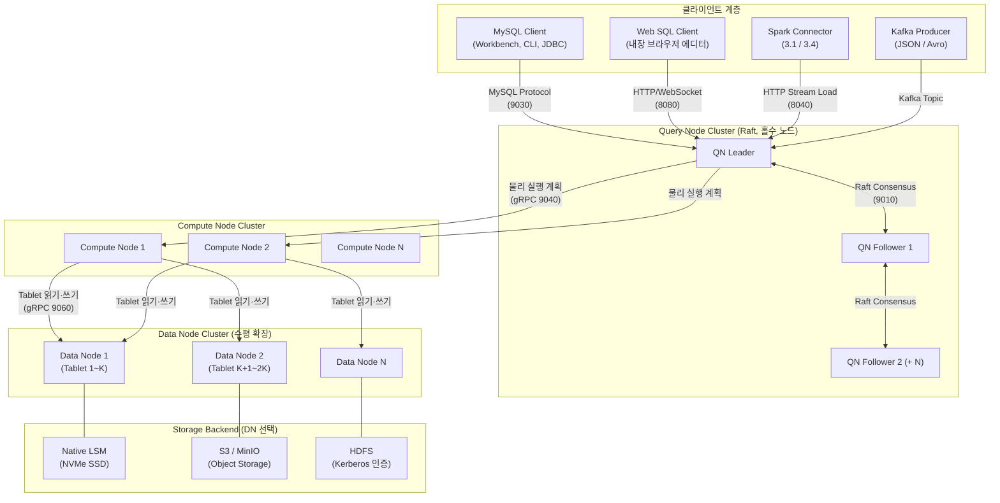
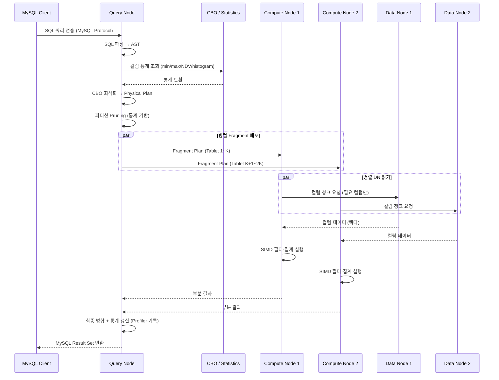
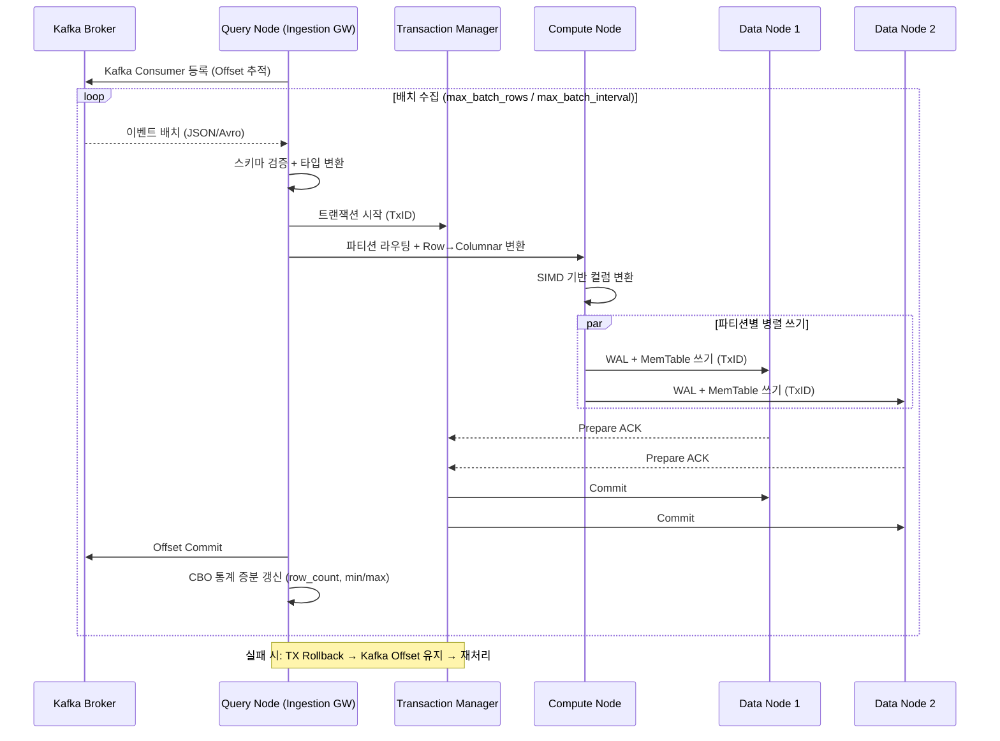
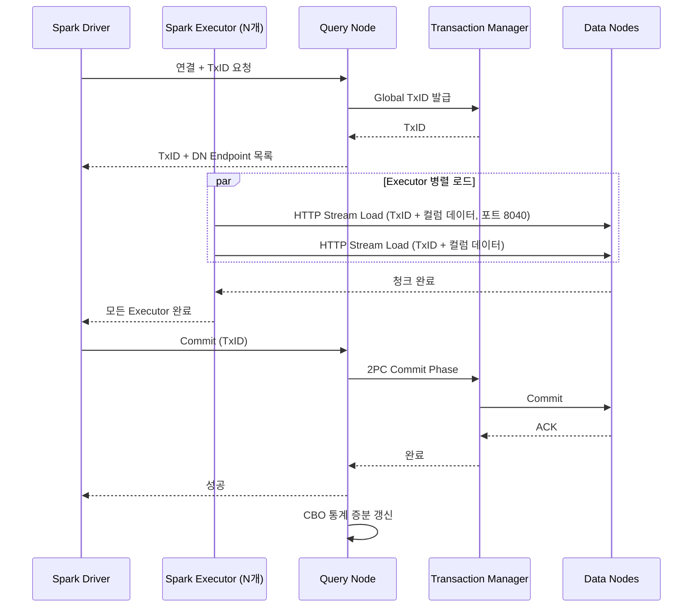
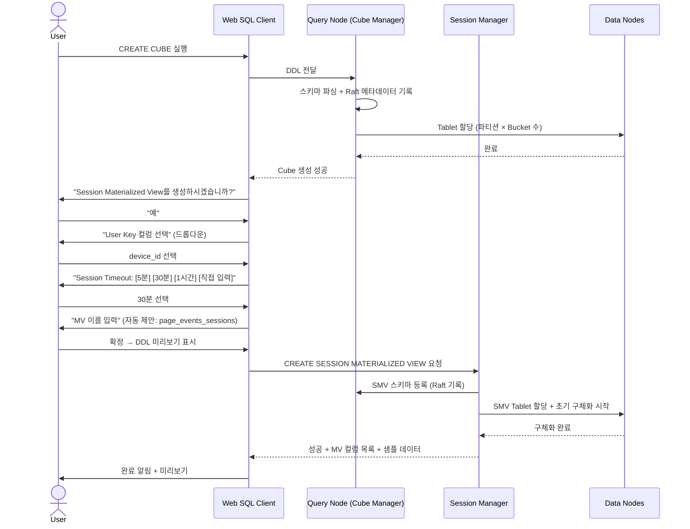
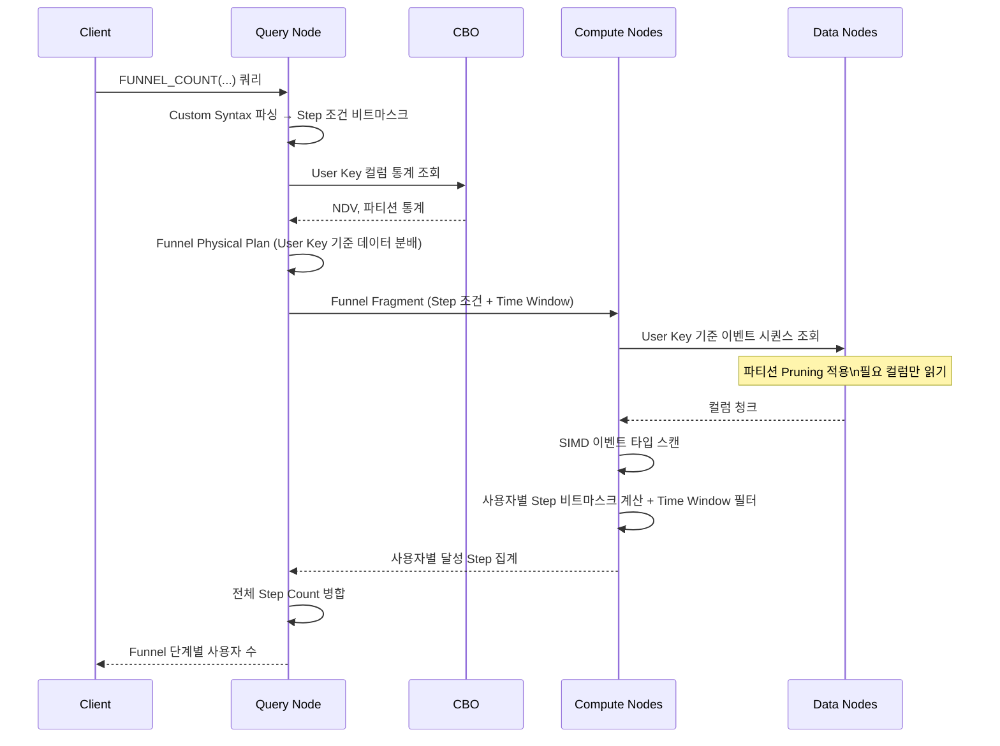
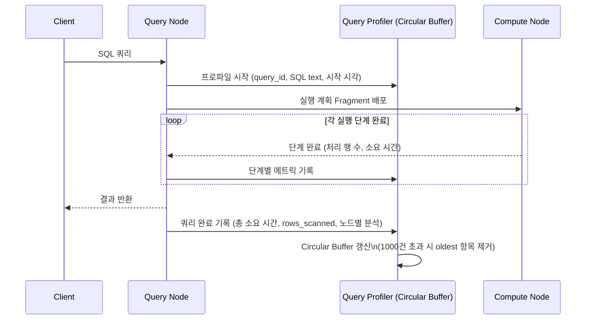
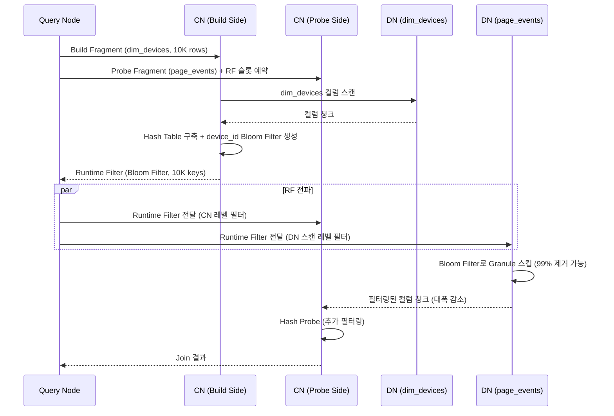

# WOW-DB Software Requirements Specification

---

| 항목 | 내용 |
|---|---|
| 문서 버전 | v0.2 Draft |
| 작성일 | 2026-04-12 |
| 상태 | 초안 (Draft) |
| 프로젝트명 | WOW-DB |
| 참조 시스템 | StarRocks, ClickHouse, RocksDB, Snowflake |

---

## 목차

1. [개요](#1장-개요)
2. [시스템 아키텍처 및 상호작용 다이어그램](#2장-시스템-아키텍처-및-상호작용-다이어그램)
3. [기능적 요구사항](#3장-기능적-요구사항)
4. [비기능적 요구사항](#4장-비기능적-요구사항)
5. [코드 예제](#5장-코드-예제)

---

# 1장. 개요

## 1.1 문서 목적

본 문서는 **WOW-DB**의 소프트웨어 요구사항 명세서(Software Requirements Specification)이다.
WOW-DB는 웹 분석에 특화된 MySQL 호환 OLAP 데이터베이스로서, 이벤트 기반의 데이터 수집·저장·분석을 주목적으로 한다.
본 문서는 설계자, 개발자, QA 엔지니어가 시스템을 구현하고 검증하기 위한 기준 문서로 활용된다.

## 1.2 시스템 배경 및 범위

### 1.2.1 배경

현대 웹 서비스는 수백억 건 이상의 사용자 이벤트를 생성한다. 기존 범용 OLAP 데이터베이스(ClickHouse, StarRocks 등)는 이러한 이벤트 데이터를 저장하고 쿼리하는 데 적합하지만, 다음과 같은 문제를 안고 있다.

- 분석가가 직접 스키마를 설계하고 세션 로직을 구현해야 함
- Funnel·Cohort·Path 분석을 위한 커스텀 SQL 작성 부담
- 이벤트 → 세션 변환 파이프라인을 별도로 구축해야 함
- Storage와 Compute가 결합되어 있어 독립적 확장 불가

WOW-DB는 이러한 문제를 해결하기 위해, **이벤트 Cube 정의만으로 자동 세션화(Sessionization) Materialized View를 생성**하고, 웹 분석에 특화된 함수(FUNNEL, COHORT, PATH)를 내장하며, Storage와 Compute를 분리한 3-Tier 분산 아키텍처를 채택한다.

### 1.2.2 범위

WOW-DB가 커버하는 범위:

- 이벤트 데이터의 대용량 수집 (Kafka, Spark, MySQL INSERT)
- 컬럼 지향 LSM-Tree 기반 분산 스토리지 (Native / S3 / HDFS)
- 웹 분석 전용 쿼리 엔진 (SIMD 가속, CBO 최적화)
- 대화형 Session Materialized View 생성 (Web UI)
- MySQL 클라이언트 프로토콜 호환
- 클러스터 모니터링 및 Query Profiler

WOW-DB가 커버하지 않는 범위:

- OLTP 워크로드 (높은 빈도의 point update)
- 지리공간(GIS) 분석
- 머신러닝 학습 (분석 결과 제공만 가능)

## 1.3 주요 용어 정의

| 용어 | 정의 |
|---|---|
| **Event** | 웹 서비스에서 사용자가 발생시킨 단일 행동 단위 (예: page_view, click, purchase) |
| **Cube** | WOW-DB에서 이벤트 데이터를 저장하는 논리적 스키마 단위. `CREATE CUBE` DDL로 정의 |
| **Session** | 동일 사용자가 일정 시간 내에 연속적으로 발생시킨 이벤트의 묶음 |
| **Session Materialized View (SMV)** | Cube로부터 자동 생성된 세션화 뷰. 세션 ID, 세션 시작/종료 시각, 이벤트 시퀀스 등이 포함됨 |
| **User Key** | 사용자를 식별하는 컬럼. `user_id`, `device_id` 등 사용자가 지정 |
| **Session Timeout** | 연속 이벤트 간 허용되는 최대 비활성 시간. 이 시간을 초과하면 새 세션으로 분리 |
| **Funnel Analysis** | 사전 정의된 단계(Step)를 순서대로 수행한 사용자 전환율 분석 |
| **Cohort Analysis** | 특정 기준일(진입 이벤트 기준)로 그룹화된 사용자의 재방문/전환 추적 |
| **Path Analysis** | 사용자가 실제로 이동한 이벤트 시퀀스 패턴 분석 |
| **Query Node (QN)** | SQL 파싱·CBO·플래닝·메타데이터 관리·사용자 Frontend 담당 노드. 홀수 개로 Raft 클러스터 구성. Stateless 설계로 K8s LoadBalancer 라우팅 지원 |
| **Compute Node (CN)** | Query Node의 물리 실행 계획을 수행하는 Worker 노드. Data Node와 co-located 또는 독립 배치 가능 |
| **Data Node (DN)** | 컬럼 지향 LSM-Tree 기반 스토리지 담당 노드. 수평 확장 가능. Native/S3/HDFS 백엔드 지원 |
| **CBO** | Cost-Based Optimizer. 컬럼 통계(min/max/NDV/Histogram)를 기반으로 최적 실행 계획을 선택 |
| **NDV** | Number of Distinct Values. 컬럼의 유니크 값 종류 수 (CBO 통계 항목) |
| **Tablet** | Data Node에서 데이터를 분산 저장하는 최소 물리 단위 |
| **Partition** | Cube의 데이터를 시간 또는 키 범위로 나눈 논리 단위. **파티션 내에서만 LSM Merge 발생** |
| **Sort Key** | 파티션 내 LSM Merge 및 SSTable 정렬 기준. `ORDER BY`로 지정 |
| **SIMD** | Single Instruction Multiple Data. CPU 벡터 연산을 활용한 병렬 데이터 처리 |
| **LSM-Tree** | Log-Structured Merge Tree. 쓰기에 최적화된 트리 구조 스토리지 |
| **Query Profiler** | 최근 최대 1,000건의 쿼리 실행 이력(SQL, 소요 시간, 노드별 처리량)을 기록하는 모듈 |
| **Storage Backend** | Data Node의 물리 저장소 종류: Native LSM (로컬 NVMe), S3, HDFS (Kerberos 인증 필수) |
| **Pre-aggregation MV** | 원본 Cube의 GROUP BY 집계 결과를 물리 저장하는 Materialized View. INSERT 시점 또는 주기 갱신. 반복 대시보드 쿼리를 MV에서 처리하여 응답 가속 |
| **TTL (Time-To-Live)** | 행 또는 파티션 단위 데이터 만료 정책. 지정 기간 경과 후 Compaction 시 자동 삭제 또는 Cold 스토리지로 이동 |
| **Tiered Storage** | 접근 빈도 기반 Hot(NVMe) → Cold(S3) 자동 이동. 오래된 파티션을 저비용 스토리지로 마이그레이션 |
| **Data Skipping Index** | SSTable 내 Granule(고정 행 블록) 단위 MINMAX / BLOOM / SET / NGRAMBF 인덱스. 불필요한 Granule 읽기를 스킵 |
| **Granule** | Data Skipping Index의 최소 단위. SSTable 내 연속된 고정 행 블록 (기본 8,192행) |
| **Flat JSON** | JSON 컬럼의 key별 데이터 출현율을 Compaction 시 분석하여, 임계값 이상인 key를 자동으로 독립 컬럼 파일로 추출·저장하는 기능. 추출된 컬럼은 일반 컬럼과 동일하게 SIMD 스캔·Bloom Filter·CBO 통계 적용 |
| **Runtime Filter** | Hash Join Build Side에서 생성한 Bloom/In-list/MinMax Filter를 Probe Side CN 및 DN 스캔에 동적 전파하여 스캔량을 극적으로 감소 |
| **Query Result Cache** | 동일 Logical Plan + 동일 파티션 버전에 대한 Tablet 단위 집계 결과를 CN 메모리에 캐시 |
| **Colocate Group** | 동일 분산 키·버킷 수를 가진 Cube들을 동일 DN 버킷에 배치하는 그룹. 그룹 내 Join은 네트워크 Shuffle 없이 로컬 처리 |
| **Auto Partition** | INSERT 시 매칭 파티션 부재 시 QN이 시간 단위(일/월/연)에 따라 자동으로 파티션 생성 |
| **DOP (Degree of Parallelism)** | CN 내 단일 쿼리 Fragment를 처리하는 병렬 파이프라인 수. CPU 코어 수 기반 자동 결정, 명시적 제어 가능 |
| **Global Dictionary** | 저기수 문자열 컬럼(event_name 등)에 대해 QN이 클러스터 전체 공유 정수 사전을 구축. 모든 DN이 동일 코드 사용으로 비교 연산 가속 |
| **Async INSERT** | MySQL INSERT를 즉시 LSM에 쓰지 않고 QN 메모리 버퍼에 누적 후 일괄 플러시. 고빈도 소형 INSERT의 쓰기 증폭 감소 |
| **External Table** | S3/HDFS/Hive Metastore/Iceberg 등 외부 스토리지를 임포트 없이 직접 쿼리하는 가상 테이블 |
| **Resource Group** | 사용자·롤 단위로 CPU/메모리/동시 쿼리 수/타임아웃을 제한하는 자원 관리 정책 단위 |

## 1.4 시스템 개요

WOW-DB는 다음 여섯 가지 핵심 가치를 중심으로 설계된다.

```
1. 웹 분석 최적화      : Event → Session 변환 자동화, 전용 분석 함수 내장
2. 대용량 처리         : 200억+ 레코드, Data Node 수평 확장
3. 실시간 수집         : Kafka, Spark Streaming, MySQL INSERT 동시 지원
4. MySQL 호환성        : 기존 MySQL 클라이언트/툴/드라이버 그대로 연결
5. Storage-Compute 분리: Compute Node와 Data Node 독립 확장, 클라우드 스토리지 지원
6. 개발자 친화성       : Web SQL Editor, 대화형 Cube Builder, Profiler, Monitoring 내장
```

## 1.5 설계 원칙

| 원칙 | 설명 |
|---|---|
| **Write Optimized First** | LSM-Tree 채택으로 대용량 이벤트 스트림 수집 최우선 |
| **Column-Oriented Storage** | 컬럼 단위 파일 저장으로 분석 쿼리 IO 최소화 |
| **SIMD Everywhere** | 스캔, 집계, 필터, 해시 조인 모든 연산에 AVX2 이상 적용 |
| **Schema on Write** | Cube 정의 시 스키마 확정으로 쿼리 성능 보장 |
| **Guided Analytics** | 대화형 UI로 세션/분석 설정 가능 |
| **Storage-Compute Separation** | DN과 CN 분리로 독립 확장 및 S3/HDFS 클라우드 활용 |
| **Stateless Query Nodes** | 모든 QN이 Raft 복제 메타데이터 보유 → K8s 무작위 라우팅 가능 |
| **CBO-Driven Planning** | 쿼리 통계 기반 비용 최적화, 불필요 파티션/파일 스캔 제거 |

## 1.6 참조 시스템

- **StarRocks 3.x**: FE/BE 분리 아키텍처, Tablet 분산, Routine Load 설계 참조
- **ClickHouse**: 실시간 수집, MergeTree 컬럼 저장, SIMD 활용 참조
- **Snowflake**: Storage-Compute 분리, 멀티 클라우드 스토리지 참조
- **RocksDB**: LSM-Tree 구현체 참조 (WOW-DB는 Rust로 자체 구현)
- **MySQL 8.0**: 클라이언트 프로토콜, DDL/DML 문법 호환 기준

---

# 2장. 시스템 아키텍처 및 상호작용 다이어그램

## 2.1 전체 시스템 아키텍처



> **Storage-Compute 분리 모드**: CN과 DN을 별도 호스트에 배치, S3/HDFS를 공유 스토리지로 사용. CN만 독립 확장 가능.
>
> **Co-located 모드**: CN과 DN을 동일 호스트에서 실행. 네트워크 오버헤드 최소화, 온프레미스 환경에 적합.

## 2.2 Query Node (QN) 상세 구조

### 2.2.1 QN 역할

| 컴포넌트 | 책임 |
|---|---|
| MySQL Protocol Handler | MySQL 8.0 Wire Protocol 처리 (포트 9030) |
| Web Server | Web SQL Editor REST API + WebSocket (포트 8080) |
| SQL Parser | MySQL 호환 SQL + WOW-DB Custom Syntax 파싱, AST 생성 |
| CBO (Cost-Based Optimizer) | 컬럼 통계 기반 Logical → Physical Plan 최적화 |
| Statistics Manager | 컬럼별 min/max/NDV/Histogram 통계 수집·저장·제공 |
| Logical Planner | AST → 논리 계획 변환 (Join 순서, 집계 방식 결정) |
| Physical Planner | 논리 계획 → 분산 물리 계획 (CN Fragment 할당) |
| Cube Manager | CREATE/ALTER/DROP CUBE DDL, 스키마 메타데이터 관리 |
| Session Manager | Session MV 생성 대화 흐름, MV 갱신 스케줄 관리 |
| Ingestion Gateway | Kafka Offset 추적, Spark 트랜잭션 코디네이션 |
| Transaction Manager | 2-Phase Commit (2PC) 프로토콜 구현 |
| Monitoring Service | 클러스터 전체 상태 수집·제공 (Prometheus `/metrics`) |
| Query Profiler | 최근 1,000건 쿼리 실행 이력 기록 (Circular Buffer) |

### 2.2.2 QN HA 구성 및 Raft 메타데이터

- **노드 수**: 반드시 홀수 (3, 5, 7, ...). Raft 과반수 보장을 위해 필수
- **Leader**: 모든 쓰기 요청 처리, 메타데이터 변경 권한, CN 작업 할당
- **Follower**: 읽기 요청 분산 처리, Leader 장애 시 자동 선출
- **메타데이터 내용**: Cube 스키마, Tablet 위치 맵, 컬럼 통계, Routine Load 상태, 세션 토큰
- **동기화**: 모든 메타데이터 변경은 Raft WAL로 팔로워에 복제 후 클라이언트 응답

### 2.2.3 QN Stateless 설계 (Kubernetes 대응)

```
[K8s LoadBalancer / Service]
         ↓ (라운드로빈 또는 랜덤)
  QN-Pod-1 | QN-Pod-2 | QN-Pod-3
         ↓
  모두 동일한 Raft 복제 메타데이터 보유
  → 어떤 QN 파드에 접속해도 동일한 응답 보장
```

- QN 요청 처리에 필요한 모든 상태를 Raft 메타스토어에서 읽음
- 로컬 인메모리 캐시는 TTL 기반 무효화
- Web Client 세션 토큰은 Raft KV에 저장 → 모든 QN에서 검증 가능

### 2.2.4 CBO (Cost-Based Optimizer)

**수집 통계 항목:**

| 통계 | 설명 | 수집 시점 |
|---|---|---|
| `row_count` | 파티션·Tablet별 레코드 수 | 쓰기 완료 시 증분 |
| `min_val` | 컬럼의 최솟값 | SSTable Flush 시 |
| `max_val` | 컬럼의 최댓값 | SSTable Flush 시 |
| `ndv` | 컬럼의 유니크 값 수 (HyperLogLog 추정) | 쿼리 실행 시 샘플링 |
| `null_count` | NULL 값 수 | SSTable Flush 시 |
| `histogram` | 컬럼 값 분포 버킷 (기본 100 버킷) | `ANALYZE TABLE` 또는 자동 |

**CBO 활용 예:**

| 최적화 | 활용 통계 |
|---|---|
| **파티션 Pruning** | `min_val`, `max_val` 으로 WHERE 조건 비교 → 불필요 파티션 스캔 제거 |
| **Join 순서** | `row_count`, `ndv` 로 Build/Probe 측 결정 |
| **집계 전략** | `ndv` 기반 Hash Agg vs Sort Agg 선택 |
| **Index 활용** | BITMAP 인덱스의 `ndv` 가 낮을 때 우선 사용 |
| **Predicate Pushdown** | `histogram` 으로 선택도 추정 → DN 레벨 필터 적용 여부 결정 |

## 2.3 Compute Node (CN) 상세 구조

### 2.3.1 CN 역할

Compute Node는 Query Node의 Physical Planner가 생성한 실행 계획을 실제로 수행하는 Worker이다.

| 컴포넌트 | 책임 |
|---|---|
| Execution Engine | Physical Plan Fragment 수신 및 Pipeline 실행 |
| SIMD Executor | AVX2/AVX-512 기반 컬럼 스캔, 필터, 집계 |
| Hash Join Engine | SIMD 기반 해시 빌드·프로브, Partitioned Hash Join |
| Sort / Merge Engine | 정렬, Merge Sort, Top-K |
| Vectorized Aggregation | GROUP BY, 집계 함수의 벡터화 실행 |
| Data Shuffle | 분산 Join·Aggregation을 위한 CN 간 데이터 교환 |
| Pipeline Scheduler | 비동기 파이프라인 실행, 백프레셔(backpressure) 관리 |
| Session/Funnel/Path Executor | FUNNEL_COUNT, COHORT_ANALYSIS, PATH_ANALYSIS 전용 실행기 |

### 2.3.2 Co-located 모드 vs. 분리 모드

| 항목 | Co-located 모드 | 분리(Decoupled) 모드 |
|---|---|---|
| **배치** | CN + DN 동일 호스트 | CN과 DN 별도 호스트 |
| **데이터 접근** | 로컬 파일 직접 읽기 | 네트워크를 통해 DN 또는 S3/HDFS 접근 |
| **확장 방식** | CN/DN 함께 확장 | CN만 독립 확장 가능 |
| **권장 환경** | 온프레미스 NVMe 서버 | 클라우드 (S3/HDFS 공유 스토리지) |
| **성능** | 최고 (로컬 IO) | 약간 낮음 (네트워크 IO) |

## 2.4 Data Node (DN) 상세 구조

### 2.4.1 DN 역할

| 컴포넌트 | 책임 |
|---|---|
| Partition Manager | Sort Key 기반 파티션 라우팅 |
| LSM-Tree Engine | MemTable + WAL + SSTable 관리 (파티션 단위) |
| Compaction Service | Partition 경계 내 Leveled Compaction (백그라운드) |
| Columnar File Writer | 컬럼 단위 SSTable 파일 생성 |
| Storage Abstraction Layer | Native / S3 / HDFS 백엔드 통합 인터페이스 |
| Block Cache | LRU 기반 SSTable 블록 캐시 (컬럼 블록 단위) |
| WAL | 크래시 복구를 위한 Write-Ahead Log |
| Bloom Filter | SSTable별 Bloom Filter (point lookup 최적화) |

### 2.4.2 컬럼 지향 파티션 파일 구조

WOW-DB는 컬럼 지향(Column-Oriented) DB이다. 각 컬럼은 파티션 단위로 독립된 파일로 저장된다.

```
Data Node 스토리지 레이아웃

analytics/page_events/
├── partition=p_2024_q1/
│   ├── device_id/
│   │   ├── seg_0001.col        ← 컬럼 데이터 (압축: LZ4/ZSTD)
│   │   ├── seg_0001.bloom      ← Bloom Filter
│   │   └── seg_0001.min_max    ← CBO용 Min/Max 통계
│   ├── event_name/
│   │   ├── seg_0001.col
│   │   └── seg_0001.dict       ← Dictionary 인코딩 (저기수 컬럼)
│   ├── event_time/
│   │   └── seg_0001.col        ← Delta 인코딩 (단조 증가 시계열)
│   ├── properties/
│   │   ├── seg_0001.col        ← JSON 원본 저장 (ZSTD 압축)
│   │   └── _flat/              ← Flat JSON 자동 추출 컬럼
│   │       ├── product_id/     ← 출현율 ≥ 임계값인 key 자동 컬럼화
│   │       │   ├── seg_0001.col
│   │       │   ├── seg_0001.min_max
│   │       │   └── seg_0001.bloom
│   │       ├── price/
│   │       │   ├── seg_0001.col
│   │       │   └── seg_0001.min_max
│   │       └── _flat_meta.json ← 추출된 key 목록, 출현율, 추론 타입
│   └── _meta/
│       ├── schema.json         ← 파티션 스키마 메타데이터
│       └── stats.json          ← CBO용 컬럼 통계 (flat 컬럼 포함)
├── partition=p_2024_q2/
│   └── ...
└── _cube_meta/
    └── tablet_map.json         ← Tablet → DN 매핑
```

**컬럼 인코딩 전략:**

| 컬럼 특성 | 인코딩 | 예시 |
|---|---|---|
| 저기수(NDV < 1000) | Dictionary Encoding | event_name, country_code |
| 단조 증가 | Delta Encoding | event_time, sequence_id |
| 고기수 문자열 | Plain + LZ4 | device_id, page_url |
| 정수 | BitPacking | session_event_count |
| JSON | Plain + ZSTD + Flat JSON 자동 추출 | properties |

### 2.4.3 LSM-Tree 파티션 내 Merge

```
파티션 내 LSM-Tree 동작:

Write Path:
  새 이벤트 도착
    → WAL 기록
    → MemTable에 Sort Key(ORDER BY) 기준 정렬 삽입
    → MemTable 임계값 초과 → Immutable MemTable 전환
    → Flush: 파티션 디렉토리에 컬럼별 SSTable 파일 생성 (Level 0)
    → 백그라운드 Compaction: Level 0 → Level N (파티션 경계 내)

파티션 경계 규칙:
  - LSM Merge는 파티션 내부에서만 발생 (파티션 간 Merge 없음)
  - 파티션 Pruning: CBO가 min_val/max_val 통계로 불필요 파티션 스킵
```

### 2.4.4 스토리지 백엔드

#### Native LSM (로컬 NVMe)

- 기본 백엔드. DN과 동일 호스트 로컬 디스크
- I/O: Rust `tokio::fs` + `io_uring` (Linux, 비동기 DIO)
- 권장: NVMe SSD, XFS 파일시스템, noatime 마운트

#### S3 Backend

- AWS S3 및 S3 호환 스토리지 (MinIO, Ceph RGW 등) 지원
- SSTable 파일 단위 Object PUT/GET/DELETE
- 로컬 LRU 캐시 레이어: 반복 접근 블록 캐시 (크기 설정 가능)

```toml
# data_node.toml
[storage]
backend          = "s3"
bucket           = "wowdb-data"
prefix           = "analytics/"
region           = "ap-northeast-2"
local_cache_dir  = "/tmp/wowdb_cache"
local_cache_size = "128GB"
# 인증: 환경변수 AWS_ACCESS_KEY_ID / AWS_SECRET_ACCESS_KEY 또는 IAM Role
```

#### HDFS Backend (Kerberos 인증 필수)

- Hadoop 3.x HDFS 지원
- **Kerberos 인증은 필수** (비인증 HDFS 접속 불허)
- keytab 자동 갱신 (`kerberos_renew_interval_sec` 설정)

```toml
# data_node.toml
[storage]
backend                     = "hdfs"
namenode                    = "hdfs://namenode:8020"
base_path                   = "/wowdb/analytics"
kerberos_keytab             = "/etc/security/keytabs/wowdb.keytab"
kerberos_principal          = "wowdb/dn-host@REALM.COM"
kerberos_renew_interval_sec = 3600
```

## 2.5 상호작용 다이어그램 (Interaction Diagrams)

### 2.5.1 SELECT 쿼리 실행 흐름



### 2.5.2 Kafka Streaming Ingestion 흐름



### 2.5.3 Spark Ingestion 흐름



### 2.5.4 Cube 생성 및 Session MV 대화 흐름 (Web UI)



### 2.5.5 Funnel 분석 쿼리 실행 흐름



### 2.5.6 Query Profiler 기록 흐름



## 2.6 분산 클러스터 구성

### 2.6.1 최소 운영 구성

```
Query Node  : 3 노드 (홀수 필수, Raft Leader 1 + Follower 2)
Compute Node: 2 노드 이상 (DN co-located 또는 별도)
Data Node   : 3 노드 이상 (Tablet 복제본 3개 보장)
```

### 2.6.2 대용량 운영 구성 (200억+ 레코드 기준)

```
Query Node  : 3 또는 5 노드
Compute Node: 8~16 노드 (분리 모드, S3/HDFS 공유 스토리지)
              또는 co-located with DN
Data Node   : 10~30 노드 (NVMe SSD 또는 S3/HDFS)
```

### 2.6.3 포트 구성

| 노드 | 포트 | 용도 |
|---|---|---|
| Query Node | 9030 | MySQL Wire Protocol |
| Query Node | 8080 | Web SQL Client HTTP/WebSocket |
| Query Node | 9010 | 내부 Raft 통신 (QN 간) |
| Query Node | 9011 | QN ↔ CN/DN 내부 gRPC |
| Compute Node | 9040 | Fragment Plan 수신 (gRPC) |
| Data Node | 9060 | 내부 스토리지 API (gRPC) |
| Data Node | 8040 | HTTP Stream Load (Spark 커넥터) |
| 모든 노드 | 9090 | Prometheus `/metrics` |

## 2.7 고급 최적화 메커니즘

### 2.7.1 Runtime Filter (동적 조건 전파)

StarRocks Runtime Filter 참조. Hash Join 수행 중 Build Side(소형 테이블)에서 생성한 필터를 Probe Side의 CN 및 DN 스캔 레벨에 동적으로 전파하여 불필요한 행 읽기를 극적으로 감소시킨다.



**Runtime Filter 유형:**

| 타입 | 생성 조건 | DN 적용 | 설명 |
|---|---|---|---|
| Bloom Filter | Build NDV < 10M | 가능 | 존재 여부 확률적 판단 |
| In-list Filter | Build NDV < 1,024 | 가능 | 소형 집합 완전 일치 |
| Min-Max Filter | 범위 조인 | 가능 | 값 범위 기반 Granule 스킵 |

QN Physical Planner는 Build Side NDV 통계를 기반으로 RT Filter 생성 여부를 자동 결정한다.

---

### 2.7.2 인트라-노드 파이프라인 병렬성 (DOP)

StarRocks Pipeline Execution Engine 참조. CN 내 단일 Fragment를 DOP(Degree of Parallelism) 수만큼의 병렬 파이프라인으로 쪼개어 멀티코어를 완전 활용한다.

```
CN 내부 Fragment 파이프라인 (DOP=4 예시):

  QN이 CN에 Fragment Plan 배포
         ↓
  Fragment Scheduler (1개)
         ↓ 데이터 분할
  Pipeline-1  Pipeline-2  Pipeline-3  Pipeline-4
  (Scan+Filter)(Scan+Filter)(Scan+Filter)(Scan+Filter)
       ↓            ↓            ↓            ↓
  Aggregator  Aggregator  Aggregator  Aggregator
       ↓            ↓            ↓            ↓
         Merge Aggregator (단일 쓰레드)
                   ↓
            결과를 QN으로 전송
```

- **기본 DOP**: CN CPU 코어 수 / 2 (HyperThread 고려)
- **자동 조정**: 파티션 수·데이터 볼륨이 DOP보다 적으면 자동 축소 (오버헤드 방지)
- **명시적 제어**: `SET max_dop = 16;`
- QN Physical Planner가 Fragment 수(CN 간) × DOP(CN 내) 두 수준의 병렬성을 결정

---

### 2.7.3 Global Dictionary (전역 문자열 사전)

StarRocks Global Dictionary 참조. 저기수 문자열 컬럼에 대해 클러스터 전체가 동일한 정수 코드를 사용하여 비교·집계 연산을 정수 연산으로 대체한다.

```
Global Dictionary 없는 경우:
  DN-1: p_2024_q1/event_name/seg.dict → {page_view:0, click:1, purchase:2}
  DN-2: p_2024_q2/event_name/seg.dict → {click:0, purchase:1, page_view:2}
  → DN 간 코드가 달라 JOIN/GROUP BY 시 문자열 비교 필요

Global Dictionary 적용 후:
  QN Raft KV: event_name global dict → {page_view:1, click:2, purchase:3, ...}
  모든 DN이 동일 정수 코드 사용
  → GROUP BY event_name: 정수 비교 (SIMD 처리, 10~30% 성능 향상)
  → COUNT(DISTINCT event_name): 정수 집합 연산
```

**대상 컬럼 조건**: NDV < 32,768 (16-bit 인코딩), VARCHAR/CHAR 타입, 자주 GROUP BY/JOIN 대상

**DDL 선언**:
```sql
event_name   VARCHAR(128) ENCODING GLOBAL_DICT,
country_code CHAR(2)      ENCODING GLOBAL_DICT,
```

**관리**:
- 신규 값 INSERT 시 사전에 자동 추가 (QN Raft 동기화)
- NDV 초과(32,768) 또는 비활성화 시 Per-partition Local Dictionary로 자동 폴백
- `SHOW GLOBAL DICT FOR page_events;` 로 사전 상태 조회

---

# 3장. 기능적 요구사항

## 3.1 Event Cube 관리

### 3.1.1 Cube 생성 (FR-CUBE-001)

**지원 옵션:**

| 옵션 | 필수 여부 | 설명 |
|---|---|---|
| 컬럼 정의 | 필수 | 이름, 타입, NOT NULL, COMMENT, CODEC |
| ENGINE | 필수 | `WOW_LSM` 고정 |
| PARTITION BY | 선택 | RANGE(datetime), RANGE + HASH, 또는 AUTO PARTITION INTERVAL |
| DISTRIBUTED BY | 필수 | HASH 기반 Tablet 분산 키 |
| ORDER BY | 권장 | LSM Sort Key. 파티션 내 SSTable 정렬 기준 |
| PROPERTIES | 선택 | 복제본 수, 압축 알고리즘, 스토리지 백엔드, TTL, colocate_with 등 |
| INDEX | 선택 | BITMAP (행 레벨), MINMAX/BLOOM_FILTER/SET/NGRAMBF_V1 (Granule 단위 Skip Index) |

**컬럼 CODEC 선언 (ClickHouse CODEC 참조):**

각 컬럼에 압축·인코딩 코덱을 명시적으로 지정할 수 있다. 미지정 시 컬럼 특성에 따라 자동 선택.

| 코덱 | 대상 | 설명 |
|---|---|---|
| `CODEC(Delta(4), ZSTD(1))` | 단조 증가 정수·시계열 | Delta 인코딩 후 ZSTD 압축 |
| `CODEC(DoubleDelta, ZSTD)` | 타임스탬프 시퀀스 | Double Delta로 초당 변화량 인코딩 |
| `CODEC(Gorilla, LZ4)` | 부동소수점 | Gorilla 알고리즘 (XOR 기반) + LZ4 |
| `CODEC(ZSTD(3))` | 고기수 문자열 | ZSTD 압축 레벨 3 |
| `CODEC(LZ4HC(9))` | 읽기 집약적 컬럼 | LZ4HC 고압축비 |
| `CODEC(NONE)` | 압축 비활성화 | 초소형 고속 컬럼 |

**지원 데이터 타입:**

| 카테고리 | 타입 |
|---|---|
| 정수 | TINYINT, SMALLINT, INT, BIGINT |
| 실수 | FLOAT, DOUBLE, DECIMAL(p, s) |
| 문자열 | VARCHAR(n), CHAR(n), TEXT |
| 날짜/시간 | DATE, DATETIME, TIMESTAMP |
| 반정형 | JSON |
| 불리언 | BOOLEAN |
| 고기수 집계용 | HLL (HyperLogLog), BITMAP |

### 3.1.2 Cube 수정 (FR-CUBE-002)

- `ALTER CUBE ADD COLUMN` 지원 (Online DDL, 서비스 무중단)
- `ALTER CUBE MODIFY COLUMN` 타입 확장만 허용 (축소 불가)
- `ALTER CUBE ADD PARTITION` 파티션 동적 추가
- 컬럼 삭제 시 연관 SMV 자동 무효화 경고

### 3.1.3 Cube 삭제 (FR-CUBE-003)

- `DROP CUBE <name>` 지원
- 연관 SMV 존재 시 `CASCADE` 필수

## 3.2 Session Materialized View (SMV)

### 3.2.1 대화형 SMV 생성 (FR-SMV-001)

```
Step 1: "이 Cube에 대한 Session Materialized View를 생성하시겠습니까?"
        [예] [아니요]

Step 2: "세션을 구분할 User Key 컬럼을 선택하세요"
        → 컬럼 목록 드롭다운 (COALESCE 식 직접 입력도 허용)

Step 3: "Session Timeout을 설정하세요"
        [5분] [30분] [1시간] [직접 입력 (분 단위)]

Step 4: "Materialized View 이름을 입력하세요"
        → 기본값: {cube_name}_sessions

Step 5: 요약 화면 (생성될 DDL SQL 미리보기) → [생성] [취소]
```

### 3.2.2 SMV 자동 생성 컬럼 (FR-SMV-002)

| 컬럼명 | 타입 | 설명 |
|---|---|---|
| `session_id` | VARCHAR(64) | 세션 고유 ID (UUID 기반) |
| `session_start_time` | DATETIME | 세션 첫 이벤트 시각 |
| `session_end_time` | DATETIME | 세션 마지막 이벤트 시각 |
| `session_duration_sec` | BIGINT | 세션 지속 시간 (초) |
| `session_event_count` | INT | 세션 내 이벤트 수 |
| `session_seq` | INT | 세션 내 이벤트 순서 (1부터) |
| `is_new_user` | BOOLEAN | 해당 Cube 기준 첫 세션 여부 |

### 3.2.3 SMV 갱신 전략 (FR-SMV-003)

| 갱신 모드 | 설명 | 권장 사용 |
|---|---|---|
| `REFRESH REALTIME` | 새 이벤트 수집 시 증분 갱신 | Kafka |
| `REFRESH ON DEMAND` | 수동 `REFRESH MATERIALIZED VIEW` | 배치 |
| `REFRESH EVERY <interval>` | 지정 주기 자동 갱신 | Spark 마이크로배치 |

### 3.2.4 세션 경계 판단 알고리즘 (FR-SMV-004)

```
동일 User Key의 연속 이벤트에 대해:
  if (event[i+1].event_time - event[i].event_time) > SESSION_TIMEOUT
    → 새 세션 시작 (session_id 신규 발급)
  else
    → 동일 세션 유지
```

## 3.3 쿼리 엔진

### 3.3.1 MySQL 호환 SQL (FR-QE-001)

| 구문 | 지원 범위 |
|---|---|
| SELECT | FROM, WHERE, GROUP BY, HAVING, ORDER BY, LIMIT, OFFSET |
| JOIN | INNER, LEFT OUTER, CROSS JOIN |
| 집계 함수 | COUNT, SUM, AVG, MIN, MAX, COUNT(DISTINCT) |
| 윈도우 함수 | ROW_NUMBER, RANK, DENSE_RANK, LAG, LEAD, SUM OVER, AVG OVER |
| 서브쿼리 | 스칼라, IN/EXISTS, FROM 절 |
| CTE | WITH 절 (재귀 CTE 포함) |
| JSON 함수 | JSON_EXTRACT, JSON_VALUE, JSON_KEYS, JSON_CONTAINS |
| 날짜 함수 | DATE_FORMAT, DATE_ADD, DATE_DIFF, TIMESTAMPDIFF, NOW() |
| 문자열 함수 | CONCAT, SUBSTRING, LIKE, REGEXP |

### 3.3.2 CBO 통계 수집 (FR-QE-002)

- 쿼리 실행 시 샘플링 방식으로 NDV 추정치 갱신
- SSTable Flush 시 min/max/null_count 자동 수집
- `ANALYZE TABLE` 명령으로 전체 통계 재계산 (백그라운드)
- `SHOW STATS` 명령으로 현재 통계 조회
- 통계는 Raft 메타스토어에 저장 (모든 QN 동기화)

### 3.3.3 Funnel Analysis (FR-QE-003)

```sql
FUNNEL_COUNT(
    <조건1> STEP <n>, ...,
    TIME_WINDOW => INTERVAL <n> <UNIT>,
    STRICT => TRUE | FALSE
)

SELECT * FROM FUNNEL_ANALYSIS(
    SOURCE => '<table>', USER_KEY => '<col>',
    STEPS  => ARRAY['<조건식1>', ...],
    TIME_WINDOW => INTERVAL <n> <UNIT>
)
```

### 3.3.4 Cohort Analysis (FR-QE-004)

```sql
SELECT * FROM COHORT_ANALYSIS(
    SOURCE => '<table>', ENTRY_EVENT => '<event>',
    RETURN_EVENT => '<event>', COHORT_DATE => <날짜 표현식>,
    METRIC => 'RETENTION_RATE' | 'USER_COUNT' | 'CONVERSION_RATE',
    TIME_UNIT => 'DAY' | 'WEEK' | 'MONTH',
    MAX_PERIODS => <n>, USER_KEY => '<col>'
)
```

### 3.3.5 Path Analysis (FR-QE-005)

```sql
SELECT * FROM PATH_ANALYSIS(
    SOURCE => '<table>', PATH_EVENT => '<col>',
    USER_KEY => '<col>', SESSION_KEY => '<col>',
    MAX_DEPTH => <n>, MIN_SUPPORT => <0.0~1.0>,
    ENTRY_FILTER => '<조건식>', EXIT_FILTER => '<조건식>'
)
```

### 3.3.6 Custom Query 문법 (FR-QE-006)

| 구문 | 설명 |
|---|---|
| `CREATE CUBE` | 이벤트 스키마 정의 |
| `CREATE SESSION MATERIALIZED VIEW` | 세션화 MV 생성 |
| `REFRESH MATERIALIZED VIEW` | MV 수동 갱신 |
| `CREATE ROUTINE LOAD` | Kafka 지속 수집 작업 등록 |
| `SHOW CUBES` / `SHOW SESSIONS` | Cube / SMV 목록 조회 |
| `EXPLAIN PHYSICAL` | 물리 실행 계획 출력 |
| `SHOW TABLET STATUS` | Tablet 분산 상태 조회 |
| `ANALYZE TABLE` / `SHOW STATS` | CBO 통계 재계산 / 조회 |
| `SHOW QUERY PROFILE` | Query Profiler 이력 조회 |
| `SHOW CLUSTER STATUS` | 전체 노드 상태 조회 |

## 3.4 데이터 수집 (Ingestion)

### 3.4.1 MySQL INSERT (FR-ING-001)

- 표준 `INSERT INTO ... VALUES` 및 `INSERT INTO ... SELECT` 지원
- 성능 목표: QN 단일 노드 기준 초당 100,000건 이상

### 3.4.2 Kafka Streaming Ingestion (FR-ING-002)

| 기능 | 설명 |
|---|---|
| 포맷 | JSON, Avro, CSV |
| Offset 관리 | OFFSET_BEGINNING, OFFSET_END, 특정 Offset |
| 병렬 소비 | 파티션별 병렬 Consumer |
| 스키마 검증 | 타입 불일치 레코드 → Dead Letter Queue |
| 보안 | SASL/SSL 지원 |
| Exactly-once | Kafka 트랜잭션 API + WOW-DB 2PC |
| 모니터링 | `SHOW ROUTINE LOAD` 상태·Lag 조회 |

### 3.4.3 Spark Batch/Micro-batch Ingestion (FR-ING-003)

| Spark 버전 | API | 특이사항 |
|---|---|---|
| 3.1 | DataSource V1 | HTTP Stream Load (DN 포트 8040) |
| 3.4 | DataSource V2 | 분산 트랜잭션, Structured Streaming |

### 3.4.4 트랜잭션 지원 (FR-ING-004)

- Kafka, Spark 모두 2PC 트랜잭션 지원
- 타임아웃 설정 가능 (기본 5분), 실패 시 자동 롤백
- 트랜잭션 로그: QN WAL에 보관

## 3.5 스토리지 엔진

### 3.5.1 LSM-Tree 구현 (FR-ST-001)

| 구성요소 | 요구사항 |
|---|---|
| MemTable | Skip List 기반, Arc + RwLock 동시성 |
| WAL | Append-only, 세그먼트 방식, CRC32 체크섬 |
| SSTable | 컬럼별 독립 파일, Bloom Filter, LZ4/ZSTD 압축 |
| Block Cache | LRU 기반, 컬럼 블록 단위 |
| Compaction | Leveled Compaction, **파티션 내부에서만** |
| MVCC | 버전 태그 기반 스냅샷 격리 |

### 3.5.2 SIMD 가속 (FR-ST-002)

| 연산 | 최소 ISA |
|---|---|
| 컬럼 스캔, WHERE 필터, SUM/COUNT/MIN/MAX | AVX2 |
| LIKE 패턴 매칭 | SSE4.2 |
| 해시 조인, BITMAP 집계, Row→Columnar 변환 | AVX2 |

- 런타임 `cpuid` 감지로 AVX-512 자동 활성화

### 3.5.3 스토리지 백엔드 (FR-ST-003)

| 백엔드 | 설정 값 | 인증 |
|---|---|---|
| Native LSM | `backend = "local"` | OS 파일 권한 |
| S3 | `backend = "s3"` | AWS IAM Role 또는 Access Key |
| HDFS | `backend = "hdfs"` | **Kerberos 필수** |

### 3.5.4 Materialized View 관리 (FR-ST-004)

- SMV는 독립 Cube로 물리 저장 (독립 Tablet 할당)
- 증분 갱신: 새 이벤트 도착 시 영향 세션만 재계산

## 3.6 Web SQL Client (FR-WEB)

| 기능 | 설명 |
|---|---|
| SQL 편집기 | 코드 하이라이팅, 자동완성, 결과 표시, 다중 탭, Explain 시각화 |
| Cube Builder | 컬럼/파티션/백엔드 GUI 설정, DDL 미리보기, SMV 생성 진입 |
| **JSON Column Inspector** | JSON 컬럼의 Flat JSON 상태, 추출 key 목록, 수동/자동 구분, 출현율 차트 시각화 및 GUI 관리 |
| Profiler 화면 | 최근 1,000건 쿼리 이력 테이블 (정렬·필터) |
| Cluster 모니터링 | 노드별 CPU/메모리/디스크/쿼리 현황 실시간 대시보드 |
| 분석 대시보드 | Funnel/Cohort/Path 결과 기본 차트, JDBC 접속 정보 내보내기 |

### 3.6.1 JSON Column Inspector (FR-WEB-004)

웹 분석에서 JSON 컬럼은 핵심 데이터이므로 Web UI에서 Flat JSON 상태를 시각적으로 관리할 수 있어야 한다.

**Inspector 진입:** Cube Builder → 컬럼 목록 → JSON 컬럼 클릭 → "JSON Column Inspector" 패널 열기

**Inspector 화면 구성:**

```
┌─────────────────────────────────────────────────────────────┐
│  JSON Column Inspector: page_events.properties              │
│  Flat JSON: ● 활성화  Auto: ✓ (임계값 60%)  Manual: 7 keys │
├─────────────────────────────────────────────────────────────┤
│  [Key 출현율 차트]                                           │
│  █████████████████ product_id      94.3%  [MANUAL] [삭제]  │
│  ██████████████    price           78.1%  [MANUAL] [삭제]  │
│  ████████████      campaign_id     61.4%  [MANUAL] [삭제]  │
│  ██████████        session_source  68.2%  [AUTO  ]         │
│  ██████████        ref_domain      55.8%  [AUTO  ]         │
│  ───────────────── 임계값 선 (60%) ─────────────────────── │
│  ████              promo_code      48.3%  [미추출] [+추가]  │
│  ████              user_email      43.1%  [미추출] [+추가]  │
│  ██                user_agent      12.4%  [미추출] [제외됨] │
├─────────────────────────────────────────────────────────────┤
│  [+ 수동으로 Key 추가]  Path: ___________  Type: [AUTO ▼]  │
│  [임계값 조정: 60% ──●──────]  [자동 분석 재실행]          │
│                                     [저장]  [SQL 미리보기]  │
└─────────────────────────────────────────────────────────────┘
```

**기능:**
- **출현율 바 차트**: 전체 key를 출현율 내림차순으로 표시. 임계값 선으로 자동/수동 영역 구분
- **[+추가] 버튼**: 미추출 key를 수동 컬럼화로 즉시 추가 (타입 드롭다운 포함)
- **[삭제] 버튼**: 추출 해제 (MANUAL key만, AUTO key는 임계값 조정으로 제어)
- **[제외됨]**: 블랙리스트에 등록된 key 표시
- **임계값 슬라이더**: 자동 추출 기준 조정 (즉시 영향 key 수 미리보기)
- **[SQL 미리보기]**: 변경사항을 `ALTER CUBE ... ADD FLAT JSON COLUMN ...` SQL로 확인
- **[자동 분석 재실행]**: `INFER FLAT JSON SCHEMA` 결과를 UI에 반영

## 3.7 MySQL 프로토콜 호환성 (FR-COMPAT)

| 항목 | 세부 사항 |
|---|---|
| Wire Protocol | MySQL 8.0 Client/Server Protocol (포트 9030) |
| 인증 | mysql_native_password, caching_sha2_password |
| 클라이언트 호환 | MySQL CLI, Workbench, DBeaver, JDBC 8.x |
| 시스템 테이블 | `information_schema.TABLES`, `COLUMNS` 지원 |
| SHOW 명령 | `SHOW DATABASES`, `SHOW TABLES`, `SHOW CREATE TABLE` |
| 주의 사항 | `UPDATE`/`DELETE`는 단일 Tablet 범위 제한 |

## 3.8 분산 처리 (FR-DIST)

| 기능 | 요구사항 |
|---|---|
| DN 노드 추가 | 온라인 Tablet 재분배 (무중단) |
| CN 노드 추가/제거 | 무중단 (QN이 새 CN에 Fragment 자동 배분) |
| QN Leader 선출 | Raft 기반 자동 선출 (장애 감지 3초, 선출 15초 이내) |
| DN 장애 처리 | Replication Factor 3, 동시 1 노드 허용, 자동 복제본 전환 |
| K8s 지원 | QN Stateless, Service/LoadBalancer 라우팅, Helm Chart 제공 |

## 3.9 클러스터 모니터링 (FR-MON)

**수집 메트릭:**

| 분류 | 메트릭 |
|---|---|
| 노드 상태 | 생존 여부, 역할(Leader/Follower), 버전, 업타임 |
| 시스템 리소스 | CPU 사용률, 메모리, 디스크, 네트워크 I/O |
| 스토리지 | DN별 Tablet 수, LSM Level별 파일 수, Compaction 진행, WAL 크기 |
| 수집 | Kafka Consumer Lag, Routine Load 처리 속도, 트랜잭션 성공/실패 |
| 쿼리 | 활성 쿼리 수, 큐 대기 수, 평균/P99 응답 시간 |
| CBO | 통계 갱신 빈도, 파티션 Pruning 효율 |

**접근 방법:**
- Prometheus 엔드포인트: 모든 노드 `:9090/metrics`
- Web UI 대시보드: `http://QN:8080/admin/cluster`
- SQL: `SHOW CLUSTER STATUS`
- Alertmanager 연동 지원

## 3.10 Query Profiler (FR-PROF)

QN의 Circular Buffer에 최근 **1,000건** 쿼리 실행 이력 유지.

**수집 항목:** query_id, sql_text, user, start_time, end_time, duration_ms, rows_scanned, rows_returned, partitions_pruned, compute_nodes_used, status (SUCCESS/ERROR/TIMEOUT), error_message, node_breakdown (JSON)

**접근 방법:**

```sql
SHOW QUERY PROFILE ORDER BY duration_ms DESC LIMIT 20;
SHOW QUERY PROFILE WHERE status = 'ERROR';
SHOW QUERY PROFILE WHERE query_id = '<uuid>';
```

- Web UI: `http://QN:8080/profiler`
- 1,000건 초과 시 oldest 자동 제거, 재시작 시 초기화

## 3.11 Pre-aggregation Materialized View (FR-PREMV)

ClickHouse AggregatingMergeTree + StarRocks Synchronous MV 참조. Session MV(FR-SMV)와 별개로, **임의 GROUP BY 집계를 물리 저장**하는 범용 MV 타입. 반복 대시보드 쿼리를 원본 Cube 대신 MV에서 처리.

### 3.11.1 Pre-agg MV 생성 (FR-PREMV-001)

```sql
-- 일별 국가별 이벤트 통계 사전 집계
CREATE MATERIALIZED VIEW mv_daily_events
AS SELECT
    DATE(event_time)                  AS event_date,
    country_code,
    event_name,
    COUNT(*)                          AS event_count,
    HLL_UNION(TO_HLL(device_id))      AS device_hll,   -- COUNT(DISTINCT) 근사
    SUM(revenue)                      AS total_revenue,
    BITMAP_UNION(TO_BITMAP(user_id))  AS user_bitmap    -- 정확한 DISTINCT 집합
FROM page_events
GROUP BY event_date, country_code, event_name
ORDER BY (event_date, country_code, event_name)
REFRESH REALTIME;  -- INSERT 시 동기 갱신 (또는 REFRESH EVERY INTERVAL 1 HOUR)
```

### 3.11.2 지원 집계 함수 (FR-PREMV-002)

| 쿼리 집계 | MV 저장 타입 | 병합 방식 |
|---|---|---|
| `COUNT(*)` | `BIGINT` | Compaction 시 `SUM` 병합 |
| `SUM(col)` | 원본 타입 | `SUM` 병합 |
| `COUNT(DISTINCT col)` | `HLL` (HyperLogLog, 근사) | `HLL_UNION` |
| `BITMAP_UNION(TO_BITMAP(col))` | `BITMAP` (정확한 집합) | `BITMAP_OR` |
| `MIN(col)` / `MAX(col)` | 원본 타입 | 비교 병합 |

### 3.11.3 CBO 자동 MV 선택 (FR-PREMV-003)

CBO가 쿼리 GROUP BY 절과 MV 구조를 비교하여 **사용자 투명하게** MV를 자동 선택한다.

```sql
-- 사용자 쿼리 (page_events 대상)
SELECT DATE(event_time) AS dt, country_code, COUNT(*) AS cnt
FROM page_events WHERE event_time >= '2024-01-01'
GROUP BY dt, country_code;

-- CBO가 자동으로 mv_daily_events 사용 (파티션·GROUP BY 범위 매칭 시)
-- EXPLAIN 출력: "RewrittenWith: mv_daily_events"
```

**선택 조건**: MV GROUP BY 컬럼 ⊇ 쿼리 GROUP BY, MV 필터 범위 ⊇ 쿼리 범위, MV Freshness(최근 갱신) ≤ `mv_staleness_secs` 설정값.

### 3.11.4 Compaction 시 부분 집계 병합 (FR-PREMV-004)

동일 GROUP BY 키를 가진 여러 SSTable 레코드를 Compaction 시 자동 병합(AggregatingMergeTree 방식):
- 원본 Cube 데이터 변경 없음
- MV Tablet 내부에서만 집계 레코드 병합
- REALTIME 모드: 새 이벤트 INSERT → MV에 부분 집계 행 추가 → 다음 Compaction에서 병합

---

## 3.12 TTL 및 계층형 스토리지 (FR-TTL)

ClickHouse TTL 시스템 참조. 200억+ 레코드 환경에서 데이터 생명주기를 자동 관리하여 스토리지 비용 최적화.

### 3.12.1 Row-level TTL (FR-TTL-001)

```sql
CREATE CUBE page_events (...)
ENGINE = WOW_LSM ...
PROPERTIES (
    "ttl"        = "event_time + INTERVAL 365 DAY",  -- 1년 후 자동 삭제
    "ttl.action" = "DELETE"
);

-- 온라인 TTL 변경
ALTER CUBE page_events SET ("ttl" = "event_time + INTERVAL 730 DAY");
```

TTL 평가 시점: 백그라운드 Compaction 중 (실시간 즉시 삭제 아님). 만료 행은 Compaction 결과물에서 제외되어 자연스럽게 소멸.

### 3.12.2 계층형 스토리지 TTL (FR-TTL-002)

Hot(NVMe) → Cold(S3) 자동 파티션 이동:

```sql
CREATE CUBE page_events (...)
PROPERTIES (
    "ttl.hot"          = "event_time + INTERVAL 30 DAY",    -- 30일: NVMe 유지
    "ttl.cold"         = "event_time + INTERVAL 365 DAY",   -- 365일: S3로 이동
    "ttl.cold.backend" = "s3",
    "ttl.cold.prefix"  = "s3://wowdb-cold/analytics/page_events/",
    "ttl.action"       = "DELETE"   -- 365일 후 완전 삭제
);
```

이동 동작:
1. DN Compaction Scheduler가 주기적으로 파티션 연령 검사
2. `ttl.hot` 초과 파티션: S3에 컬럼 파일 업로드 → 로컬 파일 삭제 → 메타데이터 갱신
3. Cold 파티션 쿼리: CN이 S3에서 직접 읽기 (LRU 블록 캐시 활용)
4. 이동 중에도 쿼리 가능 (파티션 레벨 READ 잠금만, 행 레벨 잠금 없음)

### 3.12.3 파티션 개수 기반 TTL (FR-TTL-003)

Auto Partition과 연계하여 오래된 파티션을 자동 DROP:

```sql
PROPERTIES (
    "partition_ttl_number" = "12",  -- 최근 12개 파티션만 유지 (월 파티션 시 1년치)
    "partition_ttl"        = "365"  -- 또는 365일 이상 된 파티션 DROP
);
```

---

## 3.13 Data Skipping Index (FR-SKIP)

ClickHouse Data Skipping Index 참조. Bloom Filter(SSTable 단위)보다 세분화된 **Granule 단위** 스킵 인덱스로 불필요한 읽기 연산 제거.

**Granule**: SSTable 내 연속된 고정 행 블록. 기본 8,192행. Data Skipping Index의 최소 탐색 단위.

### 3.13.1 지원 인덱스 타입 (FR-SKIP-001)

| 타입 | 저장 정보 | 최적 적용 조건 |
|---|---|---|
| `MINMAX` | Granule별 min/max 값 | 범위 조건 (`BETWEEN`, `>`, `<`) |
| `BLOOM_FILTER(fpr=0.01)` | Granule별 Bloom Filter | 등치 조건 (`=`, `IN`) |
| `SET(max_rows=1024)` | Granule별 유니크 값 집합 | 저기수 등치 (`country_code`, `event_name`) |
| `NGRAMBF_V1(n, size, h, seed)` | N-gram Bloom Filter | 문자열 부분 검색 (`LIKE '%keyword%'`) |

### 3.13.2 DDL 선언 (FR-SKIP-002)

```sql
CREATE CUBE page_events (
    event_time   DATETIME     NOT NULL CODEC(DoubleDelta, ZSTD(1)),
    device_id    VARCHAR(64)  NOT NULL CODEC(ZSTD(3)),
    event_name   VARCHAR(128) NOT NULL CODEC(ZSTD(1)) ENCODING GLOBAL_DICT,
    page_url     VARCHAR(2048)         CODEC(ZSTD(3)),
    country_code CHAR(2)               CODEC(ZSTD(1)) ENCODING GLOBAL_DICT,
    revenue      DECIMAL(10,2)         CODEC(Gorilla, LZ4),
    properties   JSON                  CODEC(ZSTD(3)),

    -- 행 레벨 BITMAP Index (등치/집합 연산)
    INDEX idx_event_name (event_name)  USING BITMAP,
    INDEX idx_country    (country_code) USING BITMAP,

    -- Granule 단위 Data Skipping Index
    INDEX skip_event     (event_name)  USING SET(512),
    INDEX skip_country   (country_code) USING SET(256),
    INDEX skip_url       (page_url)    USING NGRAMBF_V1(4, 256, 2, 42),
    INDEX skip_revenue   (revenue)     USING MINMAX,
    INDEX skip_device    (device_id)   USING BLOOM_FILTER(0.005)
)
ENGINE = WOW_LSM
...
```

### 3.13.3 Approximate Query (Sampling) (FR-SKIP-003)

ClickHouse SAMPLE 절 참조. 탐색적 분석 시 전체 데이터의 일부만 샘플링하여 빠른 추정값 획득:

```sql
-- 전체의 10% 샘플로 빠른 추정
SELECT
    DATE(event_time)            AS dt,
    COUNT(*) * 10               AS estimated_events,    -- 10배 보정
    COUNT(DISTINCT device_id)   AS sampled_dau
FROM page_events
SAMPLE 0.1           -- 비율 (0.0~1.0), 또는 SAMPLE 1000000 (고정 행 수)
WHERE event_time >= '2024-01-01'
GROUP BY dt ORDER BY dt;
```

샘플링 구현: DISTRIBUTED BY HASH(device_id)와 동일 해시 기반 균등 분산 샘플링. 동일 device_id의 이벤트는 항상 동일 샘플에 포함(사용자 일관성 보장).

---

## 3.14 쿼리 결과 캐시 (FR-CACHE)

StarRocks Query Cache 참조. CN 메모리에 Tablet 단위 집계 결과를 캐시하여 반복 대시보드 쿼리 가속.

### 3.14.1 캐시 동작 원리 (FR-CACHE-001)

- **캐시 키**: 쿼리 Logical Plan 정규화 해시 + 참조 파티션의 SSTable 버전 해시
- **캐시 범위**: Tablet 단위 부분 집계 결과 (전체 쿼리 결과 캐시가 아님)
- **자동 무효화**: Compaction으로 SSTable 버전 변경 시 해당 Tablet 캐시 자동 무효화
- **영구 캐시 가능 파티션**: 오래된 파티션(변경 없음)의 결과는 무기한 캐시 유지

```
쿼리: SELECT DATE(event_time), COUNT(*) FROM page_events GROUP BY 1;

Tablet-1 (p_2024_q1): 캐시 HIT  → 캐시에서 즉시 반환
Tablet-2 (p_2024_q2): 캐시 HIT  → 캐시에서 즉시 반환
Tablet-3 (p_2024_q3): 캐시 MISS → DN에서 새로 집계 → 캐시 저장
결과 병합 → QN → 클라이언트
```

### 3.14.2 설정 및 제어 (FR-CACHE-002)

```sql
-- 세션 수준 설정
SET query_cache_enable = 1;
SET query_cache_size   = 4294967296;         -- 4GB (CN당)
SET query_cache_entry_max_bytes = 4194304;   -- 4MB 초과 결과는 캐시 제외

-- 쿼리 힌트
SELECT /*+ USE_QUERY_CACHE */  DATE(event_time), COUNT(*) FROM page_events GROUP BY 1;
SELECT /*+ NO_QUERY_CACHE */   DATE(event_time), COUNT(*) FROM page_events GROUP BY 1;
```

```toml
# cn.toml
[query_cache]
enable     = true
size       = "4GB"
stale_secs = 30    # 캐시 유효 기간 (30초 이상 갱신 없는 파티션은 재확인)
```

### 3.14.3 캐시 메트릭 (FR-CACHE-003)

Prometheus: `wowdb_cn_query_cache_hits_total`, `wowdb_cn_query_cache_misses_total`, `wowdb_cn_query_cache_size_bytes`, `wowdb_cn_query_cache_evictions_total`

---

## 3.15 Colocate Table Group (FR-COL)

StarRocks Colocate Join 참조. 동일 분산 키·버킷 수를 가진 Cube들을 동일 DN 버킷에 배치하여 JOIN 시 네트워크 Shuffle 제거.

### 3.15.1 Colocate 요구 조건 (FR-COL-001)

동일 그룹 내 모든 Cube는 다음을 만족해야 한다:
1. 동일 `DISTRIBUTED BY HASH` 컬럼
2. 동일 `BUCKETS` 수
3. 동일 `replication_num`
4. 동일 `colocate_with` 그룹 이름

```sql
-- 그룹의 첫 번째 Cube (그룹 자동 생성)
CREATE CUBE page_events (
    event_time  DATETIME     NOT NULL,
    device_id   VARCHAR(64)  NOT NULL,
    event_name  VARCHAR(128)
)
DISTRIBUTED BY HASH(device_id) BUCKETS 64
PROPERTIES ("replication_num" = "3", "colocate_with" = "web_analytics");

-- 동일 그룹 참여
CREATE CUBE page_properties (
    event_time  DATETIME    NOT NULL,
    device_id   VARCHAR(64) NOT NULL,
    prop_key    VARCHAR(64),
    prop_value  VARCHAR(1024)
)
DISTRIBUTED BY HASH(device_id) BUCKETS 64     -- 동일 키, 동일 수
PROPERTIES ("replication_num" = "3", "colocate_with" = "web_analytics");

-- Colocate Join: Exchange 노드 없음, 로컬 처리
-- EXPLAIN: ColocateJoin 표시
SELECT e.event_name, p.prop_key, COUNT(*) AS cnt
FROM page_events e
JOIN page_properties p ON e.device_id = p.device_id
WHERE e.event_time >= '2024-01-01'
GROUP BY e.event_name, p.prop_key;
```

### 3.15.2 SMV 자동 Colocate (FR-COL-002)

`CREATE SESSION MATERIALIZED VIEW` 시, 원본 Cube의 `colocate_with` 그룹 자동 상속:
- SMV와 원본 Cube가 자동으로 같은 그룹에 co-located
- Funnel/Cohort 분석 시 `page_events ↔ page_events_sessions` JOIN이 Colocate Join으로 최적화

### 3.15.3 상태 확인 (FR-COL-003)

```sql
SHOW COLOCATE GROUPS;
SHOW COLOCATE GROUP STATUS FOR 'web_analytics';
-- 그룹 내 Cube 목록, Tablet 배치 정합성, 리밸런싱 상태 표시
```

---

## 3.16 Auto Partition (FR-AUTO)

StarRocks Auto Partition 참조. 시계열 이벤트 데이터의 파티션 수동 관리 부담 제거.

### 3.16.1 선언 방식 (FR-AUTO-001)

```sql
CREATE CUBE page_events (
    event_time  DATETIME     NOT NULL,
    device_id   VARCHAR(64)  NOT NULL,
    event_name  VARCHAR(128) NOT NULL
)
ENGINE = WOW_LSM
PARTITION BY RANGE(event_time) AUTO PARTITION INTERVAL '1 MONTH'
-- 또는: AUTO PARTITION INTERVAL '1 DAY'
-- 또는: AUTO PARTITION INTERVAL '1 YEAR'
DISTRIBUTED BY HASH(device_id) BUCKETS 32
ORDER BY (event_time, device_id);
```

### 3.16.2 자동 생성 규칙 (FR-AUTO-002)

| 이벤트 | 동작 |
|---|---|
| INSERT 시 매칭 파티션 없음 | QN이 해당 날짜 파티션 자동 생성 |
| 명명 규칙 | `p_YYYYMM` (월별), `p_YYYYMMDD` (일별), `p_YYYY` (연별) |
| 중복 생성 방지 | Raft 메타데이터 기반 분산 락으로 동시 생성 중복 방지 |
| TTL 연계 | `partition_ttl_number = 12` 설정 시 최신 12개 파티션 외 자동 DROP |
| 사전 생성 지원 | `START ('2024-01-01') END ('2024-06-01')` 구간 파티션 사전 생성 가능 |

---

## 3.17 쿼리 자원 제어 (FR-RES)

ClickHouse 쿼리 복잡도 제한 + StarRocks Resource Group 참조. 다중 사용자·팀 환경에서 쿼리 자원을 공정하게 분배하고 시스템 보호.

### 3.17.1 Resource Group (FR-RES-001)

```sql
-- 무거운 분석 그룹 (데이터 사이언티스트)
CREATE RESOURCE GROUP analytics_heavy
TO (user = 'data_scientist', role = 'analyst')
WITH (
    "cpu_core_limit"     = "16",           -- CN당 최대 CPU 코어
    "mem_limit"          = "0.4",          -- CN 메모리 40% 한도
    "concurrency_limit"  = "10",           -- 동시 쿼리 10개
    "max_execution_time" = "120000",       -- 120초 타임아웃
    "max_scan_rows"      = "50000000000",  -- 500억 행 스캔 제한
    "priority"           = "NORMAL"
);

-- 경량 대시보드 그룹 (고우선순위)
CREATE RESOURCE GROUP dashboard_light
TO (user = 'dashboard_user')
WITH (
    "cpu_core_limit"     = "4",
    "mem_limit"          = "0.1",
    "concurrency_limit"  = "50",
    "max_execution_time" = "5000",    -- 5초 타임아웃
    "priority"           = "HIGH"     -- 높은 CPU 스케줄링 우선순위
);

SHOW RESOURCE GROUPS;
ALTER RESOURCE GROUP analytics_heavy SET ("concurrency_limit" = "20");
DROP RESOURCE GROUP analytics_heavy;
```

### 3.17.2 세션별 쿼리 제한 (FR-RES-002)

```sql
SET max_execution_time     = 30000;      -- 30초
SET max_memory_usage       = 8589934592; -- 8GB
SET max_rows_to_read       = 1000000000; -- 1B행 스캔 제한
SET max_result_rows        = 100000;     -- 결과 10만 행 제한
SET max_dop                = 8;          -- CN 내 파이프라인 병렬도

-- 특정 쿼리 강제 종료
KILL QUERY '550e8400-e29b-41d4-a716-446655440000';

-- 현재 실행 중인 쿼리 확인
SHOW PROCESSLIST;
```

### 3.17.3 쿼리 큐 (FR-RES-003)

Resource Group 동시 쿼리 한도 도달 시:
- 즉시 실패 대신 큐 대기 → 공정한 처리
- 큐 대기 시간 초과: `ERROR: Query queue timeout (30s)`
- 설정: `queue_timeout_ms = 30000`, `queue_size = 100`
- Prometheus: `wowdb_qn_query_queue_depth`, `wowdb_qn_query_queue_timeout_total`

---

## 3.18 Async INSERT Buffer (FR-ASYNC)

ClickHouse Async Insert 참조. Kafka 없이 MySQL INSERT만으로도 고처리량 달성. QN 메모리 버퍼에 소형 INSERT를 누적 후 일괄 LSM 기록으로 쓰기 증폭 감소.

### 3.18.1 Async INSERT 활성화 (FR-ASYNC-001)

```sql
-- 세션 수준 활성화
SET async_insert                  = 1;
SET async_insert_max_data_size    = 104857600;  -- 100MB 버퍼 임계값 → 즉시 플러시
SET async_insert_busy_timeout_ms  = 200;        -- 200ms 주기 플러시
SET async_insert_stale_timeout_ms = 1000;       -- 1초 비활성 시 강제 플러시

-- INSERT 문법 동일 (버퍼링 투명)
INSERT INTO page_events (event_time, device_id, event_name)
VALUES (NOW(), 'device-123', 'page_view');
-- 즉시 OK 응답 (버퍼에 기록됨)
-- 실제 LSM 쓰기: 임계값 도달 또는 타임아웃 시 일괄 처리
```

### 3.18.2 내구성 보장 (FR-ASYNC-002)

- 버퍼 수신 즉시 QN WAL에 기록 → QN 재시작 후 버퍼 자동 복구
- 플러시 성공 후 WAL 세그먼트 삭제 (내구성 + 빠른 응답 양립)
- 수동 플러시: `FLUSH ASYNC INSERT FOR page_events;`

### 3.18.3 중복 제거 (FR-ASYNC-003)

```sql
SET async_insert_deduplicate = 1;
-- 동일 내용 INSERT가 클라이언트 재시도로 중복 전송되어도 한 번만 적재
-- 중복 판단: (table, data_hash, insert_time 1초 이내)
```

---

## 3.19 External Table (FR-EXT)

StarRocks External Catalog + ClickHouse S3/HDFS Table Engine 참조. 외부 스토리지 데이터를 임포트 없이 직접 쿼리하거나 WOW-DB Cube로 선택 임포트.

### 3.19.1 S3 External Table (FR-EXT-001)

```sql
CREATE EXTERNAL TABLE ext_raw_events (
    event_time DATETIME,
    device_id  VARCHAR(64),
    event_name VARCHAR(128),
    properties VARCHAR(65535)
)
ENGINE = S3
PROPERTIES (
    "path"          = "s3://datalake/raw-events/year=2024/",
    "format"        = "parquet",    -- parquet, orc, csv, json, avro 지원
    "aws.s3.region" = "ap-northeast-2",
    "partition_columns" = "year,month,day"  -- S3 파티션 열 인식
);

-- 직접 쿼리
SELECT DATE(event_time), COUNT(*) FROM ext_raw_events
WHERE event_time >= '2024-01-01' GROUP BY 1;

-- WOW-DB Cube로 선택 임포트
INSERT INTO page_events SELECT * FROM ext_raw_events
WHERE event_time = '2024-01-15';
```

### 3.19.2 HDFS External Table (FR-EXT-002)

```sql
CREATE EXTERNAL TABLE ext_events_hdfs (
    event_time DATETIME, device_id VARCHAR(64), event_name VARCHAR(128)
)
ENGINE = HDFS
PROPERTIES (
    "path"                    = "hdfs://namenode:8020/datalake/events/",
    "format"                  = "orc",
    "hdfs.kerberos.keytab"    = "/etc/security/keytabs/wowdb.keytab",
    "hdfs.kerberos.principal" = "wowdb/qn@REALM.COM"
);
```

### 3.19.3 Iceberg / Hive Metastore Catalog (FR-EXT-003)

```sql
-- Iceberg External Catalog 등록
CREATE EXTERNAL CATALOG iceberg_datalake
PROPERTIES (
    "type"                 = "iceberg",
    "iceberg.catalog.type" = "hive",
    "hive.metastore.uris"  = "thrift://hms:9083",
    "aws.s3.region"        = "ap-northeast-2"
);

-- Catalog 내 테이블 직접 쿼리
SELECT * FROM iceberg_datalake.analytics.raw_events LIMIT 100;

-- WOW-DB Cube와 조인 (External Catalog ↔ WOW-DB Native)
SELECT e.device_id, r.campaign_name, COUNT(*) AS cnt
FROM page_events e
JOIN iceberg_datalake.marketing.campaigns r
    ON JSON_VALUE(e.properties, '$.campaign_id') = CAST(r.campaign_id AS VARCHAR)
WHERE e.event_time >= '2024-01-01'
GROUP BY e.device_id, r.campaign_name;

SHOW EXTERNAL CATALOGS;
DROP EXTERNAL CATALOG iceberg_datalake;
```

### 3.19.4 External Table 제약사항 (FR-EXT-004)

| 항목 | 설명 |
|---|---|
| 쓰기 | External Table에 INSERT 불가 (읽기 전용) |
| 트랜잭션 | 2PC 범위 외 |
| CBO 통계 | 파일 메타데이터 기반 추정만 가능 (ANALYZE TABLE 불가) |
| 성능 | 네이티브 Cube 대비 느림 (S3/HDFS 직접 읽기); LRU 블록 캐시로 반복 쿼리 보완 |
| Runtime Filter | External Table Probe Side에도 Runtime Filter 적용 가능 |

---

## 3.20 Flat JSON (FR-FLATJSON)

StarRocks FlatJSON 참조. `properties JSON` 컬럼처럼 스키마가 유동적인 JSON 데이터에서 **자주 출현하는 key를 자동으로 컬럼화**하여 JSON 파싱 비용 없이 컬럼 지향 저장의 이점을 누린다.

### 3.20.1 동작 원리 (FR-FLATJSON-001)

JSON은 lexicographic 정렬이 불가능하고 행마다 구조가 다르기 때문에 컬럼 지향 저장의 핵심 이점(SIMD 스캔, min/max 통계, Bloom Filter)을 전혀 받을 수 없다. Flat JSON은 이 문제를 다음 방식으로 해결한다.

```
Compaction/SSTable Flush 시 DN의 Flat JSON Analyzer 동작:

1. SSTable 내 properties JSON 컬럼을 샘플링 (기본 100,000행 또는 전체)
2. 각 JSON key의 출현율 계산:
   - "product_id"  → 출현율 94%  ✓ 임계값(기본 50%) 이상 → 자동 컬럼화
   - "price"       → 출현율 78%  ✓ 자동 컬럼화
   - "campaign_id" → 출현율 61%  ✓ 자동 컬럼화
   - "referrer"    → 출현율 31%  ✗ JSON blob에 유지
   - "user_agent"  → 출현율 12%  ✗ JSON blob에 유지

3. 임계값 이상 key를 properties/_flat/ 디렉토리에 독립 컬럼 파일로 추출
4. 추출된 컬럼에 대해 타입 자동 추론:
   - 값이 모두 숫자 → BIGINT 또는 DOUBLE
   - 값이 날짜 형식 → DATETIME
   - 그 외 → VARCHAR(최대 길이 자동 측정)
5. 원본 JSON blob은 그대로 유지 (미추출 key 보존)
6. _flat_meta.json 갱신: 추출 key 목록, 출현율, 추론 타입, SSTable 버전
```

### 3.20.2 쿼리 투명 처리 (FR-FLATJSON-002)

사용자는 기존 `JSON_VALUE()` / `->` 문법을 그대로 사용한다. QN SQL Rewriter가 flat 컬럼 존재 여부를 확인하여 자동으로 직접 컬럼 스캔으로 재작성한다.

```sql
-- 사용자 쿼리 (변경 없음)
SELECT JSON_VALUE(properties, '$.product_id') AS pid,
       JSON_VALUE(properties, '$.price')      AS price,
       COUNT(*)                               AS cnt
FROM page_events
WHERE JSON_VALUE(properties, '$.price') > 50000
  AND event_time >= '2024-01-01'
GROUP BY pid, price
ORDER BY cnt DESC;

-- QN 내부 재작성 (flat 컬럼 존재 시)
-- JSON_VALUE(properties, '$.price') → properties._flat.price  (DOUBLE 컬럼)
-- WHERE price > 50000               → SIMD 스캔 + MINMAX skip index 적용
-- → JSON 파싱 비용 0, 일반 DOUBLE 컬럼과 동일 성능
```

**재작성 조건**: `_flat_meta.json`에 해당 key가 등록되어 있고, 쿼리의 JSON path가 단일 depth(`$.key`)인 경우.

### 3.20.3 통계 수집 및 CBO 활용 (FR-FLATJSON-003)

추출된 flat 컬럼은 일반 컬럼과 동일하게 CBO 통계 수집 대상이 된다:

```sql
-- 일반 컬럼처럼 통계 확인
SHOW STATS FOR page_events COLUMNS (properties);
-- 출력 예:
-- column:     properties
-- flat_keys:  product_id(BIGINT, ndv=50432, null_pct=6%),
--             price(DOUBLE, min=1000, max=2999000, ndv=18293),
--             campaign_id(VARCHAR(32), ndv=847, null_pct=39%)

-- CBO가 flat 컬럼 통계를 이용한 파티션 Pruning:
-- WHERE JSON_VALUE(properties, '$.price') BETWEEN 10000 AND 50000
-- → flat price 컬럼의 min/max로 파티션 Pruning 적용
```

### 3.20.4 설정 및 제어 (FR-FLATJSON-004)

**자동 추출(빈도 기반)과 수동 지정(사용자 명시)은 독립적으로 혼용 가능하다.**

> 빈도가 높다고 해서 쿼리에서 자주 쓰이는 것은 아니다. 사용자가 직접 컬럼화할 key를 지정하는 것이 최우선으로 적용된다.

#### 수동 컬럼화 — CREATE CUBE 시 명시적 선언

```sql
CREATE CUBE page_events (
    event_time   DATETIME     NOT NULL,
    device_id    VARCHAR(64)  NOT NULL,
    event_name   VARCHAR(128) NOT NULL,
    properties   JSON,

    -- JSON path를 명시적으로 컬럼화 (출현율 무관하게 항상 추출)
    FLAT JSON COLUMN product_id     AS (properties, '$.product_id',       BIGINT),
    FLAT JSON COLUMN price          AS (properties, '$.price',             DOUBLE),
    FLAT JSON COLUMN campaign_id    AS (properties, '$.campaign_id',       VARCHAR(64)),
    FLAT JSON COLUMN category       AS (properties, '$.category',          VARCHAR(128)),
    FLAT JSON COLUMN is_first_order AS (properties, '$.is_first_order',    BOOLEAN),
    FLAT JSON COLUMN order_count    AS (properties, '$.order_count',       INT)
)
ENGINE = WOW_LSM
...
PROPERTIES (
    -- 자동 추출 병행 여부 (명시 컬럼 외 빈도 기반 추가 추출)
    "flat_json.auto"      = "true",    -- 명시 컬럼 + 자동 추출 병행 (기본값)
    -- "flat_json.auto"   = "false",   -- 명시 컬럼만, 자동 추출 비활성
    "flat_json.threshold" = "0.6",     -- 자동 추출 임계값 (auto=true일 때)
    "flat_json.max_flat_columns" = "30"
);
```

**타입 미지정 시 자동 추론 가능:**
```sql
-- 타입을 AUTO로 지정하면 실제 데이터에서 추론
FLAT JSON COLUMN product_id AS (properties, '$.product_id', AUTO),
```

#### 수동 컬럼화 — ALTER CUBE로 런타임 추가/제거

```sql
-- 특정 key를 컬럼화로 추가 (타입 명시)
ALTER CUBE page_events
    ADD FLAT JSON COLUMN promo_code     AS (properties, '$.promo_code',    VARCHAR(32)),
    ADD FLAT JSON COLUMN shipping_fee   AS (properties, '$.shipping_fee',  DOUBLE);

-- 특정 key를 컬럼화에서 제외 (원본 JSON blob으로 복귀)
ALTER CUBE page_events
    DROP FLAT JSON COLUMN promo_code;

-- 자동 추출에서 특정 key 블랙리스트 (빈도 높아도 추출 안 함)
ALTER CUBE page_events
    SET FLAT JSON EXCLUDE '$.user_agent',
                          '$.debug_info';
```

#### 조회

```sql
-- 현재 컬럼화된 key 목록 (수동/자동 구분 포함)
SHOW FLAT JSON COLUMNS FROM page_events;
-- | flat_col_name  | json_path       | type        | mode   | occurrence_rate | has_stats |
-- | product_id     | $.product_id    | BIGINT      | MANUAL | 94.3%           | YES       |
-- | price          | $.price         | DOUBLE      | MANUAL | 78.1%           | YES       |
-- | campaign_id    | $.campaign_id   | VARCHAR(64) | MANUAL | 61.4%           | YES       |
-- | session_source | $.session_src   | VARCHAR(64) | AUTO   | 55.2%           | YES       |
-- | referer_domain | $.ref_domain    | VARCHAR(128)| AUTO   | 51.8%           | NO        |

-- Flat JSON 재분석 트리거 (데이터 패턴 변화 후)
ALTER CUBE page_events REANALYZE FLAT JSON;
```

### 3.20.5 SQL 기반 상태 조회 (FR-FLATJSON-005)

Flat JSON 활성화 여부, 추출된 key 목록, 수동/자동 구분, 통계를 SQL과 `information_schema`로 조회.

```sql
-- ① Cube 단위 Flat JSON 활성화 여부 확인
SHOW FLAT JSON STATUS FOR page_events;
-- | cube        | json_column | auto_enabled | threshold | max_columns | exclude_keys         |
-- | page_events | properties  | true         | 0.6       | 30          | $.debug,$.internal.. |

-- ② 추출된 컬럼 전체 목록 (수동/자동 구분 포함)
SHOW FLAT JSON COLUMNS FROM page_events;
-- | flat_col_name  | json_path       | type        | mode   | occurrence_rate | has_bloom | has_minmax | has_stats | added_at   |
-- | product_id     | $.product_id    | BIGINT      | MANUAL | 94.3%           | YES       | NO         | YES        | 2024-01-15 |
-- | price          | $.price         | DOUBLE      | MANUAL | 78.1%           | NO        | YES        | YES        | 2024-01-15 |
-- | campaign_id    | $.campaign_id   | VARCHAR(64) | MANUAL | 61.4%           | YES       | NO         | YES        | 2024-01-15 |
-- | session_source | $.session_src   | VARCHAR(64) | AUTO   | 68.2%           | NO        | NO         | YES        | 2024-01-20 |
-- | referer_domain | $.ref_domain    | VARCHAR(128)| AUTO   | 55.8%           | NO        | NO         | NO         | 2024-01-20 |

-- ③ 특정 JSON 컬럼만 필터
SHOW FLAT JSON COLUMNS FROM page_events WHERE json_column = 'properties' AND mode = 'AUTO';

-- ④ information_schema 시스템 테이블 (JDBC/프로그래밍 접근)
SELECT
    cube_name,
    json_column,
    flat_column_name,
    json_path,
    inferred_type,
    extract_mode,         -- 'MANUAL' | 'AUTO'
    occurrence_rate,
    has_bloom_filter,
    has_minmax_index,
    statistics_collected,
    added_at
FROM information_schema.FLAT_JSON_COLUMNS
WHERE cube_name = 'page_events'
ORDER BY occurrence_rate DESC;

-- ⑤ 아직 추출되지 않은 top-N JSON key 후보 (자동 분석 결과 미반영 key)
SHOW FLAT JSON CANDIDATES FROM page_events LIMIT 20;
-- | json_path           | estimated_occurrence | estimated_type | suggested_action |
-- | $.promo_code        | 48.3%                | VARCHAR(32)    | 수동 추가 고려    |
-- | $.shipping_address  | 42.1%                | VARCHAR(256)   | 임계값 미달       |
-- | $.tags              | 38.5%                | ARRAY          | ARRAY 타입 미지원  |
```

### 3.20.6 중첩 JSON 지원 (FR-FLATJSON-006)

1-depth key(`$.key`) 외에 자주 쓰이는 2-depth path도 추출 가능:

```sql
-- properties = {"product": {"id": 42, "category": "electronics"}, "price": 29900}
-- 2-depth 출현율도 분석:
-- "$.product.id"       → 출현율 80% → 추출 (flat 컬럼명: product__id)
-- "$.product.category" → 출현율 75% → 추출 (flat 컬럼명: product__category)

PROPERTIES ("flat_json.max_depth" = "2");  -- 기본값 1, 최대 3
```

### 3.20.7 SIMD JSON Parser 및 고속 JSON 처리 (FR-FLATJSON-007)

웹 분석 이벤트는 대부분 JSON `properties` 컬럼을 포함하므로 JSON 파싱 성능이 전체 수집·쿼리 처리량에 직접 영향을 미친다.

**SIMD JSON Parser (simdjson 기반):**

```
WOW-DB JSON 처리 스택:

수집 경로 (Kafka/INSERT):
  JSON 원본 텍스트
      ↓ SIMD JSON Parser (AVX2/AVX-512)
      ↓ - SIMD로 JSON 구조 한 번에 파싱 (일반 파서 대비 2~4×)
      ↓ - flat key 추출 (수동/자동 지정된 key만 선택적 파싱)
      ↓ - 타입 검증 및 변환
  flat 컬럼 값 + 원본 JSON blob
      ↓
  LSM MemTable에 컬럼별 쓰기

쿼리 경로 (SELECT):
  JSON_VALUE(properties, '$.price') = 50000
      ↓ QN SQL Rewriter
      ↓ flat 컬럼 존재 확인 → flat_col:price (DOUBLE)
      ↓ CN SIMD 필터 (price == 50000.0)  [JSON 파싱 불필요]
  → 파싱 비용 0, 일반 DOUBLE 스캔과 동일

  JSON_VALUE(properties, '$.tags') → flat 미추출 path
      ↓ DN에서 JSON blob 원본 읽기
      ↓ SIMD JSON Parser로 $.tags 경로 추출
      ↓ CN 필터 적용
```

**Lazy JSON Parsing**: 쿼리에서 요청한 path만 파싱. `SELECT JSON_VALUE(properties, '$.price')`이면 price path만 탐색하고 나머지 키는 건너뜀.

**JSON Schema Inference**: 기존 데이터로부터 JSON 구조를 자동 분석하여 Flat JSON 컬럼 정의를 제안:

```sql
-- 기존 데이터 100만 건을 샘플링해 JSON 구조 분석 후 ADD 구문 자동 생성
INFER FLAT JSON SCHEMA FROM page_events (properties)
SAMPLE 1000000
MIN_OCCURRENCE 0.3;
-- 출력:
-- FLAT JSON COLUMN product_id     AS (properties, '$.product_id',  BIGINT),   -- 94.3%
-- FLAT JSON COLUMN price          AS (properties, '$.price',        DOUBLE),   -- 78.1%
-- FLAT JSON COLUMN campaign_id    AS (properties, '$.campaign_id',  AUTO),     -- 61.4%
-- -- 아래는 임계값(30%) 이상이지만 사용자 판단 필요:
-- -- FLAT JSON COLUMN promo_code  AS (properties, '$.promo_code',   VARCHAR),  -- 48.3%
-- ALTER CUBE 구문으로 복사하여 바로 실행 가능
```

---

# 4장. 비기능적 요구사항

## 4.1 성능 (NFR-PERF)

| 항목 | 목표치 | 측정 조건 |
|---|---|---|
| 쓰기 처리량 | ≥ 1,000,000 이벤트/초 | 10 DN 노드, Kafka 수집 |
| Async INSERT 처리량 | ≥ 100,000 INSERT/초 | 단일 QN, Async 모드 |
| 쿼리 지연 (P99) | ≤ 3초 | 10억 행, GROUP BY 쿼리 |
| 쿼리 지연 (P50) | ≤ 500ms | 동일 조건 |
| Funnel 쿼리 | ≤ 10초 | 10억 행, 4-step |
| 동시 쿼리 | ≥ 200 동시 쿼리 | 10 CN + 10 DN 노드 |
| 총 데이터 규모 | ≥ 200억 레코드 | 분산 클러스터 |
| 컬럼 스캔 속도 | ≥ 10 GB/s | AVX-512, CN 단일 코어 |
| 파티션 Pruning 효율 | ≥ 70% 파티션 제거 | 1개월 범위 쿼리, 12개월 데이터 |
| Runtime Filter 스캔 감소 | ≥ 50% 스캔량 감소 | NDV 10K 기준 Hash Join |
| Pre-agg MV 쿼리 가속 | ≥ 10× 원본 대비 | 일별 집계 대시보드 쿼리 |
| Query Cache 히트 시 | ≤ 50ms | 캐시 HIT, 동일 파티션 버전 |
| Tiered Storage 이동 | ≤ 영향 없음 | 이동 중 쿼리 응답 시간 무변화 |

## 4.2 확장성 (NFR-SCALE)

- **DN 수평 확장**: DN 추가만으로 저장 용량·처리량 선형 증가
- **CN 독립 확장**: CN만 추가하여 연산 처리량 확장 (분리 모드)
- **QN 수평 확장**: Read Follower 추가로 읽기 처리량 확장
- **최대 지원 규모**: DN 100대, CN 200대, Tablet 10,000개

## 4.3 가용성 및 안정성 (NFR-HA)

| 항목 | 목표 |
|---|---|
| 가용성 | 99.99% (연간 ≤ 52분 다운타임) |
| RPO | ≤ 1분 (WAL 기반) |
| RTO | ≤ 30초 (자동 장애 복구) |
| DN 장애 내성 | Replication Factor 3, 동시 1 노드 허용 |
| QN Leader 장애 | Raft 자동 선출, 15초 이내 복구 |
| CN 장애 | QN이 실패 Fragment를 다른 CN에 재배분 |

## 4.4 보안 (NFR-SEC)

| 항목 | 요구사항 |
|---|---|
| 전송 암호화 | TLS 1.2 이상 (Client↔QN, QN↔CN, QN↔DN) |
| 인증 | MySQL 호환 사용자 계정 |
| 권한 관리 | GRANT/REVOKE (DATABASE/TABLE/COLUMN 레벨) |
| 감사 로그 | 모든 DDL 및 관리 명령 로깅 |
| HDFS | **Kerberos 인증 필수** |
| Web Client | HTTPS 필수, 세션 토큰 (Raft KV 저장) |

## 4.5 운영성 (NFR-OPS)

| 항목 | 요구사항 |
|---|---|
| 모니터링 | Prometheus 메트릭 (모든 노드 `:9090/metrics`) |
| 로깅 | 구조화 JSON 로그, 레벨 조정 가능 |
| 설정 | TOML 파일 기반 (QN, CN, DN 각각) |
| 업그레이드 | 롤링 업그레이드 지원 (무중단) |
| 백업 | Snapshot 기반 백업/복원 |
| CLI | `wowdb-ctl` 커맨드라인 관리 툴 |
| K8s | Helm Chart 제공, CN HPA (Horizontal Pod Autoscaler) 지원 |

## 4.6 구현 기술 제약 (NFR-TECH)

| 항목 | 요구사항 |
|---|---|
| 구현 언어 | Rust (stable, edition 2021+) |
| 최소 SIMD | AVX2 (x86-64) |
| 운영체제 | Linux (Ubuntu 20.04+, RHEL 8+), Docker/K8s |
| QN 메모리 | 최소 16GB |
| CN 메모리 | 최소 32GB |
| DN 메모리 | 최소 64GB |
| DN 스토리지 | NVMe SSD 권장 (Local 모드) |
| 네트워크 | 10GbE 이상 (CN↔DN 간) |

---

# 5장. 코드 예제

## 5.1 DDL 예제

### 5.1.1 Event Cube 생성 (S3 백엔드)

```sql
CREATE CUBE IF NOT EXISTS page_events (
    event_time      DATETIME     NOT NULL  COMMENT '이벤트 발생 시각',
    user_id         VARCHAR(64)            COMMENT '로그인 사용자 ID',
    device_id       VARCHAR(64)  NOT NULL  COMMENT '디바이스 식별자',
    session_source  VARCHAR(32)            COMMENT 'utm_source',
    event_name      VARCHAR(128) NOT NULL  COMMENT '이벤트 이름',
    page_url        VARCHAR(2048)          COMMENT '페이지 URL',
    referrer_url    VARCHAR(2048)          COMMENT '직전 페이지 URL',
    country_code    CHAR(2)                COMMENT 'ISO 3166-1',
    properties      JSON                   COMMENT '이벤트 추가 속성',
    revenue         DECIMAL(10,2)          COMMENT '거래 금액',
    INDEX idx_event_name (event_name) USING BITMAP,
    INDEX idx_country    (country_code) USING BITMAP
)
ENGINE = WOW_LSM
PARTITION BY RANGE(event_time) (
    PARTITION p_2024_q1 VALUES [('2024-01-01'), ('2024-04-01')),
    PARTITION p_2024_q2 VALUES [('2024-04-01'), ('2024-07-01')),
    PARTITION p_future  VALUES [('2024-07-01'), (MAXVALUE))
)
DISTRIBUTED BY HASH(device_id) BUCKETS 64
ORDER BY (event_time, device_id, event_name)
PROPERTIES (
    "replication_num" = "3",
    "compression"     = "LZ4",
    "storage_backend" = "s3",
    "s3.bucket"       = "wowdb-data",
    "s3.prefix"       = "analytics/page_events/"
);
```

### 5.1.2 Event Cube 생성 (HDFS + Kerberos)

```sql
CREATE CUBE IF NOT EXISTS page_events_hdfs (
    event_time  DATETIME     NOT NULL,
    device_id   VARCHAR(64)  NOT NULL,
    event_name  VARCHAR(128) NOT NULL,
    properties  JSON
)
ENGINE = WOW_LSM
PARTITION BY RANGE(event_time) (
    PARTITION p_2024 VALUES [('2024-01-01'), ('2025-01-01')),
    PARTITION p_2025 VALUES [('2025-01-01'), (MAXVALUE))
)
DISTRIBUTED BY HASH(device_id) BUCKETS 32
ORDER BY (event_time, device_id)
PROPERTIES (
    "replication_num"           = "3",
    "storage_backend"           = "hdfs",
    "hdfs.namenode"             = "hdfs://namenode:8020",
    "hdfs.base_path"            = "/wowdb/analytics/page_events",
    "hdfs.kerberos_keytab"      = "/etc/security/keytabs/wowdb.keytab",
    "hdfs.kerberos_principal"   = "wowdb/dn@CORP.REALM.COM"
);
```

### 5.1.3 Session Materialized View 생성

```sql
-- device_id 기준 30분 세션 MV
CREATE SESSION MATERIALIZED VIEW IF NOT EXISTS page_events_sessions
FROM page_events
USER_KEY        = device_id
SESSION_TIMEOUT = 30 MINUTE
REFRESH REALTIME
PROPERTIES ("replication_num" = "3");

-- COALESCE 복합 User Key
CREATE SESSION MATERIALIZED VIEW IF NOT EXISTS page_events_user_sessions
FROM page_events
USER_KEY        = COALESCE(user_id, device_id)
SESSION_TIMEOUT = 1 HOUR
REFRESH EVERY INTERVAL 5 MINUTE;
```

### 5.1.4 CBO 통계 및 클러스터 관리

```sql
ANALYZE TABLE page_events;           -- CBO 통계 재계산 (백그라운드)
SHOW STATS page_events;              -- 통계 조회
SHOW CLUSTER STATUS;                 -- 전체 노드 상태
SHOW TABLET STATUS FROM page_events; -- Tablet 분산 상태

-- 파티션 추가
ALTER CUBE page_events
    ADD PARTITION p_2025_q1 VALUES [('2025-01-01'), ('2025-04-01'));
```

## 5.2 SELECT 예제

### 5.2.1 기본 집계 쿼리

```sql
SELECT
    DATE(event_time)          AS event_date,
    event_name,
    COUNT(*)                  AS event_count,
    COUNT(DISTINCT device_id) AS unique_devices
FROM page_events
WHERE event_time BETWEEN '2024-01-01' AND '2024-01-31 23:59:59'
GROUP BY event_date, event_name
ORDER BY event_date, event_count DESC;
```

### 5.2.2 Funnel Analysis

```sql
SELECT
    event_date,
    step_counts[1]  AS step1_landing,
    step_counts[2]  AS step2_product,
    step_counts[3]  AS step3_cart,
    step_counts[4]  AS step4_purchase,
    ROUND(step_counts[4] / step_counts[1] * 100, 2) AS total_cvr
FROM (
    SELECT
        DATE(session_start_time) AS event_date,
        FUNNEL_COUNT(
            event_name = 'landing_page' STEP 1,
            event_name = 'product_view' STEP 2,
            event_name = 'add_to_cart'  STEP 3,
            event_name = 'purchase'     STEP 4,
            TIME_WINDOW => INTERVAL 7 DAY,
            STRICT => TRUE
        ) AS step_counts
    FROM page_events_sessions
    WHERE session_start_time BETWEEN '2024-01-01' AND '2024-01-31'
    GROUP BY event_date
) t
ORDER BY event_date;
```

### 5.2.3 Cohort Retention Analysis

```sql
SELECT cohort_date, period, cohort_size, returned_users,
       ROUND(metric_value * 100, 2) AS retention_pct
FROM COHORT_ANALYSIS(
    SOURCE       => 'page_events_sessions',
    ENTRY_EVENT  => 'first_visit',
    RETURN_EVENT => 'purchase',
    COHORT_DATE  => DATE(session_start_time),
    METRIC       => 'RETENTION_RATE',
    TIME_UNIT    => 'WEEK',
    MAX_PERIODS  => 8,
    USER_KEY     => 'device_id'
)
WHERE cohort_date BETWEEN '2024-01-01' AND '2024-03-31'
ORDER BY cohort_date, period;
```

### 5.2.4 Path Analysis

```sql
SELECT path, path_count, unique_users,
       ROUND(support_rate * 100, 3) AS support_pct
FROM PATH_ANALYSIS(
    SOURCE       => 'page_events_sessions',
    PATH_EVENT   => 'event_name',
    USER_KEY     => 'device_id',
    SESSION_KEY  => 'session_id',
    MAX_DEPTH    => 6,
    MIN_SUPPORT  => 0.005,
    ENTRY_FILTER => "event_name = 'landing_page'",
    EXIT_FILTER  => "event_name = 'purchase'"
)
ORDER BY path_count DESC LIMIT 50;
```

### 5.2.5 Query Profiler 조회

```sql
-- 느린 쿼리 Top 10
SHOW QUERY PROFILE ORDER BY duration_ms DESC LIMIT 10;

-- 오늘 오류 쿼리
SHOW QUERY PROFILE WHERE status = 'ERROR' AND start_time >= CURDATE();

-- 특정 쿼리 상세
SHOW QUERY PROFILE WHERE query_id = '550e8400-e29b-41d4-a716-446655440000';
```

### 5.2.6 실행 계획 확인

```sql
EXPLAIN PHYSICAL
SELECT DATE(event_time) AS dt, COUNT(DISTINCT device_id) AS dau
FROM page_events
WHERE event_time BETWEEN '2024-01-01' AND '2024-01-31'
GROUP BY dt ORDER BY dt;
-- CBO가 제거한 파티션 목록 및 CN Fragment 배분 계획 출력
```

## 5.3 INSERT 예제

### 5.3.1 단건 INSERT

```sql
INSERT INTO page_events
    (event_time, user_id, device_id, event_name, page_url, properties)
VALUES (
    '2024-01-15 14:32:10', 'user-001', 'device-abc-123', 'product_view',
    'https://example.com/products/42',
    '{"product_id": 42, "category": "electronics", "price": 299000}'
);
```

### 5.3.2 배치 INSERT

```sql
INSERT INTO page_events
    (event_time, device_id, event_name, page_url, country_code, properties)
VALUES
    ('2024-01-15 14:32:10', 'device-001', 'page_view',    'https://example.com/',       'KR', '{"referrer": "google"}'),
    ('2024-01-15 14:32:45', 'device-001', 'product_view', 'https://example.com/p/42',   'KR', '{"product_id": 42}'),
    ('2024-01-15 14:33:20', 'device-001', 'add_to_cart',  'https://example.com/p/42',   'KR', '{"product_id": 42, "qty": 1}'),
    ('2024-01-15 14:35:00', 'device-002', 'page_view',    'https://example.com/',       'US', '{"referrer": "direct"}'),
    ('2024-01-15 14:35:30', 'device-002', 'search',       'https://example.com/search', 'US', '{"query": "laptop"}');
```

## 5.4 LOAD 예제

### 5.4.1 Kafka Routine Load

```sql
CREATE ROUTINE LOAD analytics.load_web_events ON page_events
PROPERTIES (
    "desired_concurrent_number" = "4",
    "max_batch_interval"        = "20",
    "max_batch_rows"            = "500000",
    "format"                    = "json",
    "jsonpaths"                 = "[\"$.ts\",\"$.uid\",\"$.did\",\"$.event\",\"$.url\",\"$.props\"]",
    "timezone"                  = "Asia/Seoul"
)
FROM KAFKA (
    "kafka_broker_list"          = "kafka1:9092,kafka2:9092,kafka3:9092",
    "kafka_topic"                = "web-events-prod",
    "kafka_offsets"              = "OFFSET_END",
    "property.group.id"          = "wowdb-routine-loader",
    "property.security.protocol" = "SASL_SSL",
    "property.sasl.username"     = "wowdb_consumer",
    "property.sasl.password"     = "${KAFKA_PASSWORD}"
);

SHOW ROUTINE LOAD FOR load_web_events;
PAUSE  ROUTINE LOAD FOR load_web_events;
RESUME ROUTINE LOAD FOR load_web_events;
```

### 5.4.2 Spark 3.1 Batch Load

```scala
// build.sbt: "io.wowdb" %% "wowdb-spark-connector" % "1.0.0"
import org.apache.spark.sql.SparkSession

object WowDbSpark31Load extends App {
  val spark = SparkSession.builder()
    .appName("WOW-DB Spark 3.1 Batch Load")
    .getOrCreate()

  spark.read
    .schema(EventSchema.schema)
    .parquet("hdfs://namenode:8020/data/events/2024-01-15/")
    .filter("event_time IS NOT NULL AND device_id IS NOT NULL")
    .repartition(64)
    .write
    .format("wowdb")
    // DN HTTP Stream Load 엔드포인트 (포트 8040)
    .option("wowdb.http.urls",         "http://wowdb-dn-1:8040;http://wowdb-dn-2:8040;http://wowdb-dn-3:8040")
    .option("wowdb.user",              "spark_loader")
    .option("wowdb.password",          sys.env("WOWDB_PASSWORD"))
    .option("wowdb.table.identifier",  "analytics.page_events")
    .option("wowdb.columns",           "event_time,user_id,device_id,event_name,page_url,properties")
    .option("wowdb.write.buffer.size", "134217728")
    .option("wowdb.compression",       "lz4")
    .mode("append")
    .save()

  spark.stop()
}
```

### 5.4.3 Spark 3.4 Batch Load (DataSource V2 + Transaction)

```scala
// build.sbt: "io.wowdb" %% "wowdb-spark-connector-v2" % "2.0.0"
import org.apache.spark.sql.SparkSession

object WowDbSpark34Load extends App {
  val spark = SparkSession.builder()
    .appName("WOW-DB Spark 3.4 Batch Load")
    .config("spark.sql.extensions", "io.wowdb.spark.WowDbExtensions")
    .getOrCreate()

  spark.read.format("delta").option("versionAsOf", "42")
    .load("s3a://data-lake/events/page_events/")
    .filter("event_time IS NOT NULL AND device_id IS NOT NULL")
    .repartition(128)
    .write
    .format("wowdb-v2")
    // QN 엔드포인트 (포트 9030)
    .option("wowdb.endpoints",           "wowdb-qn-1:9030,wowdb-qn-2:9030,wowdb-qn-3:9030")
    .option("wowdb.user",                "spark_loader")
    .option("wowdb.password",            sys.env("WOWDB_PASSWORD"))
    .option("wowdb.database",            "analytics")
    .option("wowdb.table",               "page_events")
    .option("wowdb.transaction.enable",  "true")
    .option("wowdb.transaction.timeout", "600000")
    .option("wowdb.batch.size",          "500000")
    .option("wowdb.parallelism",         "8")
    .option("wowdb.compression",         "zstd")
    .option("wowdb.write.mode",          "exactly_once")
    .mode("append")
    .save()

  spark.stop()
}
```

### 5.4.4 Spark 3.4 Structured Streaming

```scala
import org.apache.spark.sql.SparkSession
import org.apache.spark.sql.functions._
import org.apache.spark.sql.types._

object WowDbSpark34Streaming extends App {
  val spark = SparkSession.builder()
    .appName("WOW-DB Spark 3.4 Structured Streaming")
    .getOrCreate()

  val schema = StructType(Seq(
    StructField("event_time", TimestampType, nullable = false),
    StructField("user_id",    StringType,    nullable = true),
    StructField("device_id",  StringType,    nullable = false),
    StructField("event_name", StringType,    nullable = false),
    StructField("page_url",   StringType,    nullable = true),
    StructField("properties", StringType,    nullable = true)
  ))

  spark.readStream
    .format("kafka")
    .option("kafka.bootstrap.servers", "kafka1:9092,kafka2:9092")
    .option("subscribe",               "web-events-prod")
    .option("startingOffsets",         "latest")
    .load()
    .select(from_json(col("value").cast("string"), schema).as("d"))
    .select("d.*")
    .filter(col("event_time").isNotNull)
    .writeStream
    .format("wowdb-v2")
    .option("wowdb.endpoints",          "wowdb-qn-1:9030,wowdb-qn-2:9030")
    .option("wowdb.user",               "spark_stream_loader")
    .option("wowdb.password",           sys.env("WOWDB_PASSWORD"))
    .option("wowdb.database",           "analytics")
    .option("wowdb.table",              "page_events")
    .option("wowdb.transaction.enable", "true")
    .option("checkpointLocation",       "hdfs://namenode:8020/checkpoints/page_events/")
    .outputMode("append")
    .trigger(org.apache.spark.sql.streaming.Trigger.ProcessingTime("30 seconds"))
    .start()
    .awaitTermination()
}
```

## 5.5 Pre-aggregation Materialized View 예제

### 5.5.1 일별 DAU / 수익 Pre-agg MV 생성

```sql
-- 원본 Cube (per-column CODEC + Global Dict + Skip Index 포함)
CREATE CUBE page_events (
    event_time   DATETIME      NOT NULL  CODEC(DoubleDelta, ZSTD(1)),
    user_id      VARCHAR(64)             CODEC(ZSTD(3)),
    device_id    VARCHAR(64)   NOT NULL  CODEC(ZSTD(3)),
    event_name   VARCHAR(128)  NOT NULL  CODEC(ZSTD(1)) ENCODING GLOBAL_DICT,
    page_url     VARCHAR(2048)           CODEC(ZSTD(3)),
    country_code CHAR(2)                 CODEC(ZSTD(1)) ENCODING GLOBAL_DICT,
    revenue      DECIMAL(10,2)           CODEC(Gorilla, LZ4),
    properties   JSON                    CODEC(ZSTD(3)),

    INDEX idx_event_name  (event_name)   USING BITMAP,
    INDEX idx_country     (country_code) USING BITMAP,
    INDEX skip_event      (event_name)   USING SET(512),
    INDEX skip_country    (country_code) USING SET(256),
    INDEX skip_revenue    (revenue)      USING MINMAX,
    INDEX skip_url        (page_url)     USING NGRAMBF_V1(4, 256, 2, 42)
)
ENGINE = WOW_LSM
PARTITION BY RANGE(event_time) AUTO PARTITION INTERVAL '1 MONTH'
DISTRIBUTED BY HASH(device_id) BUCKETS 64
ORDER BY (event_time, device_id, event_name)
PROPERTIES (
    "replication_num"      = "3",
    "compression"          = "ZSTD",
    "colocate_with"        = "web_analytics",
    "ttl.hot"              = "event_time + INTERVAL 90 DAY",
    "ttl.cold"             = "event_time + INTERVAL 730 DAY",
    "ttl.cold.backend"     = "s3",
    "ttl.cold.prefix"      = "s3://wowdb-cold/analytics/page_events/",
    "ttl.action"           = "DELETE",
    "partition_ttl_number" = "24"    -- 최근 24개월 파티션만 유지
);

-- 일별 국가별 집계 Pre-agg MV
CREATE MATERIALIZED VIEW mv_daily_country_stats
AS SELECT
    DATE(event_time)                 AS event_date,
    country_code,
    event_name,
    COUNT(*)                         AS event_count,
    HLL_UNION(TO_HLL(device_id))     AS device_hll,      -- 근사 COUNT(DISTINCT)
    BITMAP_UNION(TO_BITMAP(user_id)) AS user_bitmap,      -- 정확한 COUNT(DISTINCT)
    SUM(revenue)                     AS total_revenue,
    COUNT(revenue IS NOT NULL)       AS purchase_count
FROM page_events
GROUP BY event_date, country_code, event_name
ORDER BY (event_date, country_code, event_name)
REFRESH REALTIME;

-- CBO가 자동으로 MV 선택 (사용자는 원본 Cube 쿼리)
SELECT
    event_date,
    country_code,
    HLL_CARDINALITY(device_hll)     AS dau,            -- MV의 HLL 사용
    BITMAP_COUNT(user_bitmap)       AS paid_users,
    SUM(total_revenue)              AS revenue,
    ROUND(SUM(total_revenue) / BITMAP_COUNT(user_bitmap), 2) AS arpu
FROM mv_daily_country_stats
WHERE event_date BETWEEN '2024-01-01' AND '2024-01-31'
  AND event_name = 'purchase'
GROUP BY event_date, country_code
ORDER BY event_date, revenue DESC;
```

### 5.5.2 쿼리 근사 샘플링 (Sampling)

```sql
-- 1B+ 행 테이블 빠른 탐색 (10% 샘플, ~50ms 목표)
SELECT
    event_name,
    COUNT(*) * 10                  AS estimated_count,
    COUNT(DISTINCT device_id)      AS sampled_unique_devices
FROM page_events
SAMPLE 0.1
WHERE event_time >= '2024-01-01'
GROUP BY event_name
ORDER BY estimated_count DESC
LIMIT 20;

-- 고정 행 수 샘플 (재현 가능)
SELECT DATE(event_time), event_name, COUNT(*) AS cnt
FROM page_events SAMPLE 5000000   -- 정확히 500만 행
WHERE event_time BETWEEN '2024-01-01' AND '2024-03-31'
GROUP BY 1, 2 ORDER BY 1, cnt DESC;
```

---

## 5.6 TTL & 계층형 스토리지 예제

```sql
-- TTL 상태 확인
SHOW CREATE TABLE page_events\G
-- ttl.hot / ttl.cold / partition_ttl_number 설정 확인

-- 파티션별 스토리지 위치 확인 (Hot/Cold 구분)
SHOW TABLET STATUS FROM page_events;
-- cold_storage = "s3://wowdb-cold/..." 인 파티션 확인

-- TTL 정책 온라인 변경 (무중단)
ALTER CUBE page_events SET (
    "ttl.hot"          = "event_time + INTERVAL 60 DAY",   -- 기존 90일 → 60일로 단축
    "partition_ttl_number" = "18"                          -- 최근 18개월로 변경
);

-- 즉시 TTL 재평가 요청 (다음 Compaction에 반영)
ALTER CUBE page_events COMPACT;

-- Cold 파티션 쿼리 (S3에서 직접 읽기, 투명)
SELECT COUNT(*), SUM(revenue)
FROM page_events
WHERE event_time BETWEEN '2022-01-01' AND '2022-12-31';
-- Cold 파티션이지만 동일한 SQL로 쿼리 가능
-- EXPLAIN에 "storage=S3, cached=false" 표시
```

---

## 5.7 Colocate Group & Runtime Filter 예제

```sql
-- Colocate Group으로 묶인 두 Cube
CREATE CUBE dim_devices (
    device_id    VARCHAR(64) NOT NULL,
    device_brand VARCHAR(64),
    device_os    VARCHAR(32),
    country_code CHAR(2)
)
ENGINE = WOW_LSM
DISTRIBUTED BY HASH(device_id) BUCKETS 64  -- page_events와 동일
ORDER BY (device_id)
PROPERTIES ("replication_num" = "3", "colocate_with" = "web_analytics");

-- Colocate Join + Runtime Filter 동시 활용
-- Runtime Filter: dim_devices의 device_id Bloom Filter → page_events DN 스캔에 적용
-- Colocate Join: 동일 버킷의 Tablet끼리 로컬 처리 (Exchange 없음)
EXPLAIN PHYSICAL
SELECT
    d.device_brand,
    d.device_os,
    DATE(e.event_time)          AS dt,
    COUNT(DISTINCT e.device_id) AS dau,
    SUM(e.revenue)              AS revenue
FROM page_events e
JOIN dim_devices d ON e.device_id = d.device_id
WHERE e.event_time BETWEEN '2024-01-01' AND '2024-01-31'
  AND d.country_code = 'KR'
GROUP BY d.device_brand, d.device_os, dt
ORDER BY dt, revenue DESC;
-- EXPLAIN 예상 출력:
-- ColocateHashJoin (no Exchange)
-- RuntimeFilter[BloomFilter] → DN(page_events) scan
-- PartitionPruning: [p_202401]
```

---

## 5.8 쿼리 자원 제어 예제

```sql
-- Resource Group 설정
CREATE RESOURCE GROUP bi_team
TO (role = 'bi_analyst')
WITH (
    "cpu_core_limit"     = "8",
    "mem_limit"          = "0.25",
    "concurrency_limit"  = "20",
    "max_execution_time" = "60000",
    "priority"           = "NORMAL"
);

-- Async INSERT 고처리량 직접 수집 (Kafka 없이)
SET async_insert                  = 1;
SET async_insert_max_data_size    = 52428800;   -- 50MB
SET async_insert_busy_timeout_ms  = 100;

-- Python SDK 예시 (1,000건 연속 INSERT)
-- conn.execute("INSERT INTO page_events ... VALUES (...)")  × 1,000
-- 실제 LSM 쓰기: ~100ms 후 일괄 1회 처리

-- 수동 플러시 (ETL 완료 시점 강제 플러시)
FLUSH ASYNC INSERT FOR page_events;

-- 현재 실행 쿼리 모니터링
SHOW PROCESSLIST;

-- 느린 쿼리 강제 종료
KILL QUERY '550e8400-e29b-41d4-a716-446655440000';

-- Resource Group 활용률 확인
SHOW RESOURCE GROUPS;
```

---

## 5.9 External Table & Iceberg Catalog 예제

```sql
-- Iceberg Catalog 등록 (S3 기반 데이터레이크)
CREATE EXTERNAL CATALOG iceberg_lake
PROPERTIES (
    "type"                 = "iceberg",
    "iceberg.catalog.type" = "hive",
    "hive.metastore.uris"  = "thrift://hms.internal:9083",
    "aws.s3.region"        = "ap-northeast-2",
    "aws.s3.access_key"    = "${AWS_ACCESS_KEY}",
    "aws.s3.secret_key"    = "${AWS_SECRET_KEY}"
);

-- 외부 테이블 목록 확인
SHOW DATABASES FROM iceberg_lake;
SHOW TABLES FROM iceberg_lake.marketing;

-- 외부 Iceberg 테이블 직접 쿼리
SELECT campaign_id, campaign_name, budget
FROM iceberg_lake.marketing.campaigns
WHERE start_date >= '2024-01-01';

-- WOW-DB 이벤트 + 외부 캠페인 데이터 조인
-- (Runtime Filter: campaigns.campaign_id → page_events DN에 전파)
SELECT
    r.campaign_name,
    DATE(e.event_time)          AS dt,
    COUNT(DISTINCT e.device_id) AS reach,
    COUNT(CASE WHEN e.event_name = 'purchase' THEN 1 END) AS conversions,
    SUM(e.revenue)              AS revenue
FROM page_events e
JOIN iceberg_lake.marketing.campaigns r
    ON JSON_VALUE(e.properties, '$.campaign_id') = CAST(r.campaign_id AS VARCHAR)
WHERE e.event_time >= '2024-01-01'
GROUP BY r.campaign_name, dt
ORDER BY dt, revenue DESC;

-- 외부 데이터를 WOW-DB Cube로 임포트 (일회성 마이그레이션)
INSERT INTO page_events
SELECT
    from_unixtime(ts / 1000)   AS event_time,
    device_id,
    event_type                 AS event_name,
    NULL                       AS page_url,
    country                    AS country_code,
    extra_props                AS properties,
    NULL                       AS revenue
FROM iceberg_lake.legacy.old_events
WHERE DATE(from_unixtime(ts / 1000)) = '2023-12-31';
```

---

## 5.10 Flat JSON 예제

### 5.10.1 수동 + 자동 혼용 Cube 생성

```sql
-- 이커머스 이벤트 Cube: 분석팀이 자주 쓰는 JSON key는 수동 지정,
-- 나머지 자주 출현하는 key는 자동 추출
CREATE CUBE page_events (
    event_time   DATETIME      NOT NULL CODEC(DoubleDelta, ZSTD(1)),
    device_id    VARCHAR(64)   NOT NULL CODEC(ZSTD(3)),
    event_name   VARCHAR(128)  NOT NULL CODEC(ZSTD(1)) ENCODING GLOBAL_DICT,
    country_code CHAR(2)                CODEC(ZSTD(1)) ENCODING GLOBAL_DICT,
    properties   JSON                   CODEC(ZSTD(3)),

    -- 분석팀이 쿼리에서 자주 사용하는 key → 수동 명시 (출현율 무관)
    FLAT JSON COLUMN product_id     AS (properties, '$.product_id',     BIGINT),
    FLAT JSON COLUMN product_name   AS (properties, '$.product_name',   VARCHAR(256)),
    FLAT JSON COLUMN price          AS (properties, '$.price',          DOUBLE),
    FLAT JSON COLUMN quantity       AS (properties, '$.quantity',       INT),
    FLAT JSON COLUMN campaign_id    AS (properties, '$.campaign_id',    VARCHAR(64)),
    FLAT JSON COLUMN category       AS (properties, '$.category',       VARCHAR(128)),
    FLAT JSON COLUMN is_first_order AS (properties, '$.is_first_order', BOOLEAN),

    INDEX idx_event_name (event_name) USING BITMAP,
    INDEX skip_price     (price)      USING MINMAX,   -- flat 컬럼에도 skip index 적용
    INDEX skip_product   (product_id) USING BLOOM_FILTER(0.01)
)
ENGINE = WOW_LSM
PARTITION BY RANGE(event_time) AUTO PARTITION INTERVAL '1 MONTH'
DISTRIBUTED BY HASH(device_id) BUCKETS 64
ORDER BY (event_time, device_id, event_name)
PROPERTIES (
    "replication_num"         = "3",
    "colocate_with"           = "web_analytics",
    "flat_json.auto"          = "true",    -- 수동 외 자주 출현 key도 자동 추출
    "flat_json.threshold"     = "0.6",     -- 자동 추출 임계값 60%
    "flat_json.max_flat_columns" = "30",
    "flat_json.exclude"       = "$.debug,$.internal_flags",  -- 자동 추출 제외 목록
    "ttl.hot"                 = "event_time + INTERVAL 90 DAY",
    "ttl.cold.backend"        = "s3"
);
```

### 5.10.2 기존 Cube에 수동 컬럼 추가

```sql
-- 새로운 분석 요구사항: 배송비, 프로모 코드 추가
ALTER CUBE page_events
    ADD FLAT JSON COLUMN shipping_fee AS (properties, '$.shipping_fee', DOUBLE),
    ADD FLAT JSON COLUMN promo_code   AS (properties, '$.promo_code',   VARCHAR(32));

-- 불필요한 자동 추출 key 제거
ALTER CUBE page_events
    DROP FLAT JSON COLUMN session_source;   -- 자동 추출됐지만 실제 쿼리에서 안 씀

-- 자동 추출 블랙리스트 추가
ALTER CUBE page_events
    SET FLAT JSON EXCLUDE '$.user_agent', '$.raw_fingerprint';

-- 재분석으로 새 데이터 패턴 반영
ALTER CUBE page_events REANALYZE FLAT JSON;

-- 결과 확인
SHOW FLAT JSON COLUMNS FROM page_events;
```

### 5.10.3 Flat JSON 기반 쿼리 (투명 처리)

```sql
-- 일반 JSON 쿼리 문법 그대로 사용 (내부적으로 flat 컬럼 스캔)
SELECT
    DATE(event_time)                           AS dt,
    JSON_VALUE(properties, '$.category')       AS category,
    COUNT(*)                                   AS orders,
    SUM(JSON_VALUE(properties, '$.price'))     AS revenue,
    AVG(JSON_VALUE(properties, '$.quantity'))  AS avg_qty,
    COUNT(CASE WHEN JSON_VALUE(properties, '$.is_first_order') = 'true'
               THEN 1 END)                     AS first_orders
FROM page_events
WHERE event_time BETWEEN '2024-01-01' AND '2024-01-31'
  AND event_name = 'purchase'
  AND JSON_VALUE(properties, '$.price') BETWEEN 10000 AND 500000  -- skip_price MINMAX 적용
  AND JSON_VALUE(properties, '$.campaign_id') IS NOT NULL
GROUP BY dt, category
ORDER BY dt, revenue DESC;

-- EXPLAIN으로 flat 컬럼 재작성 확인
EXPLAIN PHYSICAL
SELECT JSON_VALUE(properties, '$.price'), COUNT(*)
FROM page_events WHERE event_time >= '2024-01-01' GROUP BY 1;
-- "FlatJsonRewrite: properties.$.price → flat_col:price (DOUBLE)"
-- "SkipIndex: skip_price(MINMAX) applied"
```
