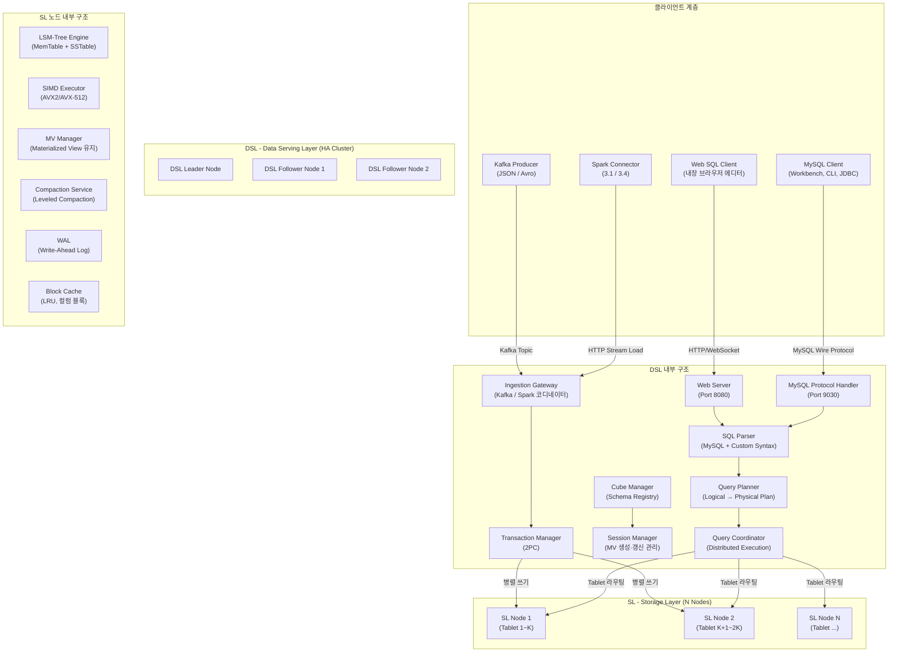
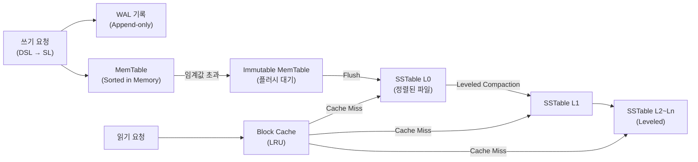
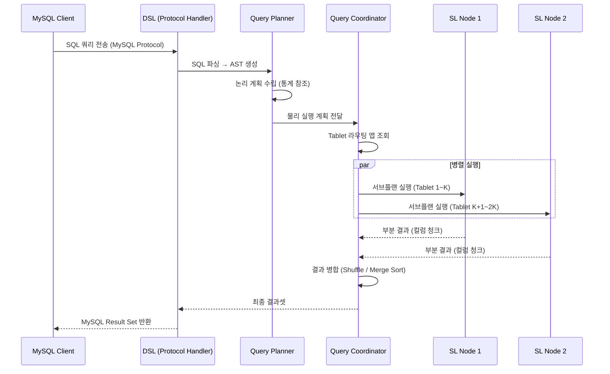
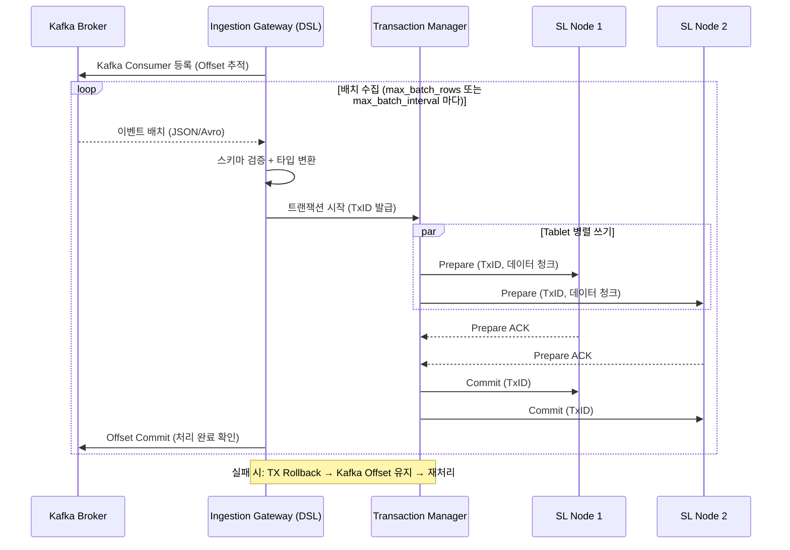
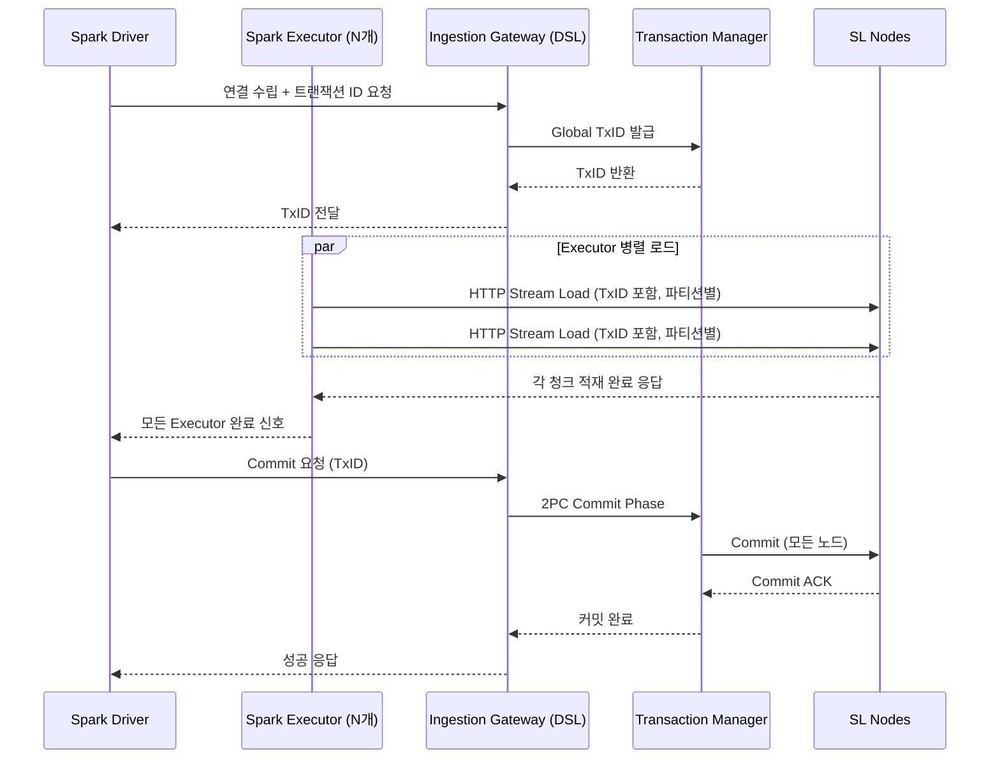
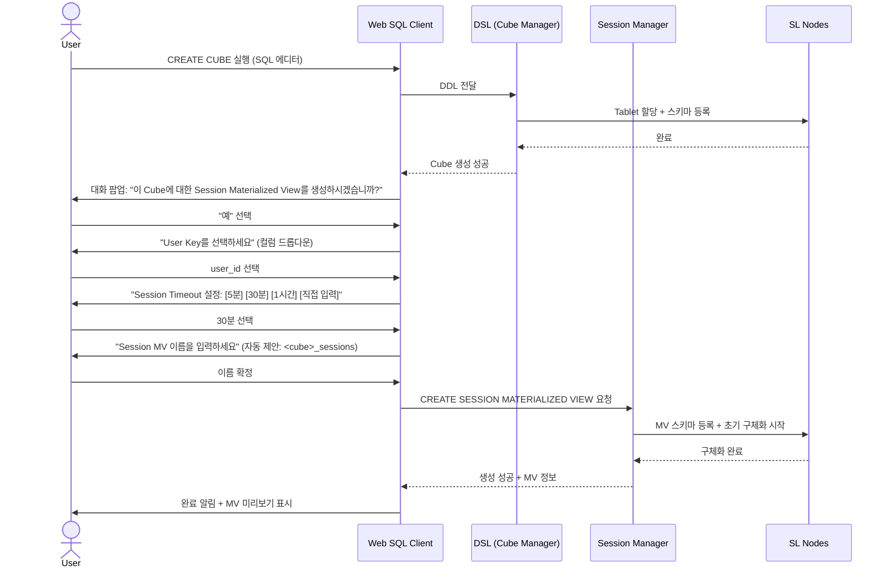
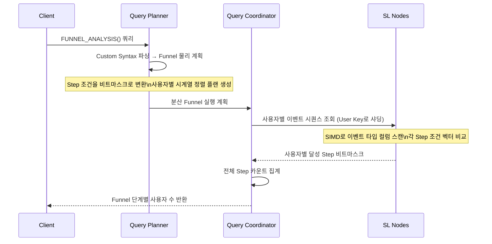

# WOW-DB Software Requirements Specification

---

| 항목 | 내용 |
|---|---|
| 문서 버전 | v0.1 Draft |
| 작성일 | 2026-04-12 |
| 상태 | 초안 (Draft) |
| 프로젝트명 | WOW-DB |
| 참조 시스템 | StarRocks, ClickHouse, RocksDB |

---

## 목차

1. [개요](#1장-개요)
2. [시스템 아키텍처 및 상호작용 다이어그램](#2장-시스템-아키텍처-및-상호작용-다이어그램)
3. [기능적 요구사항](#3장-기능적-요구사항)
4. [비기능적 요구사항](#4장-비기능적-요구사항)
5. [코드 예제](#5장-코드-예제)

---

# 1장. 개요

## 1.1 문서 목적

본 문서는 **WOW-DB**의 소프트웨어 요구사항 명세서(Software Requirements Specification)이다.  
WOW-DB는 웹 분석에 특화된 MySQL 호환 OLAP 데이터베이스로서, 이벤트 기반의 데이터 수집·저장·분석을 주목적으로 한다.  
본 문서는 설계자, 개발자, QA 엔지니어가 시스템을 구현하고 검증하기 위한 기준 문서로 활용된다.

## 1.2 시스템 배경 및 범위

### 1.2.1 배경

현대 웹 서비스는 수백억 건 이상의 사용자 이벤트를 생성한다. 기존 범용 OLAP 데이터베이스(ClickHouse, StarRocks 등)는 이러한 이벤트 데이터를 저장하고 쿼리하는 데 적합하지만, 다음과 같은 문제를 안고 있다.

- 분석가가 직접 스키마를 설계하고 세션 로직을 구현해야 함
- Funnel·Cohort·Path 분석을 위한 커스텀 SQL 작성 부담
- 이벤트 → 세션 변환 파이프라인을 별도로 구축해야 함

WOW-DB는 이러한 문제를 해결하기 위해, **이벤트 Cube 정의만으로 자동 세션화(Sessionization) Materialized View를 생성**하고, 웹 분석에 특화된 함수(FUNNEL, COHORT, PATH)를 내장하는 시스템이다.

### 1.2.2 범위

WOW-DB가 커버하는 범위:

- 이벤트 데이터의 대용량 수집 (Kafka, Spark, MySQL INSERT)
- LSM-Tree 기반 분산 스토리지
- 웹 분석 전용 쿼리 엔진 (SIMD 가속)
- 대화형 Session Materialized View 생성 (Web UI)
- MySQL 클라이언트 프로토콜 호환

WOW-DB가 커버하지 않는 범위:

- OLTP 워크로드 (높은 빈도의 point update)
- 지리공간(GIS) 분석
- 머신러닝 학습 (분석 결과 제공만 가능)

## 1.3 주요 용어 정의

| 용어 | 정의 |
|---|---|
| **Event** | 웹 서비스에서 사용자가 발생시킨 단일 행동 단위 (예: page_view, click, purchase) |
| **Cube** | WOW-DB에서 이벤트 데이터를 저장하는 논리적 스키마 단위. `CREATE CUBE` DDL로 정의 |
| **Session** | 동일 사용자가 일정 시간 내에 연속적으로 발생시킨 이벤트의 묶음 |
| **Session Materialized View (SMV)** | Cube로부터 자동 생성된 세션화 뷰. 세션 ID, 세션 시작/종료 시각, 이벤트 시퀀스 등이 포함됨 |
| **User Key** | 사용자를 식별하는 컬럼. `user_id`, `device_id` 등 사용자가 지정 |
| **Session Timeout** | 연속 이벤트 간 허용되는 최대 비활성 시간. 이 시간을 초과하면 새 세션으로 분리 |
| **Funnel Analysis** | 사전 정의된 단계(Step)를 순서대로 수행한 사용자 전환율 분석 |
| **Cohort Analysis** | 특정 기준일(진입 이벤트 기준)로 그룹화된 사용자의 재방문/전환 추적 |
| **Path Analysis** | 사용자가 실제로 이동한 이벤트 시퀀스 패턴 분석 |
| **DSL** | Data Serving Layer. 클라이언트 프로토콜 처리, 쿼리 파싱·플래닝, 세션/Cube 관리 담당 |
| **SL** | Storage Layer. LSM-Tree 기반 실제 데이터 저장 및 SIMD 기반 쿼리 실행 담당 |
| **Tablet** | SL에서 데이터를 분산 저장하는 최소 물리 단위 (StarRocks의 Tablet과 동일 개념) |
| **SIMD** | Single Instruction Multiple Data. CPU 벡터 연산을 활용한 병렬 데이터 처리 |
| **LSM-Tree** | Log-Structured Merge Tree. 쓰기에 최적화된 트리 구조 스토리지 |

## 1.4 시스템 개요

WOW-DB는 다음 다섯 가지 핵심 가치를 중심으로 설계된다.

```
1. 웹 분석 최적화   : Event → Session 변환 자동화, 전용 분석 함수 내장
2. 대용량 처리      : 200억+ 레코드, 분산 아키텍처 (SL 수평 확장)
3. 실시간 수집      : Kafka, Spark Streaming, MySQL INSERT 동시 지원
4. MySQL 호환성     : 기존 MySQL 클라이언트/툴/드라이버 그대로 연결
5. 개발자 친화성    : Web SQL Editor, 대화형 Cube Builder 내장
```

## 1.5 설계 원칙

| 원칙 | 설명 |
|---|---|
| **Write Optimized First** | LSM-Tree 채택으로 대용량 이벤트 스트림 수집 최우선 |
| **Column-Oriented Storage** | 분석 쿼리의 특성상 컬럼 단위 저장으로 IO 최소화 |
| **SIMD Everywhere** | 스캔, 집계, 필터, 해시 조인 모든 연산에 AVX2 이상 벡터 연산 적용 |
| **Schema on Write** | Cube 정의 시 스키마를 확정하여 쿼리 성능 보장 |
| **Guided Analytics** | 복잡한 SQL 없이 대화형 UI로 세션/분석 설정 가능 |
| **Separation of Concerns** | DSL(서빙)과 SL(스토리지) 완전 분리로 독립적 확장 |

## 1.6 참조 시스템

- **StarRocks 3.x**: FE/BE 분리 아키텍처, Tablet 분산, Routine Load 설계 참조
- **ClickHouse**: 실시간 수집, MergeTree 컬럼 저장, SIMD 활용 참조
- **RocksDB**: LSM-Tree 구현체 참조 (WOW-DB는 Rust로 자체 구현)
- **MySQL 8.0**: 클라이언트 프로토콜, DDL/DML 문법 호환 기준

---

# 2장. 시스템 아키텍처 및 상호작용 다이어그램

## 2.1 전체 시스템 아키텍처



## 2.2 DSL (Data Serving Layer) 상세 구조

### 2.2.1 DSL 역할

DSL은 모든 클라이언트 요청의 진입점이며 다음 책임을 갖는다.

| 컴포넌트 | 책임 |
|---|---|
| MySQL Protocol Handler | MySQL 8.0 Wire Protocol 처리 (포트 9030) |
| Web Server | Web SQL Editor REST API + WebSocket 제공 (포트 8080) |
| SQL Parser | MySQL 호환 SQL + WOW-DB Custom Syntax 파싱 |
| Query Planner | 논리 계획 → 물리 계획 변환, 통계 기반 최적화 |
| Query Coordinator | 분산 실행 계획 SL 노드에 분산, 결과 집계 |
| Cube Manager | CREATE/ALTER/DROP CUBE DDL, 메타데이터 관리 |
| Session Manager | Session MV 생성 대화 흐름, MV 갱신 스케줄 관리 |
| Ingestion Gateway | Kafka Offset 추적, Spark 트랜잭션 코디네이션 |
| Transaction Manager | 2-Phase Commit (2PC) 프로토콜 구현 |

### 2.2.2 DSL HA 구성

- **최소 구성**: 1 Leader + 2 Follower
- Leader: 모든 쓰기 요청 처리, 메타데이터 변경 권한
- Follower: 읽기 요청 분산 처리, Leader 장애 시 자동 선출 (Raft 프로토콜)
- 메타데이터 저장소: 내장 Raft 기반 Key-Value Store (별도 ZooKeeper 불필요)

## 2.3 SL (Storage Layer) 상세 구조

### 2.3.1 SL 역할

SL은 실제 데이터 저장과 쿼리 실행을 담당한다.

| 컴포넌트 | 책임 |
|---|---|
| LSM-Tree Engine | MemTable + WAL + SSTable 관리 |
| SIMD Executor | AVX2/AVX-512 기반 컬럼 스캔, 집계, 필터 실행 |
| MV Manager | Materialized View 실시간 증분 갱신 |
| Compaction Service | Leveled Compaction (백그라운드) |
| Block Cache | LRU 기반 SSTable 블록 캐시 |
| WAL | 크래시 복구를 위한 Write-Ahead Log |

### 2.3.2 SL 내부 데이터 흐름



### 2.3.3 Tablet 분산

- Cube 생성 시 `DISTRIBUTED BY HASH(<key>) BUCKETS <n>` 으로 Tablet 수 결정
- 각 Tablet은 기본 3개 복제본 (Leader + 2 Replica) 유지
- DSL Query Coordinator가 Tablet → SL Node 매핑 테이블 관리

## 2.4 상호작용 다이어그램 (Interaction Diagrams)

### 2.4.1 SELECT 쿼리 실행 흐름



### 2.4.2 Kafka Streaming Ingestion 흐름



### 2.4.3 Spark Ingestion 흐름



### 2.4.4 Cube 생성 및 Session MV 대화 흐름 (Web UI)



### 2.4.5 Funnel 분석 쿼리 실행 흐름



## 2.5 분산 클러스터 구성

### 2.5.1 최소 운영 구성

```
DSL: 1 Leader + 2 Follower (총 3 노드)
SL:  최소 3 노드 (Tablet 복제본 3개 보장)
```

### 2.5.2 대용량 운영 구성 (200억+ 레코드 기준)

```
DSL: 3 Leader-eligible + 2 Read Follower
SL:  N × SL 노드 (데이터 볼륨에 따라 수평 확장)
     - 추천: 10~20 노드, 각 노드 NVMe SSD
```

### 2.5.3 데이터 분산 전략

- **Hash Partitioning**: `DISTRIBUTED BY HASH(user_id) BUCKETS 32` (기본값)
- **Range Partitioning**: 시계열 데이터는 `PARTITION BY RANGE(event_time)` 권장
- **복합 파티셔닝**: Range + Hash 조합 지원 (예: 날짜별 파티션 + user_id 해시)

---

# 3장. 기능적 요구사항

## 3.1 Event Cube 관리

### 3.1.1 Cube 생성 (FR-CUBE-001)

시스템은 `CREATE CUBE` DDL을 지원해야 한다.

**지원 옵션:**

| 옵션 | 필수 여부 | 설명 |
|---|---|---|
| 컬럼 정의 | 필수 | 이름, 타입, NOT NULL, COMMENT |
| EVENT_TIME | 권장 | 이벤트 발생 시각 지정 컬럼 (파티셔닝 기준) |
| ENGINE | 필수 | `WOW_LSM` 고정 |
| PARTITION BY | 선택 | RANGE(datetime) 또는 RANGE(datetime) + HASH |
| DISTRIBUTED BY | 필수 | HASH 기반 Tablet 분산 키 |
| ORDER BY | 권장 | SSTable 내 정렬 순서 (쿼리 성능에 직접 영향) |
| PROPERTIES | 선택 | 복제본 수, 압축 알고리즘 등 |

**지원 데이터 타입:**

| 카테고리 | 타입 |
|---|---|
| 정수 | TINYINT, SMALLINT, INT, BIGINT |
| 실수 | FLOAT, DOUBLE, DECIMAL(p, s) |
| 문자열 | VARCHAR(n), CHAR(n), TEXT |
| 날짜/시간 | DATE, DATETIME, TIMESTAMP |
| 반정형 | JSON |
| 불리언 | BOOLEAN |
| 고기수 집계용 | HLL (HyperLogLog), BITMAP |

### 3.1.2 Cube 수정 (FR-CUBE-002)

- `ALTER CUBE <name> ADD COLUMN <col_def>` 지원
- `ALTER CUBE <name> MODIFY COLUMN` 타입 확장만 허용 (축소 불가)
- 컬럼 삭제 시 연관 Session MV 자동 무효화 경고 출력

### 3.1.3 Cube 삭제 (FR-CUBE-003)

- `DROP CUBE <name>` 지원
- 연관 Session MV 존재 시 `CASCADE` 옵션 필수 요구

## 3.2 Session Materialized View (SMV)

### 3.2.1 대화형 SMV 생성 (FR-SMV-001)

Web SQL Client에서 Cube 생성 완료 후 다음 대화형 흐름을 제공해야 한다.

**단계별 대화 흐름:**

```
Step 1: "이 Cube에 대한 Session Materialized View를 생성하시겠습니까?"
        [예] [아니요]

Step 2 (예 선택 시): "세션을 구분할 User Key 컬럼을 선택하세요"
        → Cube의 컬럼 목록 드롭다운 제공
        → 복합 키 지원 (예: device_id + user_id 순서 지정)

Step 3: "Session Timeout을 설정하세요"
        [5분] [30분] [1시간] [직접 입력 (분 단위)]

Step 4: "Materialized View 이름을 입력하세요"
        → 기본값: {cube_name}_sessions 자동 제안

Step 5: 요약 화면 → [생성] [취소]
```

### 3.2.2 SMV 자동 생성 컬럼 (FR-SMV-002)

SMV 생성 시 원본 Cube 컬럼에 더해 다음 컬럼이 자동 추가된다.

| 컬럼명 | 타입 | 설명 |
|---|---|---|
| `session_id` | VARCHAR(64) | 세션 고유 ID (UUID 기반 자동 생성) |
| `session_start_time` | DATETIME | 세션 첫 이벤트 시각 |
| `session_end_time` | DATETIME | 세션 마지막 이벤트 시각 |
| `session_duration_sec` | BIGINT | 세션 지속 시간 (초) |
| `session_event_count` | INT | 세션 내 이벤트 수 |
| `session_seq` | INT | 세션 내 이벤트 순서 번호 (1부터 시작) |
| `is_new_user` | BOOLEAN | 해당 Cube 기준 첫 세션 여부 |

### 3.2.3 SMV 갱신 전략 (FR-SMV-003)

| 갱신 모드 | 설명 | 권장 사용 사례 |
|---|---|---|
| `REFRESH REALTIME` | 새 이벤트 수집 시 증분 갱신 | Kafka 실시간 수집 |
| `REFRESH ON DEMAND` | 수동 `REFRESH MATERIALIZED VIEW` 명령 | 배치 수집 |
| `REFRESH EVERY <interval>` | 지정 주기 자동 갱신 | Spark 마이크로배치 |

### 3.2.4 SMV 세션 경계 판단 알고리즘 (FR-SMV-004)

```
동일 User Key의 연속된 두 이벤트에 대해:
  if (event[i+1].event_time - event[i].event_time) > SESSION_TIMEOUT
    → 새 세션 시작 (session_id 신규 발급)
  else
    → 동일 세션 유지
```

## 3.3 쿼리 엔진

### 3.3.1 MySQL 호환 SQL (FR-QE-001)

다음 MySQL 8.0 SQL 구문을 지원해야 한다.

| 구문 | 지원 범위 |
|---|---|
| SELECT | FROM, WHERE, GROUP BY, HAVING, ORDER BY, LIMIT, OFFSET |
| JOIN | INNER, LEFT OUTER, CROSS JOIN |
| 집계 함수 | COUNT, SUM, AVG, MIN, MAX, COUNT(DISTINCT) |
| 윈도우 함수 | ROW_NUMBER, RANK, DENSE_RANK, LAG, LEAD, SUM OVER, AVG OVER |
| 서브쿼리 | 스칼라, IN/EXISTS, FROM 절 서브쿼리 |
| CTE | WITH 절 (재귀 CTE 지원) |
| JSON 함수 | JSON_EXTRACT, JSON_VALUE, JSON_KEYS, JSON_CONTAINS |
| 날짜 함수 | DATE_FORMAT, DATE_ADD, DATE_DIFF, TIMESTAMPDIFF, NOW() |
| 문자열 함수 | CONCAT, SUBSTRING, LIKE, REGEXP |

### 3.3.2 Funnel Analysis (FR-QE-002)

**구문:**

```sql
FUNNEL_COUNT(
    <조건1> STEP <n>,
    <조건2> STEP <n>,
    ...
    TIME_WINDOW => INTERVAL <n> <UNIT>,
    STRICT => TRUE | FALSE
)
```

**동작 규칙:**

- `STRICT = TRUE` (기본값): Step 1 → 2 → 3 순서 엄격히 준수
- `STRICT = FALSE`: 중간 단계 이탈 허용 후 복귀 인정
- `TIME_WINDOW`: Step 1 이후 마지막 Step까지의 최대 허용 시간
- 반환값: 각 Step에 도달한 사용자 수 배열

**FUNNEL_ANALYSIS 테이블 함수:**

```sql
SELECT * FROM FUNNEL_ANALYSIS(
    SOURCE     => '<table>',
    USER_KEY   => '<col>',
    TIME_COL   => '<col>',
    STEPS      => ARRAY['<조건식1>', '<조건식2>', ...],
    TIME_WINDOW => INTERVAL <n> <UNIT>
)
```

### 3.3.3 Cohort Analysis (FR-QE-003)

**구문:**

```sql
SELECT * FROM COHORT_ANALYSIS(
    SOURCE       => '<table>',
    ENTRY_EVENT  => '<event_name>',
    RETURN_EVENT => '<event_name>',
    COHORT_DATE  => <날짜 표현식>,
    METRIC       => 'RETENTION_RATE' | 'USER_COUNT' | 'CONVERSION_RATE',
    TIME_UNIT    => 'DAY' | 'WEEK' | 'MONTH',
    MAX_PERIODS  => <n>,
    USER_KEY     => '<col>'
)
```

**반환 컬럼:**

| 컬럼 | 설명 |
|---|---|
| `cohort_date` | 코호트 기준일 |
| `period` | 기준일로부터 n번째 시간 단위 |
| `cohort_size` | 코호트 진입 사용자 수 |
| `returned_users` | 해당 period에 재방문/전환한 사용자 수 |
| `metric_value` | METRIC 종류에 따른 값 (율 또는 수) |

### 3.3.4 Path Analysis (FR-QE-004)

**구문:**

```sql
SELECT * FROM PATH_ANALYSIS(
    SOURCE       => '<table>',
    PATH_EVENT   => '<event_col>',
    USER_KEY     => '<col>',
    SESSION_KEY  => '<session_col>',
    MAX_DEPTH    => <n>,
    MIN_SUPPORT  => <0.0~1.0>,
    ENTRY_FILTER => '<조건식>',
    EXIT_FILTER  => '<조건식>'
)
```

**반환 컬럼:**

| 컬럼 | 설명 |
|---|---|
| `path` | 이벤트 시퀀스 (예: `'landing → product → cart → purchase'`) |
| `path_depth` | 경로 깊이 |
| `path_count` | 해당 경로 발생 횟수 |
| `unique_users` | 해당 경로를 밟은 유니크 사용자 수 |
| `support_rate` | 전체 대비 발생 빈도 |
| `avg_duration_sec` | 경로 완주 평균 시간 |

### 3.3.5 Custom Query 문법 (FR-QE-005)

MySQL과 충돌하지 않는 WOW-DB 전용 확장 구문:

| 구문 | 설명 |
|---|---|
| `CREATE CUBE` | 이벤트 스키마 정의 |
| `CREATE SESSION MATERIALIZED VIEW` | 세션화 MV 생성 |
| `REFRESH MATERIALIZED VIEW` | MV 수동 갱신 |
| `CREATE ROUTINE LOAD` | Kafka 지속 수집 작업 등록 |
| `SHOW CUBES` | Cube 목록 조회 |
| `SHOW SESSIONS` | SMV 목록 조회 |
| `EXPLAIN PHYSICAL` | 물리 실행 계획 출력 |
| `SHOW TABLET STATUS` | Tablet 분산 상태 조회 |

## 3.4 데이터 수집 (Ingestion)

### 3.4.1 MySQL INSERT (FR-ING-001)

- 표준 MySQL `INSERT INTO ... VALUES` 지원
- `INSERT INTO ... SELECT` 지원
- 단건 및 다건(배치) INSERT 모두 지원
- 성능 목표: 단일 DSL 노드 기준 초당 100,000건 이상

### 3.4.2 Kafka Streaming Ingestion (FR-ING-002)

`CREATE ROUTINE LOAD` 명령으로 지속적인 Kafka 소비 작업을 등록한다.

**지원 기능:**

| 기능 | 설명 |
|---|---|
| 포맷 지원 | JSON, Avro, CSV |
| Offset 관리 | OFFSET_BEGINNING, OFFSET_END, 특정 Offset 지정 |
| 병렬 소비 | 파티션별 병렬 Consumer 설정 |
| 스키마 검증 | 타입 불일치 레코드 격리 (dead letter queue) |
| SASL/SSL | Kafka 보안 설정 지원 |
| Exactly-once | Kafka 트랜잭션 API 연동으로 중복 방지 |
| 모니터링 | `SHOW ROUTINE LOAD` 로 상태·진행률 확인 |

### 3.4.3 Spark Batch/Micro-batch Ingestion (FR-ING-003)

WOW-DB는 Spark DataSource API를 구현한 공식 커넥터를 제공한다.

**지원 Spark 버전:**

| 버전 | API | 특이사항 |
|---|---|---|
| Spark 3.1 | DataSource V1 | HTTP Stream Load 방식 |
| Spark 3.4 | DataSource V2 | 분산 트랜잭션, 구조화 스트리밍 지원 |

**Spark 커넥터 옵션:**

| 옵션 키 | 설명 | 기본값 |
|---|---|---|
| `wowdb.endpoints` | DSL 노드 주소 (복수 설정 시 로드밸런싱) | - |
| `wowdb.user` / `wowdb.password` | 인증 정보 | - |
| `wowdb.database` | 대상 데이터베이스 | - |
| `wowdb.table` | 대상 Cube 이름 | - |
| `wowdb.batch.size` | 한 번에 전송할 행 수 | 100,000 |
| `wowdb.transaction.enable` | 2PC 트랜잭션 활성화 | false |
| `wowdb.compression` | 전송 압축 (lz4, zstd, none) | lz4 |
| `wowdb.parallelism` | Spark Executor당 병렬 쓰기 스레드 수 | 4 |

### 3.4.4 트랜잭션 지원 (FR-ING-004)

- Kafka, Spark 수집 모두 2PC(Two-Phase Commit) 트랜잭션 지원
- 트랜잭션 타임아웃 설정 가능 (기본: 5분)
- 실패 시 자동 롤백 + 재시도 지원
- 트랜잭션 로그는 DSL의 WAL에 보관 (복구 가능)

## 3.5 스토리지 엔진

### 3.5.1 LSM-Tree 구현 요구사항 (FR-ST-001)

Rust로 자체 구현하며 다음 구성요소를 포함한다.

| 구성요소 | 요구사항 |
|---|---|
| MemTable | Skip List 기반, 동시성 접근 지원 (Arc + RwLock) |
| WAL | Append-only, 세그먼트 방식, CRC32 체크섬 |
| SSTable | 블록 단위 컬럼 저장, Bloom Filter 내장, 압축(LZ4/ZSTD) |
| Block Cache | LRU 기반, 설정 가능한 최대 크기 |
| Compaction | Leveled Compaction (기본), Tiered 선택 가능 |
| MVCC | 버전 태그 기반 스냅샷 격리 (읽기 일관성) |

### 3.5.2 SIMD 가속 요구사항 (FR-ST-002)

Rust의 `std::arch` 또는 `packed_simd` / `wide` 크레이트를 활용한다.

| 연산 | SIMD 활용 방식 | 최소 ISA |
|---|---|---|
| 컬럼 스캔 | 64바이트 배치 로드 후 벡터 비교 | AVX2 |
| WHERE 필터 | 벡터 비교 + 비트마스크 생성 | AVX2 |
| SUM / COUNT | 수평 벡터 덧셈 | AVX2 |
| MIN / MAX | 벡터 비교 감소 | AVX2 |
| LIKE 패턴 매칭 | SIMD 문자열 탐색 | SSE4.2 |
| 해시 조인 | 벡터 해시 계산 | AVX2 |
| Bitmap 집계 | SIMD Popcount (HLL, BITMAP 타입) | AVX2 |

- 런타임에 CPU ISA 감지 (`cpuid`) 하여 최적 경로 선택
- AVX-512 지원 CPU에서 자동으로 512bit 경로 활성화

### 3.5.3 Materialized View 관리 (FR-ST-003)

- SMV는 별도 Cube로 물리 저장 (독립적 Tablet 할당)
- 증분 갱신: 새로운 이벤트 도착 시 영향받는 세션만 재계산
- 세션 경계 갱신: 기존 세션에 이벤트 추가 또는 새 세션 분리 처리
- 원본 Cube와 SMV 간 메타데이터 링크 유지 (의존성 추적)

## 3.6 Web SQL Client (FR-WEB)

### 3.6.1 SQL 편집기 (FR-WEB-001)

| 기능 | 설명 |
|---|---|
| 코드 하이라이팅 | MySQL + WOW-DB Custom Syntax 지원 |
| 자동완성 | 테이블명, 컬럼명, 함수명 자동완성 |
| 실행 결과 표시 | 테이블 형태, CSV 다운로드 |
| 쿼리 기록 | 최근 100개 쿼리 히스토리 |
| 다중 탭 | 여러 쿼리 동시 편집 |
| Explain 시각화 | EXPLAIN PHYSICAL 결과 시각적 트리 렌더링 |

### 3.6.2 Cube Builder (FR-WEB-002)

GUI 기반 Cube 스키마 설계 도구:
- 컬럼 추가/삭제 드래그앤드롭
- 파티션/분산 키 시각적 설정
- 미리보기: 생성될 DDL SQL 즉시 확인
- "Session MV 생성" 버튼으로 3.2.1 대화 흐름 진입

### 3.6.3 분석 대시보드 (FR-WEB-003)

- Funnel, Cohort, Path 분석 결과 기본 차트 제공
- 외부 BI 툴 연동을 위한 MySQL JDBC 접속 정보 내보내기

## 3.7 MySQL 프로토콜 호환성 (FR-COMPAT)

| 항목 | 지원 버전 / 세부 사항 |
|---|---|
| Wire Protocol | MySQL 8.0 Client/Server Protocol |
| 접속 포트 | 9030 (기본값, 변경 가능) |
| 인증 | mysql_native_password, caching_sha2_password |
| 클라이언트 호환 | MySQL CLI, MySQL Workbench, DBeaver, JDBC 8.x |
| 시스템 테이블 | `information_schema.TABLES`, `information_schema.COLUMNS` 지원 |
| SHOW 명령 | `SHOW DATABASES`, `SHOW TABLES`, `SHOW CREATE TABLE` 지원 |
| 주의 사항 | `UPDATE` / `DELETE` 는 단일 Tablet 범위로 제한 (OLAP 특성 반영) |

## 3.8 분산 처리 (FR-DIST)

| 기능 | 요구사항 |
|---|---|
| SL 노드 추가 | 온라인 Tablet 재분배 지원 (무중단) |
| SL 노드 제거 | 데이터 마이그레이션 후 제거 |
| DSL Leader 선출 | Raft 기반 자동 Leader 선출 (장애 감지 3초 이내) |
| 쿼리 장애 처리 | SL 노드 1개 장애 시 복제본으로 자동 전환 |
| 부하 분산 | DSL이 쿼리 부하를 기준으로 SL 실행 노드 선택 |

---

# 4장. 비기능적 요구사항

## 4.1 성능 (NFR-PERF)

| 항목 | 목표치 | 측정 조건 |
|---|---|---|
| 쓰기 처리량 | ≥ 1,000,000 이벤트/초 | 10 SL 노드, Kafka 수집 |
| 쿼리 지연 (P99) | ≤ 3초 | 10억 행 테이블, GROUP BY 쿼리 |
| 쿼리 지연 (P50) | ≤ 500ms | 동일 조건 |
| Funnel 쿼리 | ≤ 10초 | 10억 행, 4-step Funnel |
| 동시 쿼리 | ≥ 200 동시 쿼리 | 10 SL 노드 기준 |
| 총 데이터 규모 | ≥ 200억 레코드 | 분산 클러스터 |
| 컬럼 스캔 속도 | ≥ 10 GB/s | AVX-512 SL 노드 단일 코어 |

## 4.2 확장성 (NFR-SCALE)

- **SL 수평 확장**: SL 노드 추가만으로 저장 용량 및 처리량 선형 증가
- **DSL 수평 확장**: Read Follower 추가로 읽기 처리량 확장
- **Tablet 자동 재분배**: 노드 추가 시 Tablet 자동 이동 (백그라운드)
- **최대 지원 규모**: SL 노드 100대, Tablet 10,000개

## 4.3 가용성 및 안정성 (NFR-HA)

| 항목 | 목표 |
|---|---|
| 가용성 | 99.99% (연간 다운타임 ≤ 52분) |
| RPO (복구 목표 시점) | ≤ 1분 (WAL 기반) |
| RTO (복구 목표 시간) | ≤ 30초 (자동 장애 복구) |
| SL 노드 장애 내성 | Replication Factor 3 기준, 동시 1 노드 장애 허용 |
| DSL Leader 장애 | Raft 선출로 15초 이내 자동 복구 |

## 4.4 보안 (NFR-SEC)

| 항목 | 요구사항 |
|---|---|
| 전송 암호화 | TLS 1.2 이상 (클라이언트 ↔ DSL, DSL ↔ SL) |
| 인증 | 사용자 계정 기반 (MySQL 호환 방식) |
| 권한 관리 | GRANT/REVOKE 기반 (DATABASE, TABLE, COLUMN 레벨) |
| 감사 로그 | 모든 DDL 및 관리 명령 로깅 |
| 비밀번호 | bcrypt 해싱 저장 |
| Web Client | HTTPS 필수, 세션 토큰 기반 인증 |

## 4.5 운영성 (NFR-OPS)

| 항목 | 요구사항 |
|---|---|
| 모니터링 | Prometheus 메트릭 엔드포인트 제공 (`/metrics`) |
| 로깅 | 구조화 로그 (JSON), 레벨 조정 가능 |
| 설정 | TOML 파일 기반 (DSL, SL 각각) |
| 업그레이드 | 롤링 업그레이드 지원 (무중단) |
| 백업 | Snapshot 기반 백업 / 복원 명령 제공 |
| CLI 관리 도구 | `wowdb-ctl` 커맨드라인 관리 툴 제공 |

## 4.6 구현 기술 제약 (NFR-TECH)

| 항목 | 요구사항 |
|---|---|
| 구현 언어 | Rust (stable toolchain, edition 2021 이상) |
| 최소 SIMD 요구사항 | AVX2 (x86-64 기준) |
| 운영체제 | Linux (Ubuntu 20.04+, RHEL 8+), 컨테이너(Docker/K8s) 지원 |
| 메모리 최소 사양 | DSL 노드 16GB, SL 노드 64GB |
| 스토리지 | SL 노드 NVMe SSD 권장 |
| 네트워크 | 10GbE 이상 권장 (SL 노드 간) |

---

# 5장. 코드 예제

## 5.1 DDL 예제

### 5.1.1 Event Cube 생성

```sql
-- 웹 페이지 이벤트 Cube 생성
CREATE CUBE IF NOT EXISTS page_events (
    event_time      DATETIME     NOT NULL  COMMENT '이벤트 발생 시각',
    user_id         VARCHAR(64)            COMMENT '로그인 사용자 ID (없으면 NULL)',
    device_id       VARCHAR(64)  NOT NULL  COMMENT '디바이스 식별자',
    session_source  VARCHAR(32)            COMMENT '유입 소스 (utm_source 등)',
    event_name      VARCHAR(128) NOT NULL  COMMENT '이벤트 이름',
    page_url        VARCHAR(2048)          COMMENT '페이지 URL',
    referrer_url    VARCHAR(2048)          COMMENT '직전 페이지 URL',
    country_code    CHAR(2)                COMMENT 'ISO 3166-1 국가 코드',
    properties      JSON                   COMMENT '이벤트 추가 속성',
    revenue         DECIMAL(10,2)          COMMENT '거래 금액 (해당 없으면 NULL)',

    INDEX idx_event_name (event_name) USING BITMAP,
    INDEX idx_country (country_code) USING BITMAP
)
ENGINE = WOW_LSM
PARTITION BY RANGE(event_time) (
    PARTITION p_2024_01 VALUES [('2024-01-01'), ('2024-02-01')),
    PARTITION p_2024_02 VALUES [('2024-02-01'), ('2024-03-01')),
    PARTITION p_future   VALUES [('2024-03-01'), (MAXVALUE))
)
DISTRIBUTED BY HASH(device_id) BUCKETS 64
ORDER BY (event_time, device_id, event_name)
PROPERTIES (
    "replication_num" = "3",
    "compression"     = "LZ4",
    "storage_format"  = "v2"
)
COMMENT '웹 서비스 사용자 행동 이벤트 Cube';
```

### 5.1.2 Session Materialized View 생성 (SQL 방식)

```sql
-- page_events로부터 device_id 기준 30분 세션 MV 생성
CREATE SESSION MATERIALIZED VIEW IF NOT EXISTS page_events_sessions
FROM page_events
USER_KEY        = device_id
SESSION_TIMEOUT = 30 MINUTE
REFRESH REALTIME
PROPERTIES (
    "replication_num" = "3"
)
COMMENT 'device_id 기준 30분 세션 Materialized View';

-- 생성 결과 확인
SHOW CREATE TABLE page_events_sessions;
SHOW SESSIONS;
```

### 5.1.3 복합 User Key Session MV

```sql
-- user_id 우선, 없으면 device_id fallback 복합 키
CREATE SESSION MATERIALIZED VIEW IF NOT EXISTS page_events_user_sessions
FROM page_events
USER_KEY        = COALESCE(user_id, device_id)
SESSION_TIMEOUT = 1 HOUR
REFRESH EVERY INTERVAL 5 MINUTE
COMMENT '로그인 사용자 기준 1시간 세션 MV';
```

### 5.1.4 Cube 파티션 추가

```sql
-- 월별 파티션 동적 추가
ALTER CUBE page_events
    ADD PARTITION p_2024_04 VALUES [('2024-04-01'), ('2024-05-01'));

-- 컬럼 추가
ALTER CUBE page_events
    ADD COLUMN browser_name VARCHAR(64) COMMENT '브라우저 이름';
```

## 5.2 SELECT 예제

### 5.2.1 기본 집계 쿼리

```sql
-- 일별 이벤트 수 집계
SELECT
    DATE(event_time)                    AS event_date,
    event_name,
    COUNT(*)                            AS event_count,
    COUNT(DISTINCT device_id)           AS unique_devices,
    COUNT(DISTINCT user_id)             AS unique_users
FROM page_events
WHERE event_time BETWEEN '2024-01-01 00:00:00'
                     AND '2024-01-31 23:59:59'
GROUP BY event_date, event_name
ORDER BY event_date, event_count DESC;
```

### 5.2.2 세션 기반 분석

```sql
-- 세션 길이 분포 조회
SELECT
    CASE
        WHEN session_duration_sec < 30    THEN '0-30초'
        WHEN session_duration_sec < 120   THEN '30초-2분'
        WHEN session_duration_sec < 300   THEN '2-5분'
        WHEN session_duration_sec < 1800  THEN '5-30분'
        ELSE '30분 이상'
    END                                 AS duration_bucket,
    COUNT(DISTINCT session_id)          AS session_count,
    AVG(session_event_count)            AS avg_events_per_session
FROM page_events_sessions
WHERE session_start_time >= '2024-01-01'
GROUP BY duration_bucket
ORDER BY MIN(session_duration_sec);
```

### 5.2.3 Funnel Analysis

```sql
-- 구매 전환 4단계 퍼널 (7일 윈도우 내 완료 기준)
SELECT
    event_date,
    step_counts[1]  AS step1_landing,
    step_counts[2]  AS step2_product_view,
    step_counts[3]  AS step3_add_to_cart,
    step_counts[4]  AS step4_purchase,
    ROUND(step_counts[2] / step_counts[1] * 100, 2) AS step1_to_2_rate,
    ROUND(step_counts[3] / step_counts[2] * 100, 2) AS step2_to_3_rate,
    ROUND(step_counts[4] / step_counts[3] * 100, 2) AS step3_to_4_rate,
    ROUND(step_counts[4] / step_counts[1] * 100, 2) AS total_conversion_rate
FROM (
    SELECT
        DATE(session_start_time) AS event_date,
        FUNNEL_COUNT(
            event_name = 'landing_page'  STEP 1,
            event_name = 'product_view'  STEP 2,
            event_name = 'add_to_cart'   STEP 3,
            event_name = 'purchase'      STEP 4,
            TIME_WINDOW => INTERVAL 7 DAY,
            STRICT => TRUE
        ) AS step_counts
    FROM page_events_sessions
    WHERE session_start_time BETWEEN '2024-01-01' AND '2024-01-31'
    GROUP BY event_date
) t
ORDER BY event_date;
```

### 5.2.4 Cohort Retention Analysis

```sql
-- 첫 방문 기준 8주간 구매 리텐션 코호트
SELECT
    cohort_date,
    period,
    cohort_size,
    returned_users,
    ROUND(metric_value * 100, 2) AS retention_pct
FROM COHORT_ANALYSIS(
    SOURCE       => 'page_events_sessions',
    ENTRY_EVENT  => 'first_visit',
    RETURN_EVENT => 'purchase',
    COHORT_DATE  => DATE(session_start_time),
    METRIC       => 'RETENTION_RATE',
    TIME_UNIT    => 'WEEK',
    MAX_PERIODS  => 8,
    USER_KEY     => 'device_id'
)
WHERE cohort_date BETWEEN '2024-01-01' AND '2024-03-31'
ORDER BY cohort_date, period;
```

### 5.2.5 Path Analysis

```sql
-- 랜딩 페이지 → 구매 사이 상위 50개 사용자 경로
SELECT
    path,
    path_depth,
    path_count,
    unique_users,
    ROUND(support_rate * 100, 3)  AS support_pct,
    ROUND(avg_duration_sec / 60)  AS avg_duration_min
FROM PATH_ANALYSIS(
    SOURCE       => 'page_events_sessions',
    PATH_EVENT   => 'event_name',
    USER_KEY     => 'device_id',
    SESSION_KEY  => 'session_id',
    MAX_DEPTH    => 6,
    MIN_SUPPORT  => 0.005,
    ENTRY_FILTER => "event_name = 'landing_page'",
    EXIT_FILTER  => "event_name = 'purchase'"
)
ORDER BY path_count DESC
LIMIT 50;
```

### 5.2.6 JSON Properties 분석

```sql
-- 이벤트 properties에서 버튼 클릭 데이터 추출
SELECT
    JSON_VALUE(properties, '$.button_id')   AS button_id,
    JSON_VALUE(properties, '$.button_text') AS button_text,
    COUNT(*)                                AS click_count,
    COUNT(DISTINCT device_id)               AS unique_clickers
FROM page_events
WHERE event_name = 'button_click'
  AND event_time >= DATE_SUB(NOW(), INTERVAL 7 DAY)
  AND JSON_VALUE(properties, '$.page_section') = 'hero'
GROUP BY button_id, button_text
ORDER BY click_count DESC
LIMIT 20;
```

### 5.2.7 윈도우 함수 활용

```sql
-- 사용자별 누적 이벤트 수 및 직전 이벤트 시각 조회
SELECT
    device_id,
    event_time,
    event_name,
    LAG(event_name, 1)  OVER w  AS prev_event,
    LAG(event_time, 1)  OVER w  AS prev_event_time,
    TIMESTAMPDIFF(SECOND,
        LAG(event_time, 1) OVER w,
        event_time
    )                           AS seconds_since_prev,
    ROW_NUMBER()        OVER w  AS event_seq_in_day
FROM page_events
WHERE device_id = 'device-abc-123'
  AND DATE(event_time) = '2024-01-15'
WINDOW w AS (PARTITION BY device_id, DATE(event_time) ORDER BY event_time)
ORDER BY event_time;
```

## 5.3 INSERT 예제

### 5.3.1 단건 INSERT

```sql
INSERT INTO page_events
    (event_time, user_id, device_id, event_name, page_url, properties)
VALUES
    (
        '2024-01-15 14:32:10',
        'user-001',
        'device-abc-123',
        'product_view',
        'https://example.com/products/42',
        '{"product_id": 42, "category": "electronics", "price": 299000}'
    );
```

### 5.3.2 배치 INSERT

```sql
INSERT INTO page_events
    (event_time, device_id, event_name, page_url, country_code, properties)
VALUES
    ('2024-01-15 14:32:10', 'device-001', 'page_view',    'https://example.com/',        'KR', '{"referrer": "google"}'),
    ('2024-01-15 14:32:45', 'device-001', 'product_view', 'https://example.com/p/42',    'KR', '{"product_id": 42}'),
    ('2024-01-15 14:33:20', 'device-001', 'add_to_cart',  'https://example.com/p/42',    'KR', '{"product_id": 42, "qty": 1}'),
    ('2024-01-15 14:35:00', 'device-002', 'page_view',    'https://example.com/',        'US', '{"referrer": "direct"}'),
    ('2024-01-15 14:35:30', 'device-002', 'search',       'https://example.com/search',  'US', '{"query": "laptop"}');
```

### 5.3.3 INSERT SELECT (집계 결과 저장)

```sql
-- 일별 이벤트 요약 Cube에 INSERT
INSERT INTO daily_event_summary
    (summary_date, event_name, unique_devices, event_count)
SELECT
    DATE(event_time),
    event_name,
    COUNT(DISTINCT device_id),
    COUNT(*)
FROM page_events
WHERE DATE(event_time) = DATE_SUB(CURDATE(), INTERVAL 1 DAY)
GROUP BY DATE(event_time), event_name;
```

## 5.4 LOAD 예제

### 5.4.1 Kafka Routine Load 등록

```sql
-- Kafka 지속 수집 작업 생성
CREATE ROUTINE LOAD analytics.load_web_events ON page_events
COLUMNS TERMINATED BY ','
COLUMNS (event_time, user_id, device_id, event_name, page_url, properties)
PROPERTIES (
    "desired_concurrent_number" = "4",
    "max_batch_interval"        = "20",
    "max_batch_rows"            = "500000",
    "max_batch_size"            = "209715200",
    "strict_mode"               = "false",
    "timezone"                  = "Asia/Seoul",
    "format"                    = "json",
    "jsonpaths"                 = "[\"$.ts\",\"$.uid\",\"$.did\",\"$.event\",\"$.url\",\"$.props\"]"
)
FROM KAFKA (
    "kafka_broker_list"          = "kafka1:9092,kafka2:9092,kafka3:9092",
    "kafka_topic"                = "web-events-prod",
    "kafka_partitions"           = "0,1,2,3,4,5,6,7",
    "kafka_offsets"              = "OFFSET_END",
    "property.group.id"          = "wowdb-routine-loader",
    "property.security.protocol" = "SASL_SSL",
    "property.sasl.mechanism"    = "PLAIN",
    "property.sasl.username"     = "wowdb_consumer",
    "property.sasl.password"     = "${KAFKA_PASSWORD}"
);

-- 상태 확인
SHOW ROUTINE LOAD FOR load_web_events;

-- 일시 정지 / 재개
PAUSE ROUTINE LOAD FOR load_web_events;
RESUME ROUTINE LOAD FOR load_web_events;
```

### 5.4.2 Spark 3.1 Batch Load

```scala
// WOW-DB Spark 3.1 커넥터 사용
// build.sbt: "io.wowdb" %% "wowdb-spark-connector" % "1.0.0"

import org.apache.spark.sql.SparkSession

object WowDbSpark31Load extends App {

  val spark = SparkSession.builder()
    .appName("WOW-DB Spark 3.1 Batch Load")
    .config("spark.sql.shuffle.partitions", "200")
    .getOrCreate()

  // 소스 데이터 읽기 (Parquet)
  val eventsDF = spark.read
    .schema(EventSchema.schema)          // 사전 정의된 StructType
    .parquet("hdfs://namenode:8020/data/events/2024-01-15/")

  // 전처리
  val cleanDF = eventsDF
    .filter(eventsDF("event_time").isNotNull)
    .filter(eventsDF("device_id").isNotNull)
    .repartition(64, eventsDF("device_id"))  // Tablet 수와 일치 권장

  // WOW-DB 쓰기 (DataSource V1)
  cleanDF.write
    .format("wowdb")
    .option("wowdb.http.urls",        "http://wowdb-sl-1:8040;http://wowdb-sl-2:8040;http://wowdb-sl-3:8040")
    .option("wowdb.user",             "spark_loader")
    .option("wowdb.password",         sys.env("WOWDB_PASSWORD"))
    .option("wowdb.table.identifier", "analytics.page_events")
    .option("wowdb.columns",          "event_time,user_id,device_id,event_name,page_url,properties")
    .option("wowdb.write.buffer.size","134217728")   // 128 MB
    .option("wowdb.max.retries",      "3")
    .option("wowdb.compression",      "lz4")
    .mode("append")
    .save()

  println(s"Load completed: ${cleanDF.count()} rows written")
  spark.stop()
}
```

### 5.4.3 Spark 3.4 Batch Load (DataSource V2 + Transaction)

```scala
// WOW-DB Spark 3.4 커넥터 사용 (DataSource V2 API)
// build.sbt: "io.wowdb" %% "wowdb-spark-connector-v2" % "2.0.0"

import org.apache.spark.sql.SparkSession

object WowDbSpark34Load extends App {

  val spark = SparkSession.builder()
    .appName("WOW-DB Spark 3.4 Batch Load with Transaction")
    .config("spark.sql.extensions", "io.wowdb.spark.WowDbExtensions")
    .getOrCreate()

  // Delta Lake 소스 읽기 (Spark 3.4 네이티브)
  val eventsDF = spark.read
    .format("delta")
    .option("versionAsOf", "42")
    .load("s3a://data-lake/events/page_events/")

  // WOW-DB 쓰기 (DataSource V2, 분산 트랜잭션 지원)
  eventsDF
    .filter("event_time IS NOT NULL AND device_id IS NOT NULL")
    .repartition(128)
    .write
    .format("wowdb-v2")
    .option("wowdb.endpoints",           "wowdb-dsl-1:9030,wowdb-dsl-2:9030,wowdb-dsl-3:9030")
    .option("wowdb.user",                "spark_loader")
    .option("wowdb.password",            sys.env("WOWDB_PASSWORD"))
    .option("wowdb.database",            "analytics")
    .option("wowdb.table",               "page_events")
    .option("wowdb.transaction.enable",  "true")       // 2PC 트랜잭션
    .option("wowdb.transaction.timeout", "600000")     // 10분
    .option("wowdb.batch.size",          "500000")     // 배치당 50만 행
    .option("wowdb.parallelism",         "8")          // Executor당 8 스레드
    .option("wowdb.compression",         "zstd")
    .option("wowdb.write.mode",          "exactly_once")
    .mode("append")
    .save()

  spark.stop()
}
```

### 5.4.4 Spark 3.4 Structured Streaming (실시간)

```scala
// Kafka → WOW-DB 실시간 스트리밍 파이프라인
import org.apache.spark.sql.SparkSession
import org.apache.spark.sql.functions._
import org.apache.spark.sql.types._

object WowDbSpark34Streaming extends App {

  val spark = SparkSession.builder()
    .appName("WOW-DB Spark 3.4 Structured Streaming")
    .getOrCreate()

  val eventSchema = StructType(Seq(
    StructField("event_time",  TimestampType, nullable = false),
    StructField("user_id",     StringType,    nullable = true),
    StructField("device_id",   StringType,    nullable = false),
    StructField("event_name",  StringType,    nullable = false),
    StructField("page_url",    StringType,    nullable = true),
    StructField("properties",  StringType,    nullable = true)   // JSON string
  ))

  val kafkaStream = spark.readStream
    .format("kafka")
    .option("kafka.bootstrap.servers", "kafka1:9092,kafka2:9092")
    .option("subscribe",               "web-events-prod")
    .option("startingOffsets",         "latest")
    .option("failOnDataLoss",          "false")
    .load()

  val parsedStream = kafkaStream
    .select(from_json(col("value").cast("string"), eventSchema).as("data"))
    .select("data.*")
    .filter(col("event_time").isNotNull)

  // WOW-DB foreachBatch로 마이크로배치 쓰기
  val query = parsedStream.writeStream
    .format("wowdb-v2")
    .option("wowdb.endpoints",          "wowdb-dsl-1:9030,wowdb-dsl-2:9030")
    .option("wowdb.user",               "spark_stream_loader")
    .option("wowdb.password",           sys.env("WOWDB_PASSWORD"))
    .option("wowdb.database",           "analytics")
    .option("wowdb.table",              "page_events")
    .option("wowdb.batch.size",         "100000")
    .option("wowdb.transaction.enable", "true")
    .option("checkpointLocation",       "hdfs://namenode:8020/checkpoints/page_events/")
    .outputMode("append")
    .trigger(org.apache.spark.sql.streaming.Trigger.ProcessingTime("30 seconds"))
    .start()

  query.awaitTermination()
}
```

### 5.4.5 실행 계획 확인

```sql
-- 쿼리 실행 계획 확인
EXPLAIN PHYSICAL
SELECT
    DATE(event_time)     AS event_date,
    COUNT(DISTINCT device_id)  AS dau
FROM page_events
WHERE event_time BETWEEN '2024-01-01' AND '2024-01-31'
GROUP BY event_date
ORDER BY event_date;

-- Tablet 분산 상태 확인
SHOW TABLET STATUS FROM page_events;

-- Routine Load 상태 확인
SHOW ROUTINE LOAD;
```
